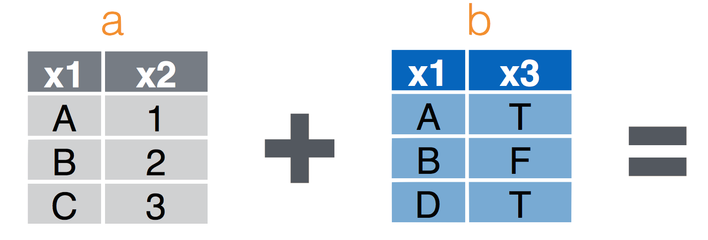
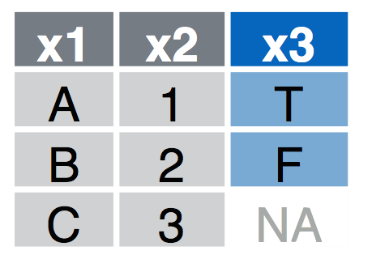
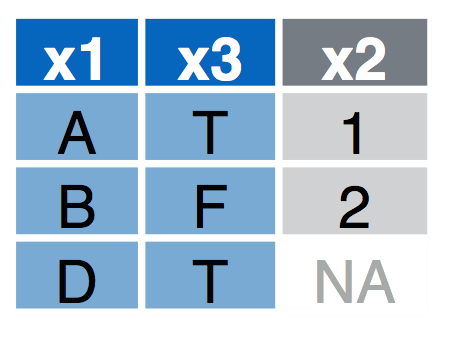
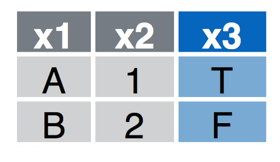
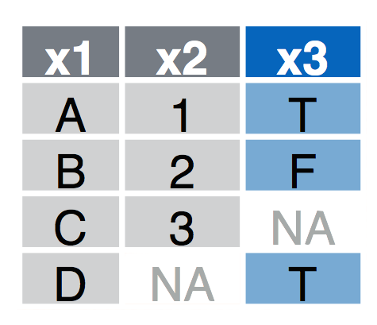
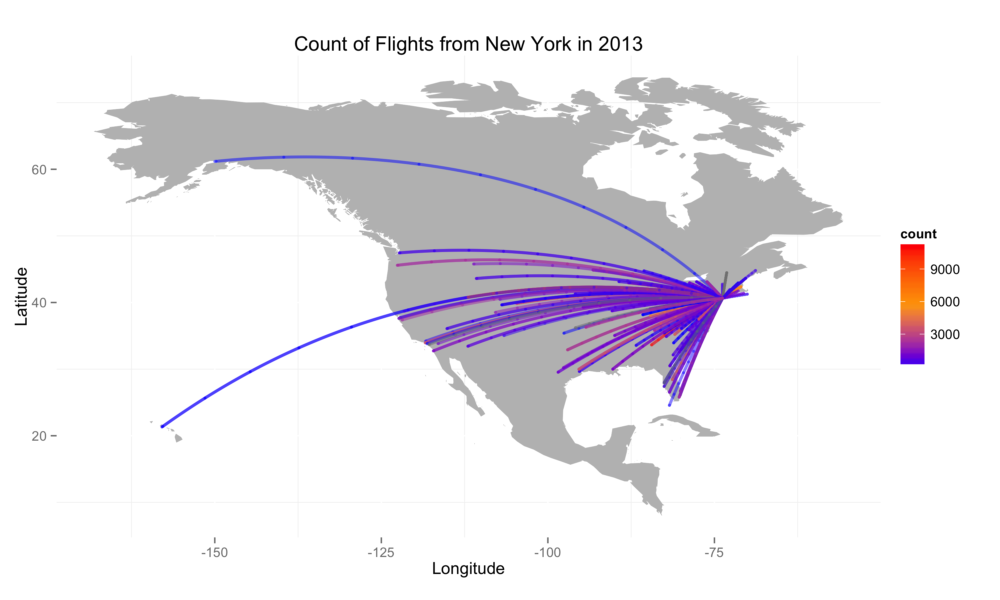

## RStudio Shortcuts

### Running code
* `ctrl-R` (or `command-R`) to run current line
* Highlight `code` in script and run `ctrl-R` (or `command-R`) to run selection
* Buttons: 

### Switching windows
* `ctrl-1`: script window
* `ctrl-2`: console window

> Try to run today's script without using your mouse/trackpad

---
## Data wrangling

### Useful packages: [`dplyr`](https://cran.rstudio.com/web/packages/dplyr/vignettes/introduction.html)  and [`tidyr`]()

[Cheat sheets on website](https://www.rstudio.com/resources/cheatsheets/) for [Data Wrangling](https://www.rstudio.com/wp-content/uploads/2015/02/data-wrangling-cheatsheet.pdf)


```r
library(dplyr)
library(tidyr)
```
Remember use `install.packages("dplyr")` to install a new package.

---
##  Example operations from [here](https://cran.rstudio.com/web/packages/dplyr/vignettes/introduction.html)

### New York City Flights
Data from [US Bureau of Transportation Statistics](http://www.transtats.bts.gov/DatabaseInfo.asp?DB_ID=120&Link=0) (see `?nycflights13`)

```r
library(nycflights13)
```
Check out the `flights` object

```r
head(flights)
```

```
## Source: local data frame [6 x 16]
## 
##   year month day dep_time dep_delay arr_time arr_delay carrier tailnum
## 1 2013     1   1      517         2      830        11      UA  N14228
## 2 2013     1   1      533         4      850        20      UA  N24211
## 3 2013     1   1      542         2      923        33      AA  N619AA
## 4 2013     1   1      544        -1     1004       -18      B6  N804JB
## 5 2013     1   1      554        -6      812       -25      DL  N668DN
## 6 2013     1   1      554        -4      740        12      UA  N39463
## Variables not shown: flight (int), origin (chr), dest (chr), air_time
##   (dbl), distance (dbl), hour (dbl), minute (dbl)
```

---
## Object _Structure_
Check out data _structure_ with `str()`

```r
str(flights)
```

```
## Classes 'tbl_df', 'tbl' and 'data.frame':	336776 obs. of  16 variables:
##  $ year     : int  2013 2013 2013 2013 2013 2013 2013 2013 2013 2013 ...
##  $ month    : int  1 1 1 1 1 1 1 1 1 1 ...
##  $ day      : int  1 1 1 1 1 1 1 1 1 1 ...
##  $ dep_time : int  517 533 542 544 554 554 555 557 557 558 ...
##  $ dep_delay: num  2 4 2 -1 -6 -4 -5 -3 -3 -2 ...
##  $ arr_time : int  830 850 923 1004 812 740 913 709 838 753 ...
##  $ arr_delay: num  11 20 33 -18 -25 12 19 -14 -8 8 ...
##  $ carrier  : chr  "UA" "UA" "AA" "B6" ...
##  $ tailnum  : chr  "N14228" "N24211" "N619AA" "N804JB" ...
##  $ flight   : int  1545 1714 1141 725 461 1696 507 5708 79 301 ...
##  $ origin   : chr  "EWR" "LGA" "JFK" "JFK" ...
##  $ dest     : chr  "IAH" "IAH" "MIA" "BQN" ...
##  $ air_time : num  227 227 160 183 116 150 158 53 140 138 ...
##  $ distance : num  1400 1416 1089 1576 762 ...
##  $ hour     : num  5 5 5 5 5 5 5 5 5 5 ...
##  $ minute   : num  17 33 42 44 54 54 55 57 57 58 ...
```

---
## `dplyr` "verbs" of data manipulation

* `select()` and `rename()`: Extract existing variables
* `filter()` and `slice()`: Extract existing observations
* `arrange()`
* `distinct()`
* `mutate()` and `transmute()`: Derive new variables
* `summarise()`: Change the unit of analysis
* `sample_n()` and `sample_frac()`

---
## Useful select functions

* "`-`"  Select everything but
* "`:`"  Select range
* `contains()` Select columns whose name contains a character string
* `ends_with()` Select columns whose name ends with a string
* `everything()` Select every column
* `matches()` Select columns whose name matches a regular expression
* `num_range()` Select columns named x1, x2, x3, x4, x5
* `one_of()` Select columns whose names are in a group of names
* `starts_with()` Select columns whose name starts with a character string

---
## `select()` examples
Select only the `year`, `month`, and `day` columns:

```r
select(flights,year, month, day)
```

```
## Source: local data frame [336,776 x 3]
## 
##    year month day
## 1  2013     1   1
## 2  2013     1   1
## 3  2013     1   1
## 4  2013     1   1
## 5  2013     1   1
## 6  2013     1   1
## 7  2013     1   1
## 8  2013     1   1
## 9  2013     1   1
## 10 2013     1   1
## ..  ...   ... ...
```

---
## `select()` examples

Select everything _except_ the `tailnum`:

```r
select(flights,-tailnum)
```

```
## Source: local data frame [336,776 x 15]
## 
##    year month day dep_time dep_delay arr_time arr_delay carrier flight
## 1  2013     1   1      517         2      830        11      UA   1545
## 2  2013     1   1      533         4      850        20      UA   1714
## 3  2013     1   1      542         2      923        33      AA   1141
## 4  2013     1   1      544        -1     1004       -18      B6    725
## 5  2013     1   1      554        -6      812       -25      DL    461
## 6  2013     1   1      554        -4      740        12      UA   1696
## 7  2013     1   1      555        -5      913        19      B6    507
## 8  2013     1   1      557        -3      709       -14      EV   5708
## 9  2013     1   1      557        -3      838        -8      B6     79
## 10 2013     1   1      558        -2      753         8      AA    301
## ..  ...   ... ...      ...       ...      ...       ...     ...    ...
## Variables not shown: origin (chr), dest (chr), air_time (dbl), distance
##   (dbl), hour (dbl), minute (dbl)
```

---
## `select()` examples

Select all columns containing the string `"time"`:

```r
select(flights,contains("time"))
```

```
## Source: local data frame [336,776 x 3]
## 
##    dep_time arr_time air_time
## 1       517      830      227
## 2       533      850      227
## 3       542      923      160
## 4       544     1004      183
## 5       554      812      116
## 6       554      740      150
## 7       555      913      158
## 8       557      709       53
## 9       557      838      140
## 10      558      753      138
## ..      ...      ...      ...
```

---

## `select()` examples

You can also rename columns with `select()`

```r
select(flights,year,carrier,destination=dest)
```

```
## Source: local data frame [336,776 x 3]
## 
##    year carrier destination
## 1  2013      UA         IAH
## 2  2013      UA         IAH
## 3  2013      AA         MIA
## 4  2013      B6         BQN
## 5  2013      DL         ATL
## 6  2013      UA         ORD
## 7  2013      B6         FLL
## 8  2013      EV         IAD
## 9  2013      B6         MCO
## 10 2013      AA         ORD
## ..  ...     ...         ...
```

---
## `filter()` observations

Filter all flights that departed on on January 1st:


```r
filter(flights, month == 1, day == 1)
```

```
## Source: local data frame [842 x 16]
## 
##    year month day dep_time dep_delay arr_time arr_delay carrier tailnum
## 1  2013     1   1      517         2      830        11      UA  N14228
## 2  2013     1   1      533         4      850        20      UA  N24211
## 3  2013     1   1      542         2      923        33      AA  N619AA
## 4  2013     1   1      544        -1     1004       -18      B6  N804JB
## 5  2013     1   1      554        -6      812       -25      DL  N668DN
## 6  2013     1   1      554        -4      740        12      UA  N39463
## 7  2013     1   1      555        -5      913        19      B6  N516JB
## 8  2013     1   1      557        -3      709       -14      EV  N829AS
## 9  2013     1   1      557        -3      838        -8      B6  N593JB
## 10 2013     1   1      558        -2      753         8      AA  N3ALAA
## ..  ...   ... ...      ...       ...      ...       ...     ...     ...
## Variables not shown: flight (int), origin (chr), dest (chr), air_time
##   (dbl), distance (dbl), hour (dbl), minute (dbl)
```


---
## _Base_ R method
This is equivalent to the more verbose code in base R:


```r
flights[flights$month == 1 & flights$day == 1, ]
```

```
## Source: local data frame [842 x 16]
## 
##    year month day dep_time dep_delay arr_time arr_delay carrier tailnum
## 1  2013     1   1      517         2      830        11      UA  N14228
## 2  2013     1   1      533         4      850        20      UA  N24211
## 3  2013     1   1      542         2      923        33      AA  N619AA
## 4  2013     1   1      544        -1     1004       -18      B6  N804JB
## 5  2013     1   1      554        -6      812       -25      DL  N668DN
## 6  2013     1   1      554        -4      740        12      UA  N39463
## 7  2013     1   1      555        -5      913        19      B6  N516JB
## 8  2013     1   1      557        -3      709       -14      EV  N829AS
## 9  2013     1   1      557        -3      838        -8      B6  N593JB
## 10 2013     1   1      558        -2      753         8      AA  N3ALAA
## ..  ...   ... ...      ...       ...      ...       ...     ...     ...
## Variables not shown: flight (int), origin (chr), dest (chr), air_time
##   (dbl), distance (dbl), hour (dbl), minute (dbl)
```

Compare with `dplyr` method: 

```r
filter(flights, month == 1, day == 1)`
```

---
## Filter excercise
> Filter the `flights` data set to keep only evening flights (`dep_time` after 1600) in June.

---


```r
filter(flights,dep_time>1600,month==6)
```

```
## Source: local data frame [10,117 x 16]
## 
##    year month day dep_time dep_delay arr_time arr_delay carrier tailnum
## 1  2013     6   1     1602        57     1721        51      MQ  N3AEMQ
## 2  2013     6   1     1602        -3     1824         4      MQ  N637MQ
## 3  2013     6   1     1602        -8     1748       -20      9E  N604LR
## 4  2013     6   1     1603        -7     1839       -32      B6  N760JB
## 5  2013     6   1     1603        18     1726         1      WN  N460WN
## 6  2013     6   1     1605        -3     1742       -30      9E  N922XJ
## 7  2013     6   1     1605         5     1801        15      9E  N601LR
## 8  2013     6   1     1605        -9     1801       -22      EV  N13968
## 9  2013     6   1     1608         8     1807       -24      9E  N933XJ
## 10 2013     6   1     1609        -6     1817       -23      MQ  N511MQ
## ..  ...   ... ...      ...       ...      ...       ...     ...     ...
## Variables not shown: flight (int), origin (chr), dest (chr), air_time
##   (dbl), distance (dbl), hour (dbl), minute (dbl)
```

---
## Other _boolean_ expressions
`filter()` is similar to `subset()` except it handles any number of filtering conditions joined together with `&`. 

You can also use other boolean operators, such as _OR_ ("|"):

```r
filter(flights, month == 1 | month == 2)
```

```
## Source: local data frame [51,955 x 16]
## 
##    year month day dep_time dep_delay arr_time arr_delay carrier tailnum
## 1  2013     1   1      517         2      830        11      UA  N14228
## 2  2013     1   1      533         4      850        20      UA  N24211
## 3  2013     1   1      542         2      923        33      AA  N619AA
## 4  2013     1   1      544        -1     1004       -18      B6  N804JB
## 5  2013     1   1      554        -6      812       -25      DL  N668DN
## 6  2013     1   1      554        -4      740        12      UA  N39463
## 7  2013     1   1      555        -5      913        19      B6  N516JB
## 8  2013     1   1      557        -3      709       -14      EV  N829AS
## 9  2013     1   1      557        -3      838        -8      B6  N593JB
## 10 2013     1   1      558        -2      753         8      AA  N3ALAA
## ..  ...   ... ...      ...       ...      ...       ...     ...     ...
## Variables not shown: flight (int), origin (chr), dest (chr), air_time
##   (dbl), distance (dbl), hour (dbl), minute (dbl)
```

---
## Filter excercise

> Filter the `flights` data set to keep only 'redeye' flights where the departure time (`dep_time`) is "after" the arrival time (`arr_time`), indicating it arrived the next day:


---


```r
filter(flights,dep_time>arr_time)
```

```
## Source: local data frame [10,633 x 16]
## 
##    year month day dep_time dep_delay arr_time arr_delay carrier tailnum
## 1  2013     1   1     1929         9        3        -4      UA  N27205
## 2  2013     1   1     1939        59       29        NA      9E  N905XJ
## 3  2013     1   1     2058        -2        8         9      UA  N27724
## 4  2013     1   1     2102        -6      146       -12      UA  N78511
## 5  2013     1   1     2108        11       25       -14      UA  N17245
## 6  2013     1   1     2120       -10       16        -2      B6  N603JB
## 7  2013     1   1     2121        41        6        43      B6  N307JB
## 8  2013     1   1     2128        -7       26       -24      AA  N338AA
## 9  2013     1   1     2134        49       20        28      UA  N27733
## 10 2013     1   1     2136        -9       25       -14      B6  N198JB
## ..  ...   ... ...      ...       ...      ...       ...     ...     ...
## Variables not shown: flight (int), origin (chr), dest (chr), air_time
##   (dbl), distance (dbl), hour (dbl), minute (dbl)
```


---
## Select rows by position using slice():

```r
slice(flights, 1:10)
```

```
## Source: local data frame [10 x 16]
## 
##    year month day dep_time dep_delay arr_time arr_delay carrier tailnum
## 1  2013     1   1      517         2      830        11      UA  N14228
## 2  2013     1   1      533         4      850        20      UA  N24211
## 3  2013     1   1      542         2      923        33      AA  N619AA
## 4  2013     1   1      544        -1     1004       -18      B6  N804JB
## 5  2013     1   1      554        -6      812       -25      DL  N668DN
## 6  2013     1   1      554        -4      740        12      UA  N39463
## 7  2013     1   1      555        -5      913        19      B6  N516JB
## 8  2013     1   1      557        -3      709       -14      EV  N829AS
## 9  2013     1   1      557        -3      838        -8      B6  N593JB
## 10 2013     1   1      558        -2      753         8      AA  N3ALAA
## Variables not shown: flight (int), origin (chr), dest (chr), air_time
##   (dbl), distance (dbl), hour (dbl), minute (dbl)
```

---
## Arrange rows with `arrange()`

`arrange()` is similar to `filter()` except it reorders instead of filtering.  


```r
arrange(flights, year, month, day)
```

```
## Source: local data frame [336,776 x 16]
## 
##    year month day dep_time dep_delay arr_time arr_delay carrier tailnum
## 1  2013     1   1      517         2      830        11      UA  N14228
## 2  2013     1   1      533         4      850        20      UA  N24211
## 3  2013     1   1      542         2      923        33      AA  N619AA
## 4  2013     1   1      544        -1     1004       -18      B6  N804JB
## 5  2013     1   1      554        -6      812       -25      DL  N668DN
## 6  2013     1   1      554        -4      740        12      UA  N39463
## 7  2013     1   1      555        -5      913        19      B6  N516JB
## 8  2013     1   1      557        -3      709       -14      EV  N829AS
## 9  2013     1   1      557        -3      838        -8      B6  N593JB
## 10 2013     1   1      558        -2      753         8      AA  N3ALAA
## ..  ...   ... ...      ...       ...      ...       ...     ...     ...
## Variables not shown: flight (int), origin (chr), dest (chr), air_time
##   (dbl), distance (dbl), hour (dbl), minute (dbl)
```
_Base_ R method:

```r
flights[order(flights$year, flights$month, flights$day), ]
```

---
## Use `desc()` for descending order:


```r
arrange(flights, desc(arr_delay))
```

```
## Source: local data frame [336,776 x 16]
## 
##    year month day dep_time dep_delay arr_time arr_delay carrier tailnum
## 1  2013     1   9      641      1301     1242      1272      HA  N384HA
## 2  2013     6  15     1432      1137     1607      1127      MQ  N504MQ
## 3  2013     1  10     1121      1126     1239      1109      MQ  N517MQ
## 4  2013     9  20     1139      1014     1457      1007      AA  N338AA
## 5  2013     7  22      845      1005     1044       989      MQ  N665MQ
## 6  2013     4  10     1100       960     1342       931      DL  N959DL
## 7  2013     3  17     2321       911      135       915      DL  N927DA
## 8  2013     7  22     2257       898      121       895      DL  N6716C
## 9  2013    12   5      756       896     1058       878      AA  N5DMAA
## 10 2013     5   3     1133       878     1250       875      MQ  N523MQ
## ..  ...   ... ...      ...       ...      ...       ...     ...     ...
## Variables not shown: flight (int), origin (chr), dest (chr), air_time
##   (dbl), distance (dbl), hour (dbl), minute (dbl)
```

_Base_ R method:

```r
flights[order(desc(flights$arr_delay)), ]
```


---
## Distinct: Find distinct rows


```r
distinct(
  select(flights,carrier)
)
```

```
## Source: local data frame [16 x 1]
## 
##    carrier
## 1       UA
## 2       AA
## 3       B6
## 4       DL
## 5       EV
## 6       MQ
## 7       US
## 8       WN
## 9       VX
## 10      FL
## 11      AS
## 12      9E
## 13      F9
## 14      HA
## 15      YV
## 16      OO
```

---
## Mutate: Derive new variables

Adds columns with calculations based on other columns.


Average air speed (miles/hour):

```r
select(
  mutate(flights,ave_speed=distance/(air_time/60)),
  distance, air_time,ave_speed)
```

```
## Source: local data frame [336,776 x 3]
## 
##    distance air_time ave_speed
## 1      1400      227  370.0441
## 2      1416      227  374.2731
## 3      1089      160  408.3750
## 4      1576      183  516.7213
## 5       762      116  394.1379
## 6       719      150  287.6000
## 7      1065      158  404.4304
## 8       229       53  259.2453
## 9       944      140  404.5714
## 10      733      138  318.6957
## ..      ...      ...       ...
```

---

## Chaining Operations
Performing multiple operations sequentially with a _pipe_ character


```r
a1 <- group_by(flights, year, month, day)
a2 <- select(a1, arr_delay, dep_delay)
a3 <- summarise(a2,
  arr = mean(arr_delay, na.rm = TRUE),
  dep = mean(dep_delay, na.rm = TRUE))
a4 <- filter(a3, arr > 30 | dep > 30)
head(a4)
```

```
## Source: local data frame [6 x 5]
## Groups: year, month
## 
##   year month day      arr      dep
## 1 2013     1  16 34.24736 24.61287
## 2 2013     1  31 32.60285 28.65836
## 3 2013     2  11 36.29009 39.07360
## 4 2013     2  27 31.25249 37.76327
## 5 2013     3   8 85.86216 83.53692
## 6 2013     3  18 41.29189 30.11796
```

---
## Chaining Operations
If you don’t want to save the intermediate results: wrap the function calls inside each other:


```r
filter(
  summarise(
    select(
      group_by(flights, year, month, day),
      arr_delay, dep_delay
    ),
    arr = mean(arr_delay, na.rm = TRUE),
    dep = mean(dep_delay, na.rm = TRUE)
  ),
  arr > 30 | dep > 30
)
```

```
## Source: local data frame [49 x 5]
## Groups: year, month
## 
##    year month day      arr      dep
## 1  2013     1  16 34.24736 24.61287
## 2  2013     1  31 32.60285 28.65836
## 3  2013     2  11 36.29009 39.07360
## 4  2013     2  27 31.25249 37.76327
## 5  2013     3   8 85.86216 83.53692
## 6  2013     3  18 41.29189 30.11796
## 7  2013     4  10 38.41231 33.02368
## 8  2013     4  12 36.04814 34.83843
## 9  2013     4  18 36.02848 34.91536
## 10 2013     4  19 47.91170 46.12783
## ..  ...   ... ...      ...      ...
```

Arguments are distant from function -> difficult to read!  

---
## Chaining Operations

`%>%` allows you to _pipe_ together various commands

`x %>% f(y)` turns into `f(x, y)`


So you can use it to rewrite multiple operations that you can read left-to-right, top-to-bottom:

```r
flights %>%
  group_by(year, month, day) %>%
  select(arr_delay, dep_delay) %>%
  summarise(
    arr = mean(arr_delay, na.rm = TRUE),
    dep = mean(dep_delay, na.rm = TRUE)
  ) %>%
  filter(arr > 30 | dep > 30)
```

```
## Source: local data frame [49 x 5]
## Groups: year, month
## 
##    year month day      arr      dep
## 1  2013     1  16 34.24736 24.61287
## 2  2013     1  31 32.60285 28.65836
## 3  2013     2  11 36.29009 39.07360
## 4  2013     2  27 31.25249 37.76327
## 5  2013     3   8 85.86216 83.53692
## 6  2013     3  18 41.29189 30.11796
## 7  2013     4  10 38.41231 33.02368
## 8  2013     4  12 36.04814 34.83843
## 9  2013     4  18 36.02848 34.91536
## 10 2013     4  19 47.91170 46.12783
## ..  ...   ... ...      ...      ...
```

---
## Analyze by group with `group_by()`
Perform operations by _group_: mean departure delay by airport (`origin`)


```r
flights %>%
  group_by(origin) %>%
  summarise(meanDelay = mean(dep_delay,na.rm=T))
```

```
## Source: local data frame [3 x 2]
## 
##   origin meanDelay
## 1    EWR  15.10795
## 2    JFK  12.11216
## 3    LGA  10.34688
```


---
## Analyze by group with `group_by()`
Perform operations by _group_: mean and sd departure delay by airline (`carrier`)


```r
flights %>% 
  group_by(carrier) %>%  
  summarise(meanDelay = mean(dep_delay,na.rm=T),
            sdDelay =   sd(dep_delay,na.rm=T))
```

```
## Source: local data frame [16 x 3]
## 
##    carrier meanDelay  sdDelay
## 1       9E 16.725769 45.90604
## 2       AA  8.586016 37.35486
## 3       AS  5.804775 31.36303
## 4       B6 13.022522 38.50337
## 5       DL  9.264505 39.73505
## 6       EV 19.955390 46.55235
## 7       F9 20.215543 58.36265
## 8       FL 18.726075 52.66160
## 9       HA  4.900585 74.10990
## 10      MQ 10.552041 39.18457
## 11      OO 12.586207 43.06599
## 12      UA 12.106073 35.71660
## 13      US  3.782418 28.05633
## 14      VX 12.869421 44.81510
## 15      WN 17.711744 43.34435
## 16      YV 18.996330 49.17227
```


---
## Analyze by group with `group_by()`

> Flights from which `origin` airport go the farthest (on average)?  

Calculate the maximum flight distance (`distance`) by airport (`origin`).

---


```r
flights %>% 
  group_by(origin) %>%  
  summarise(meanDist = mean(distance,na.rm=T),
            maxDist = max(distance,na.rm=T))
```

```
## Source: local data frame [3 x 3]
## 
##   origin  meanDist maxDist
## 1    EWR 1056.7428    4963
## 2    JFK 1266.2491    4983
## 3    LGA  779.8357    1620
```

---

> Which destination airport (`dest`) is the farthest (`distance`) from NYC?

--- 


```r
flights %>% 
  arrange(desc(distance)) %>% 
  select(dest,distance) %>% 
  slice(1)
```

```
## Source: local data frame [1 x 2]
## 
##   dest distance
## 1  HNL     4983
```
> What airport is that?

---

# Combining data sets

## `dplyr` _join_ methods


---
## `dplyr` _join_ methods


* `left_join(a, b, by = "x1")` Join matching rows from b to a.
* `right_join(a, b, by = "x1")` Join matching rows from a to b.
* `inner_join(a, b, by = "x1")` Retain only rows in both sets.
* `full_join(a, b, by = "x1")` Join data. Retain all values, all rows.

--- 
## `dplyr` _join_ methods

`left_join(a, b, by = "x1")` Join matching rows from b to a.




--- 
## `dplyr` _join_ methods

`right_join(a, b, by = "x1")` Join matching rows from a to b.





--- 
## `dplyr` _join_ methods

`inner_join(a, b, by = "x1")` Retain only rows in both sets.




--- 
## `dplyr` _join_ methods

`full_join(a, b, by = "x1")` Join data. Retain all values, all rows.




--- 
## `dplyr` _join_ methods


```r
flights%>%select(-year,-month,-day,-hour,-minute,-dep_time,-dep_delay)%>%str()
```

```
## Classes 'tbl_df', 'tbl' and 'data.frame':	336776 obs. of  9 variables:
##  $ arr_time : int  830 850 923 1004 812 740 913 709 838 753 ...
##  $ arr_delay: num  11 20 33 -18 -25 12 19 -14 -8 8 ...
##  $ carrier  : chr  "UA" "UA" "AA" "B6" ...
##  $ tailnum  : chr  "N14228" "N24211" "N619AA" "N804JB" ...
##  $ flight   : int  1545 1714 1141 725 461 1696 507 5708 79 301 ...
##  $ origin   : chr  "EWR" "LGA" "JFK" "JFK" ...
##  $ dest     : chr  "IAH" "IAH" "MIA" "BQN" ...
##  $ air_time : num  227 227 160 183 116 150 158 53 140 138 ...
##  $ distance : num  1400 1416 1089 1576 762 ...
```

Let's look at the `airports` data table (`?airports` for documentation):

```r
str(airports)
```

```
## Classes 'tbl_df', 'tbl' and 'data.frame':	1397 obs. of  7 variables:
##  $ faa : chr  "04G" "06A" "06C" "06N" ...
##  $ name: chr  "Lansdowne Airport" "Moton Field Municipal Airport" "Schaumburg Regional" "Randall Airport" ...
##  $ lat : num  41.1 32.5 42 41.4 31.1 ...
##  $ lon : num  -80.6 -85.7 -88.1 -74.4 -81.4 ...
##  $ alt : int  1044 264 801 523 11 1593 730 492 1000 108 ...
##  $ tz  : num  -5 -5 -6 -5 -4 -4 -5 -5 -5 -8 ...
##  $ dst : chr  "A" "A" "A" "A" ...
```

--- 
## `dplyr` _join_ methods

> What is the name of the destination airport farthest from the NYC airports?


Hints:

* Use a _join_ to connect the `flights` dataset and `airports` dataset.
* Figure out which column connects the two tables.
* You may need to rename the column names before joining.

--- 
## `dplyr` _join_ methods

> What is the name of the airport farthest from the NYC airports?


```r
select(airports,dest=faa,destName=name)%>%
  right_join(flights)%>% 
  arrange(desc(distance)) %>% 
  slice(1) %>% 
  select(destName)
```

```
## Joining by: "dest"
```

```
## Source: local data frame [1 x 1]
## 
##        destName
## 1 Honolulu Intl
```


---
## Plot the `flights` data

Join destination airports.  First select and rename needed variables:


```r
select(airports,dest=faa,destName=name,destLat=lat,destLon=lon)
```

```
## Source: local data frame [1,397 x 4]
## 
##    dest                       destName  destLat    destLon
## 1   04G              Lansdowne Airport 41.13047  -80.61958
## 2   06A  Moton Field Municipal Airport 32.46057  -85.68003
## 3   06C            Schaumburg Regional 41.98934  -88.10124
## 4   06N                Randall Airport 41.43191  -74.39156
## 5   09J          Jekyll Island Airport 31.07447  -81.42778
## 6   0A9 Elizabethton Municipal Airport 36.37122  -82.17342
## 7   0G6        Williams County Airport 41.46731  -84.50678
## 8   0G7  Finger Lakes Regional Airport 42.88356  -76.78123
## 9   0P2   Shoestring Aviation Airfield 39.79482  -76.64719
## 10  0S9          Jefferson County Intl 48.05381 -122.81064
## ..  ...                            ...      ...        ...
```

---


```r
library(geosphere)
library(maps)
library(ggplot2)
library(sp)
library(rgeos)

data=
  select(airports,dest=faa,destName=name,destLat=lat,destLon=lon)%>%
  right_join(flights)%>%
  group_by(dest,destLon,destLat,distance)%>%
  summarise(count=n())%>%
  ungroup()%>%
  select(destLon,destLat,count,distance)%>%
  mutate(id=row_number())%>%
  na.omit()
```

```
## Joining by: "dest"
```

```r
NYCll=airports%>%filter(faa=="JFK")%>%select(lon,lat)  # get NYC coordinates

# calculate great circle routes
rts <- gcIntermediate(as.matrix(NYCll), as.matrix(select(data,destLon,destLat)), 1000, addStartEnd=TRUE, sp=TRUE)
rts.ff <- fortify(as(rts,"SpatialLinesDataFrame")) # convert into something ggplot can plot

## join with count of flights
rts.ff$id=as.integer(rts.ff$id)
gcircles <- left_join(rts.ff, data, by="id") # join attributes, we keep them all, just in case
```

---


```r
base=ggplot()
worldmap <- map_data("world",ylim=c(10,70),xlim=c(-160,-80))
wrld<-c(geom_polygon(aes(long,lat,group=group), 
                     size = 0.1, colour= "grey", fill="grey", alpha=1, data=worldmap))
base+wrld+geom_path(data=gcircles, aes(long,lat,col=count,group=group,order=as.factor(distance)),
                    alpha=0.5, lineend="round",lwd=1)+
  coord_equal()+
  scale_colour_gradientn(colours=c("blue","orange","red"),guide = "colourbar")+
  theme(panel.background = element_rect(fill='white',colour='white'))+
  labs(y="Latitude",x="Longitude",title="Count of Flights from New York in 2013")
```

 

Idea from [here](http://spatial.ly/2012/06/mapping-worlds-biggest-airlines/).

---

## See you next week!
