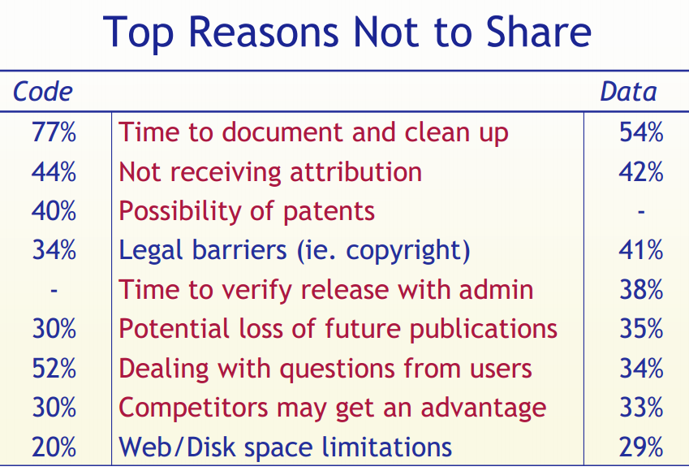
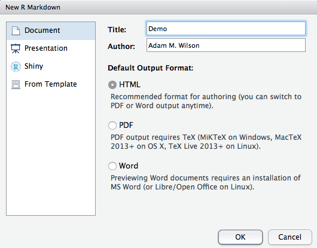

# Reproducible <br> Research

Scripting, RMarkdown, & Git


## Overview
- Definitions, motives, history, spectrum
- Current practices 
- A selection of tools to improve reproducibility 
- Challenges, standards & our role in the future of reproducible research

<small>[Slides based on Ben Marwick's presentation to the UW Center for Statistics and Social Sciences (12 March 2014)](https://github.com/benmarwick/CSSS-Primer-Reproducible-Research) ([OrcID](http://orcid.org/0000-0001-7879-4531))</small>

---

> "The goal of reproducible research is to tie specific instructions to data analysis and experimental data so that scholarship can be recreated, better understood and verified."  <small> Max Kuhn, CRAN Task View: Reproducible Research </small>


## History of reproducible research

- Mathematics (400 BC?)
- Write scientific paper, Galileo, Pasteur, etc.  (1660s?)
- Publish a pidgin algorithm and describe simulation datasets (1950s?)
- Sell magtape of code and data (1970s?)
- Place idiosyncratic dataset & software at website (1990s?)
- Publish datasets and scripts at website, eg. biology, political science, genetics, statistics (2000s?)
- Hosted integrated code and data (2020s?)

<small>Gavish & Gonoho AAAS 2011, Oxberry 2013</small>


## Motivations: <br> Claerbout's principle

> "An article about computational result is advertising, not scholarship. The actual scholarship is the full software environment, code and data, that produced the result." <small> Claerbout and Karrenbach, Proceedings of the 62nd Annual International Meeting of the Society of Exploration Geophysics. 1992</small>


## Benefits are straightforward

- **Verification & Reliability**: Find and fix bugs. Today's results == tomorrow's.
- **Transparency**: increased citation count, broader impact, improved institutional memory
- **Efficiency**: Reduces duplication of effort. Payoff in the (not so) long run
- **Flexibility**: When you don’t 'point-and-click' you gain many new analytic options.

## But limitations are substantial


**Technical**

- Classified/sensitive/big data
- Nondisclosure agreements & intellectual property 
- Software licensing issues
- Competition
- Neither necessary nor sufficient for correctness (but essential for dispute resolution)


**Cultural & personal**

- Few researchers follow even minimal reproducibility standards.
- Few expect reproducibility 
- No uniform standards of reproducibility, so no established user base
- Inertia & embarassment


## Our work exists on a spectrum of reproducibility


<small>Peng 2011, Science 334(6060) pp. 1226-1227</small>


## Goal is to expose the reader to more of the research workflow


<small><small>http://www.stodden.net/AMP2011/slides/pengslides.pdf</small></small>


## Common practices of many scientists  {.columns-2}

- Enter data in Excel
- Use Excel for data cleaning & descriptive statistics
- Import data into SPSS/SAS/Stata for further analysis
- Use point-and-click options to run statistical analyses
- Copy & paste output to Word document, repeatedly

<br><br>
<br><br>

<small></small>


## Common practices of many scientists {.columns-2}


- Version control is ad hoc
- Excel handles missing data inconsistently and sometimes incorrectly 
- Excel uses poor algorithms for many functions
- Scripting is possible but rare 

<br> <br><br>
<br><br>
<br><br><br>


## Click trails are ephemeral & dangerous

- Lots of human effort for tedious & time-wasting tasks
- Error-prone due to manual & ad hoc data handling (column and row offsets are common)
- Difficult to record -  hard to reconstruct a 'click history'
- Tiny changes in data or method require extensive reworking efforts


## Case study: Reinhart and Rogoff controversy


- Claimed high debt-to-GDP ratios led to low GDP growth
- Threshold to growth at a debt-to-GDP ratio of >90%
- Substantial popular impact on autsterity politics 


## Case study: Reinhart and Rogoff controversy


A coding error in their Excel spreadsheet sliced several countries out of the data set....
[The Economist](http://www.economist.com/news/finance-and-economics/21576362-seminal-analysis-relationship-between-debt-and-growth-comes-under)


## Case study: Gay Marrage

#### In May 2015 _Science_ retracted a study of how canvassers can sway people's opinions about gay marriage published just 5 months ago.

> Original survey data not made available for independent reproduction of results. + Survey incentives misrepresented. + Sponsorship statement false. 
<small>- Science Editor-in-Chief Marcia McNutt</small>

Two Berkeley grad students who attempted to replicate the study quickly discovered that the data must have been faked.

[Source](http://news.sciencemag.org/policy/2015/05/science-retracts-gay-marriage-paper-without-lead-author-s-consent)

---
## Case study: Seizure Medicine

#### 2013 Seizure study retracted after authors realize data got "terribly mixed"
> The article has been retracted at the request of the authors. After carefully re-examining the data presented in the article, they identified that data of two different hospitals got terribly mixed. The published results cannot be reproduced in accordance with scientific and clinical correctness. <small> Authors of Low Dose Lidocaine for Refractory Seizures in Preterm Neonates </small>

[Source](http://retractionwatch.com/2013/02/01/seizure-study-retracted-after-authors-realize-data-got-terribly-mixed/)


## Bad spreadsheet merge kills depression paper, quick fix resurrects it
Authors informed the journal that the merge of lab results and other survey data used in the paper resulted in an error regarding the identification codes. Results of the analyses were based on the data set in which this error occurred. Further analyses established the results reported in this manuscript and interpretation of the data are not correct.

> "Lower levels of CSF IL-6 were associated with current depression and with future depression […]" <small>Original conclusion</small>

> "Higher levels of CSF IL-6 and IL-8 were associated with current depression […]" <small> Revised conclusion </small>

[Source](http://retractionwatch.com/2014/07/01/bad-spreadsheet-merge-kills-depression-paper-quick-fix-resurrects-it/)


## Scripted analyses are superior  {.columns-2}

  


  - Plain text files readable for a _long_ time
  - Improved transparency, automation, maintanability, accessibility, standardisation, modularity, portability, efficiency, communicability of process (what more could we want?)
  - Steeper learning curve  


## Literate statistical programming 

> "Instead of imagining that our main task is to instruct a computer what to do, let us concentrate rather on explaining to humans what we want the computer to do." <small>Donald E. Knuth, Literate Programming, 1984</small>


For example...
Let's calculate the current time in R.
```{r, cache=F}
time <- format(Sys.time(), "%a %d %b %X %Y")
```
The text and R code are interwoven in the output:

The time is `` `r '\x60r time\x60'` ``

The time is `r time`


## Literate programming: for and against   {.columns-2}

**For**

- Text & code in one place, in logical order
- Tables and figures automatically updated
- Automatic test when building document


**Against**

- Text and code in one place; can be hard to read
- Can slow down the processing of documents (use caching!)

# Reproducible Research in R

## Need a programming language  {.columns-2}

The machine-readable part: R

* R: Free, open source, cross-platform, highly interactive, huge user community in academica and private sector
* R packages an ideal 'Compendium'?
* Scriptability → R
* Literate programming → R Markdown
* Version control → Git / GitHub


> "both a container for the different elements that make up the document and its computations (i.e. text, code, data, etc.), and as a means for distributing, managing and updating the collection... allow us to move from an era of advertisement to one where our scholarship itself is published" <small>Gentleman and Temple Lang 2004</small>


## Very low barrier to documentation of code with roxygen2


## Interactive charts in the browser with the rCharts package

```{r nvd3plot1, results = 'asis', comment = NA, message = F, echo = F} 
# this only works when the presentation is saved as HTML
# and when the cache folder is available
require(rCharts)
n1 <- nPlot(mpg ~ wt, data = mtcars, type = 'scatterChart')
n1$addParams(width = 800, height = 400)
#n1$show('iframesrc', cdn = TRUE)
n1$show('inline', include_assets = TRUE, cdn = TRUE)
```

## Interactive charts in the browser with the rCharts package

```{r nvd3plot3, results = 'asis', comment = NA, message = F, echo = F} 
require(rCharts)
options(RCHART_WIDTH = 800, RCHART_HEIGHT = 500)
hair_eye_male <- subset(as.data.frame(HairEyeColor), Sex == "Male")
n2 <- nPlot(Freq ~ Hair, group = "Eye", data = hair_eye_male, type = "multiBarChart")
#n2$show('iframesrc', cdn = TRUE)
n2$show('inline', include_assets = TRUE, cdn = TRUE)

```


## Need a document formatting language  {.columns-2}


Markdown: lightweight document formatting syntax. Easy to write, read and publish as-is.


The human-readable part

`rmarkdown`: 
- minor extensions to allow R code display and execution
- embed images in html files (convenient for sharing)
- equations

## Dynamic documents in R  {.columns-2}

knitr - descendant of Sweave  

Engine for dynamic report generation in R


<br> 

- Narrative and code in the same file or explicitly linked
- When data or narrative are updated, the document is automatically updated
- Data treated as 'read only'
- Output treated as disposable

## Pandoc: document converter  {.columns-2}


<small><small>http://kieranhealy.org/blog/archives/2014/01/23/plain-text/ </small></small>

A universal document converter, open source, cross-platform

* Write code and narrative in rmarkdown   
* knitr->markdown (with computation)   
* use pandoc to get HTML/PDF/DOCX


## Tracking changes with version control 

**Payoffs**

- Eases collaboration
- Can track changes in any file type (ideally plain text)
- Can revert file to any point in its tracked history

**Costs**
- Learning curve


## Environment for reproducible research   {.columns-2}


* integrated R console
* deep support for markdown and git
* package development tools, etc. etc.

> RStudio 'projects' make version control & document preparation simple


## Depositing code and data

**Payoffs**
- Free space for hosting (and paid options)
- Assignment of persistent DOIs
- Tracking citation metrics 

**Costs**
- Sometimes license restrictions (CC-BY & CC0)
- Limited or no private storage space


## A hierarchy of reproducibility 

- **Good**: Use code with an integrated development environment (IDE). Minimize pointing and clicking (RStudio)
- **Better**: Use version control. Help yourself keep track of changes, fix bugs and improve project management (RStudio & Git & GitHub or BitBucket)
- **Best**: Use embedded narrative and code to explicitly link code, text and data, save yourself time, save reviewers time, improve your code. (RStudio & Git & GitHub or BitBucket & rmarkdown & knitr & data repository)

##


<small>Stodden (IASSIST 2010) sampled American academics registered at the Machine Learning conference NIPS (134 responses from 593 requests (23%). Red = communitarian norms, Blue = private incentives</small>

##


<small>Stodden (IASSIST 2010) sampled American academics registered at the Machine Learning conference NIPS (134 responses from 593 requests (23%). Red = communitarian norms, Blue = private incentives</small>


## Standards to normalise reproducible research

Reproducible Research Standard (Stodden 2009)

- The full compendium on the internet
- Media such as text, figures, tables with Creative Commons Attribution license (CC-BY) 
 - Code with one of Apache 2.0, MIT, LGPL, BSD, etc.
 - Original "selection and arrangement" of data with CC0 or CC-BY

## Biggest challenge: culture change

Promote culture change through positive attribution 

Implement mechanisms to indicate & encourage **degrees of compliance** (ie. clear definitions for different levels of reproducibility), cf. Stodden's:

 - **'Reproducible'**: compendium of text-code-data online
 - **'Reproduced'**: compendium available and independently reproduced 
 - **'Semi-Reproducible'**: when the full compendium is not released
 - **'Semi-Reproduced'**: independent reproduction with other data
 - **'Perpetually Reproducible'**: streaming data

## Our role in the future of reproducible research (Leveque et al 2012)

- Train students by putting homework, assignments & dissertations on the reproducible research spectrum
- Publish examples of reproducible research in our field
- Request code & data when reviewing
- Submit to & review for journals that support reproducible research
- Critically review & audit data management plans in grant proposals
- Consider reproducibility wherever possible in hiring, promotion & reference letters.


#  Demo: let's get started

## Creating an account on [GitHub](github.com)

1. Create a GitHub account at [https://github.com/](https://github.com/)
    * This will be a public account associated with your name
    * Choose a username wisely for future use
    * Don't worry about details, you can fill them in later
2. Create a repository called _demo_
    * Add a brief and informative description
    * Choose "Public"
    * Check the box for "Initialize this repository with a README"
3. Click "Create Repository"

<small> Demo drawn using materials from Dr. Çetinkaya-Rundel</small>

## Cloning the repository

1. Go to RStudio
    * File -> New Project
    * Version Control: Checkout a project from a version control repository
    * Git: Clone a project from a repository
2. Fill in the info:
    * URL: use HTTPS address
    * Create as a subdirectory of: Browse and create a new folder called `GEO503` (or similar)
    
## R Markdown

**Live demo** 

Cheatsheet:

<a href="https://www.rstudio.com/wp-content/uploads/2015/02/rmarkdown-cheatsheet.pdf"> </a>

<small><small><small>[https://www.rstudio.com/wp-content/uploads/2015/02/rmarkdown-cheatsheet.pdf](https://www.rstudio.com/wp-content/uploads/2015/02/rmarkdown-cheatsheet.pdf)</small></small></small>


## Create new file
File -> New File -> RMarkdown -> Document -> HTML



## Step 1: Load packages

All R code to be run must be in a _code chunk_ like this:
```{r, eval=F,asis=T}
#```{r,eval=F}
CODE HERE
#```
```

Load these packages in a code chunk:

```{r, message=F}
library(dplyr)
library(ggplot2)
library(spocc)
```

> Do you think you should put `install.packages()` calls in your script?


## Step 2: Load data

Now use the `occ()` function to download all the _occurrence_ records for the American robin (_Turdus migratorius_) from the [Global Biodiversity Information Facility](gbif.org).


<small><small><small>Licensed under CC BY-SA 3.0 via [Wikimedia Commons](https://commons.wikimedia.org/wiki/File:Turdus-migratorius-002.jpg#/media/File:Turdus-migratorius-002.jpg)</small></small></small>

This can take a few seconds.
```{r} 
## define which species to query
sp='Turdus migratorius'

## run the query and convert to data.frame()
d = occ(query=sp, from='ebird',limit = 1000, geometry=c(-78.5,42.9,-78.53,42.7)) %>% occ2df()
```


## Step 3: 

```{r}
ggplot(d,aes(x=format(date,"%m"),y=latitude,group=1))+
geom_point()+
geom_smooth()
```

## Step 4:
Update the YAML header to keep the markdown file

From this:
```{r, eval=F}
title: "Untitled"
author: "Adam M. Wilson"
date: "September 21, 2015"
output: html_document
```

To this:
```{r, eval=F}
title: "Demo"
author: "Adam M. Wilson"
date: "September 21, 2015"
output: 
  html_document:
      keep_md: true
```

## Step 3: Commit and push all changes to GitHub

1. Stage
2. Commit (with a message)
3. Push


##  Final

> Abandoning the habit of secrecy in favor of process transparency and peer review was the crucial step by which alchemy became chemistry.<small>Raymond, E. S., 2004, The art of UNIX programming: Addison-Wesley.</small>

## Colophon

Slid
[Slides based on Ben Marwick's presentation to the UW Center for Statistics and Social Sciences (12 March 2014)](https://github.com/benmarwick/CSSS-Primer-Reproducible-Research) ([OrcID](http://orcid.org/0000-0001-7879-4531))

[Slides based on Ben Marwick's presentation to the UW Center for Statistics and Social Sciences (12 March 2014)](https://github.com/benmarwick/CSSS-Primer-Reproducible-Research) ([OrcID](http://orcid.org/0000-0001-7879-4531))


Licensing: 
* Presentation: [CC-BY-3.0 ](http://creativecommons.org/licenses/by/3.0/us/)
* Source code: [MIT](http://opensource.org/licenses/MIT) 


## References

See [Rpres file on github](https://raw.github.com/benmarwick/CSSS-Primer-Reproducible-Research/master/CSSS_WI14_Reproducibility.Rpres) for full references and sources
```{r, echo=FALSE}
## Scholarly literature sources for this presentation

# Buckheit, J.B. and Donoho, D.L. Wavelab and reproducible research. (1995).
# Morin, A. et al. Shining light into black boxes. Science. 336, (2012), 159-160.
# King, G. Replication, Replication. PS: Political Science and Politics. (1995).
# Schofield, P.N. et al. Post-publication sharing of data and tools. Nature. 461, (2009), 171-173.
# Birney, E. et al. Prepublication data sharing. Nature. 461, (2009), 168-70.
# Peng, R.D. Reproducible research and Biostatistics. Biostatistics (Oxford, England). 10, (2009), 405-408.
# Vandewalle, P. et al. Reproducible research in signal processing - What, why, and how. IEEE Signal Processing Magazine.
# 26, (2009), 37-47.
# Stodden, V. The Legal Framework for Reproducible Scientic Research: Licensing and Copyright. Computing in Science &
# Engineering. 11, (2009), 35-40.
# V. Stodden, “Trust Your Science? Open Your Data and Code,” Amstat News, 1 July 2011; http://magazine.amstat.org/blog/2011/07/01/trust-your-science/
# Stodden V, Guo P, Ma Z (2013) Toward Reproducible Computational Research: An Empirical Analysis of Data and Code Policy Adoption by Journals. PLoS ONE 8(6): e67111. doi:10.1371/journal.pone.0067111
# Stodden V  2010 The Scientific Method in Practice: Reproducibility in the Computational Sciences. MIT Sloan School Working Paper 4773-10. http://ssrn.com/abstract=1550193
# Merali, Z. Error: Why scientic programming does not compute. Nature. (2010), 6-8.
# Barnes, N. Publish your computer code: it is good enough. Nature. 467, (2010), 753.
# LeVeque, R.J. Python tools for reproducible research on hyperbolic problems. Computing in Science & Engineering. (2009),
# 19-27. 
# LeVeque, R.J. Wave propagation software, computational science, and reproducible research. Proceedings of the International Congress of Mathematicians (Madrid, Spain, 2006), 1-27.
# LeVeque, R, Stodden, V., & Mitchell, I. (2012). Reproducible Research for Scientific Computing: Tools and Strategies for Changing the Culture. Computing in Science and Engineering, 14(4), 13–17
# Price, K. Anything You Can Do, I Can Do Better (No You Can't)... Computer Vision, Graphics, and Image Processing. (1986), 387-391.
# Piwowar, H. a et al. Sharing detailed research data is associated with increased citation rate. PloS one. 2, (2007), 308.
# Wilson, G. et al. Best Practices for Scientic Computing. 1-6.
# Drummond, C. Reproducible Research: a Dissenting Opinion. (2012), 1-10.
# Ioannidis, J.P. a et al. Repeatability of published microarray gene expression analyses. Nature genetics. 41, (2009), 149-55.
# Savage, C.J. and Vickers, A.J. Empirical study of data sharing by authors publishing in PLoS journals. PloS one. 4, (2009),
# 7078.
# Quirk, J. Computational Science \Same Old Silence, Same Old Mistakes" \Something More Is Needed..." Adaptive Mesh
# Reenement-Theory and Applications. (2005), 4-28.
# McCullough, B.D. Got Replicability? The Journal of Money, Credit and Banking Archive. Econ Journal Watch. 4, (2007),
# 326-337.
# McCullough, B.D. Do economics journal archives promote replicable research?. Economics Journal Archives. (2008).
# Manolescu, I. et al. Repeatability & Workability Evaluation of SIGMOD 2009. SIGMOD 2009 (2009), 2-4.
# Freire, J. et al. Computational reproducibility: state-of-the-art, challenges, and database research opportunities. SIGMOD
# 2012 (2012), 593-596.
# McCullough BD, Heiser DA (2008). “On the Accuracy of Statistical Procedures in Microsoft Excel 2007.” Computational Statistics & Data Analysis, 52, 4570–4578.
# Sandve GK, Nekrutenko A, Taylor J, Hovig E (2013) Ten Simple Rules for Reproducible Computational Research. PLoS Comput Biol 9(10): e1003285. doi:10.1371/journal.pcbi.1003285
# Gentleman, R. and Temple Lang, D. (2007). Statistical analyses and reproducible research. Journal of Computational and Graphical Statistics 16, 1–23.
# Leisch F, Eugster M and Hothorn T 2011. Executable Papers for the R Community: The R2 Platform for Reproducible Research. Procedia Computer Science 4(0), 618-626.
# Rossini, Anthony and Leisch, Friedrich, "Literate Statistical Practice" (March 2003). UW Biostatistics Working Paper Series. Working Paper 194. http://biostats.bepress.com/uwbiostat/paper194
# Hothorn T and Leisch F 2011. Case studies in reproducibility. Briefings in Bioinformatics 12(3), 288-300.
# Gandrud C 2013 Reproducible Research with R and RStudio. CRC Press Florida.
# Xie Y 2013 Dynamic Documents with R and knitr. CRC Press Florida

## Blogs sourced for this presentation

# http://blog.stodden.net/2013/04/19/what-the-reinhart-rogoff-debacle-really-shows-verifying-empirical-results-needs-to-be-routine/
# http://kbroman.github.io/Tools4RR/
# http://rpubs.com/bbolker/3153
# http://sepwww.stanford.edu/data/media/public/sep//jon/repropreface.html
# http://blog.revolutionanalytics.com/2010/10/a-workflow-for-r.html
# http://www.stanford.edu/~vcs/AAAS2011/
# http://wiki.stodden.net/Best_Practices_for_Researchers_Publishing_Computational_Results
# http://www.reproducibleresearch.net/index.php/RR_links
# http://www.nature.com/nature/focus/reproducibility/
# Claerbout's ranking (http://dx.doi.org/10.1109/5992.881708)
# http://fperez.org/py4science/git.html
# http://ivory.idyll.org/blog/replication-i.html
# http://www.mendeley.com/groups/1142301/reproducible-research/
# http://biostat.mc.vanderbilt.edu/wiki/Main/StatReport
# http://reproducibleresearch.net/index.php/How_to
# http://www.executablepapers.com/index.html
# http://tomwallis.info/category/reproducible-research/
# http://simplystatistics.org/2013/08/21/treading-a-new-path-for-reproducible-research-part-1/
# http://scienceinthesands.blogspot.co.uk/search/label/reproduciblie%20research
# http://scienceinthesands.blogspot.co.uk/2012/08/7-habits-of-open-scientist-2.html
# http://scitation.aip.org/content/aip/journal/cise/11/1/10.1109/MCSE.2009.19
# http://www.reproducibility.org/RSF/book/rsf/scons/paper_html/node2.html
# http://ajrichards.bitbucket.org/lpEdit/ReproducibleResearch.html
# http://kieranhealy.org/blog/archives/2014/01/23/plain-text/
# http://nicercode.github.io/git/
# http://nicercode.github.io/blog/2013-04-05-projects/
# http://ivory.idyll.org/blog/tag/reproducibility.html
# http://yihui.name/en/tags/#Reproducible Research
# http://www.rstudio.com/ide/download/preview
# https://github.com/rstudio/rmarkdown

# web applications, services & organisations 

# http://recomputation.org/
# http://sciencecodemanifesto.org/
# http://researchcompendia.org/
# https://collage.elsevier.com/
# http://www.runmycode.org/home/?/CompanionSite/

## Software cited in the presentation (in order of appearance)

# http://www.r-project.org/
# http://cran.r-project.org/web/packages/roxygen2/index.html
#   http://www.rstudio.com/ide/docs/packages/documentation
#   http://adv-r.had.co.nz/Documenting-functions.html
# http://rcharts.io/
#   http://ramnathv.github.io/rCharts/
#   https://github.com/ramnathv/rCharts
# http://ipython.org/
# https://github.com/att/rcloud
#   http://www.research.att.com/articles/featured_stories/2013_09/201309_SandR.html?fbid=RljYLCmQyyR
# http://daringfireball.net/projects/markdown/
# http://rmarkdown.rstudio.com/
# http://yihui.name/knitr/
#   http://cran.r-project.org/web/packages/knitr/index.html
# http://johnmacfarlane.net/pandoc/
# http://git-scm.com/
#   https://github.com/
#   https://bitbucket.org/
# http://www.rstudio.com/ide/
# http://figshare.com/
# http://datadryad.org/
#

```

