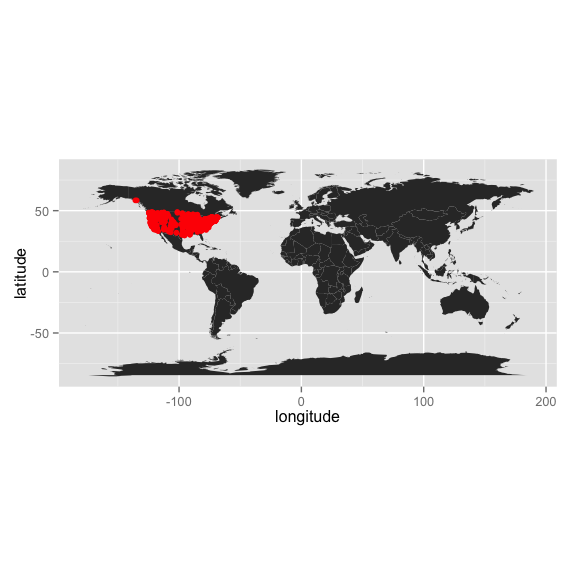

# Reproducible Research II
Adam M. Wilson  
September 2015  


## Overview

### Questions from last week?

* dplyr: data wrangling
* tidyr: data reformating

# Homework Review

#  Today

* More Git
* Introduction to `ggplot2()`


## Step 1: Load packages

All R code to be run must be in a _code chunk_ like this:

```r
#```{r,eval=F}
CODE HERE
#```
```

Load these packages in a code chunk:


```r
library(dplyr)
library(ggplot2)
library(maps)
library(spocc)
```


## Step 2: Load data

Now use the `occ()` function to download all the _occurrence_ records for the American robin (_Turdus migratorius_) from the [Global Biodiversity Information Facility](gbif.org).


```r
## define which species to query
sp='Turdus migratorius'

## run the query and convert to data.frame()
d = occ(query=sp, from='ebird',limit = 1000) %>% occ2df()
```
This can take a few seconds.

## Step 3: Map it


```r
# Load coastline
map=map_data("world")

ggplot(d,aes(x=longitude,y=latitude))+
  geom_polygon(aes(x=long,y=lat,group=group,order=order),data=map)+
  geom_point(col="red")+
  coord_equal()
```

 

## Step 4:
Update the YAML header to keep the markdown file

From this:

```r
title: "Untitled"
author: "Adam M. Wilson"
date: "September 21, 2015"
output: html_document
```

To this:

```r
title: "Demo"
author: "Adam M. Wilson"
date: "September 21, 2015"
output: 
  html_document:
      keep_md: true
```

And click `knit HTML` to generate the output

## Step 5: Commit and push all changes to GitHub

1. Stage
2. Commit (with a message)
3. Push

## Step 6:  Explore markdown functions

1. Use the Cheatsheet to add sections and some example narrative.  
2. Try changing changing the species name to your favorite species and re-run the report.  
3. Stage, Commit, Push!
4. Explore the markdown file on the GitHub website.  


## Colophon

Slid
[Slides based on Ben Marwick's presentation to the UW Center for Statistics and Social Sciences (12 March 2014)](https://github.com/benmarwick/CSSS-Primer-Reproducible-Research) ([OrcID](http://orcid.org/0000-0001-7879-4531))

Git Slides based on materials from Dr. Çetinkaya-Rundel


Licensing: 
* Presentation: [CC-BY-3.0 ](http://creativecommons.org/licenses/by/3.0/us/)
* Source code: [MIT](http://opensource.org/licenses/MIT) 


## References

See Rmd file for full references and sources
