```{r, echo=FALSE, message=FALSE, results='hide', purl=FALSE}
## This chunk automatically generates a text .R version of this script when running within knitr.  You do not need to run this...
input  = knitr::current_input()  # filename of input document
output = paste(tools::file_path_sans_ext(input), 'R', sep = '.')
knitr::purl(input,output,documentation=2,quiet=T)
knitr::opts_chunk$set(cache=T)
## Get git information
hash=system("git log --pretty=format:'%h' -n 1",intern = T)
repo=sub("[.]git","",system("git config remote.origin.url",intern = T))
```


## Overview

### Questions from last week?

* Got Git?

# Homework Review

#  Today

## Outline
* More Git
* More Markdown
* Introduction to `ggplot2()`
* Introduction to spatial data in R

# Working with Git and GitHub

## Git Has Integrity
Everything _checksummed_ before storage and then referred by _checksum_. 

> It’s impossible to change the contents of any file or directory without Git knowing. You can’t lose information in transit or get file corruption without Git being able to detect it.

A 40-character hexadecimal SHA-1 hash:

`24b9da6552252987aa493b52f8696cd6d3b00373`

## Checksum
A way of reducing digital information to a unique ID:

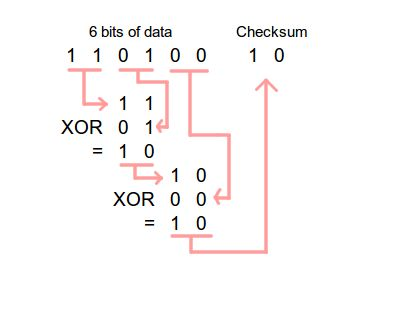

Git doesn't care about filenames, extensions, etc.  It' the information that matters...

## The 3 states of files

### staged, modified, committed


The important stuff is hidden in the `.git` folder.

## Commit to GitHub from within RStudio

### Steps:

1. Stage
2. Commit (with a message)
3. Push


## Staging
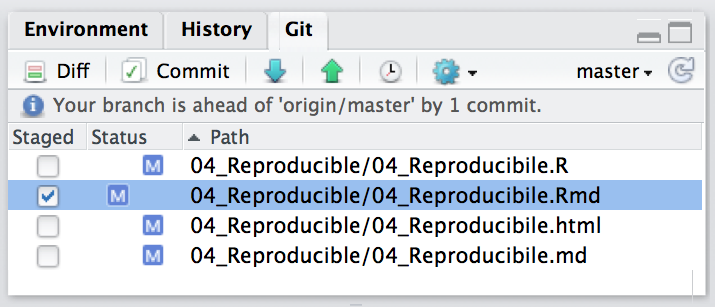

Select which files you want to commit.

## Committing
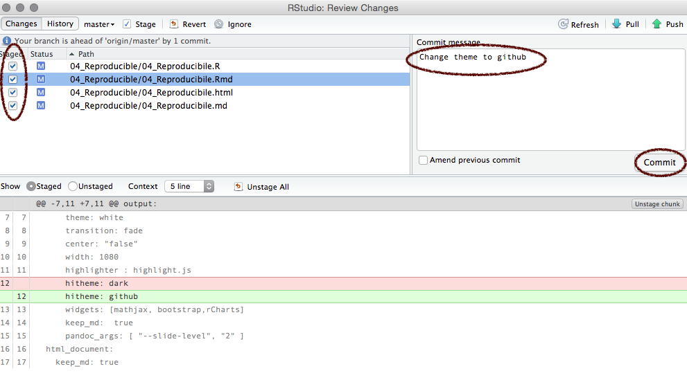

Add a _commit message_ and click commit.

## Syncing (`push`)
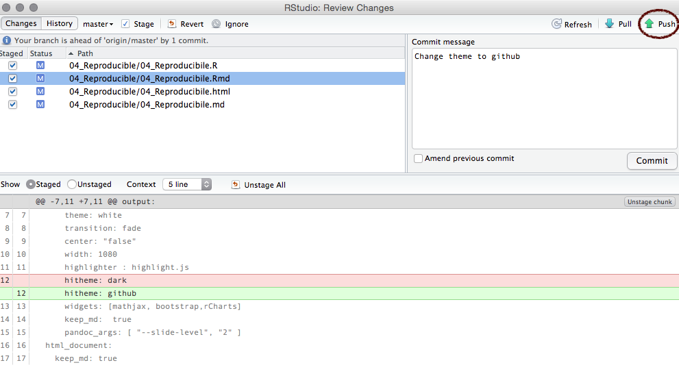

Click the green arrow to sync with GitHub.

## Github


Files are updated/stored on GitHub

## Git File Lifecycle


## Git command line from RStudio

RStudio has limited functionality.  

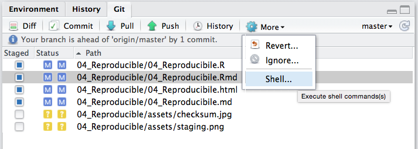


## Git help

```{}
$ git help <verb>
$ git <verb> --help
$ man git-<verb>
```
For example, you can get the manpage help for the config command by running `git help config`

## Git status
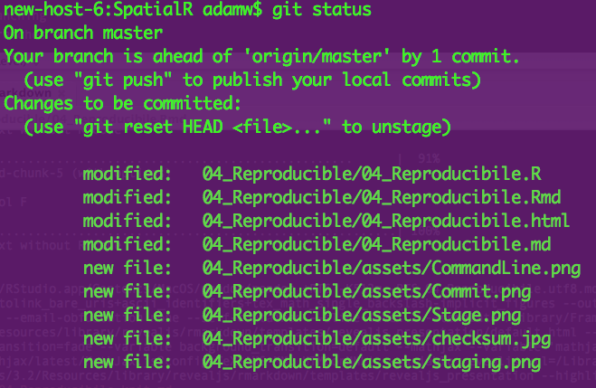

Similar to info in git tab in RStudio

## Git config
`git config` shows you all the git configuration settings:

* `user.email`
* `remote.origin.url`  (e.g. to connect to GitHub)

## Branching
Branches used to develop features isolated from each other. 


Default: _master_ branch. Use other branches for development/collaboration and merge them back upon completion.

## Basic Branching

```{}
$ git checkout -b devel   # create new branch and switch to it


$ git checkout master  #switch back to master
$ git merge devel  #merge in changes from devel branch
```
But we won't do much with branching in this course...

## Git can do far more!

Check out the (free) book [ProGIT](https://git-scm.com/book/en/v2)

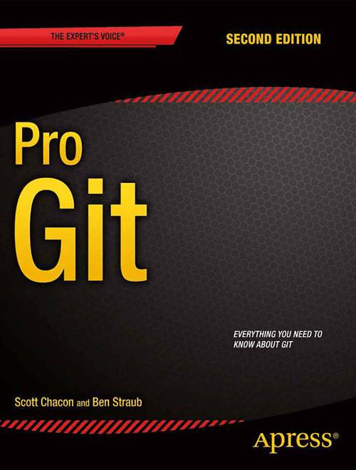


Or the [cheatsheet](https://training.github.com/kit/downloads/github-git-cheat-sheet.pdf).

## Philosphy  
Remember, the data and code are _real_, the products (tables, figures) are ephemeral...  

# RMarkdown
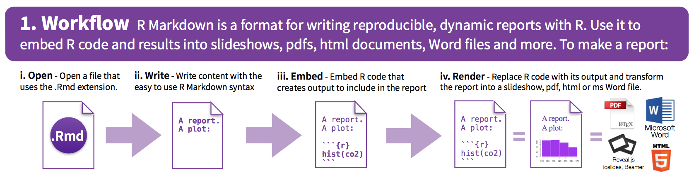

## RMarkdown: new file
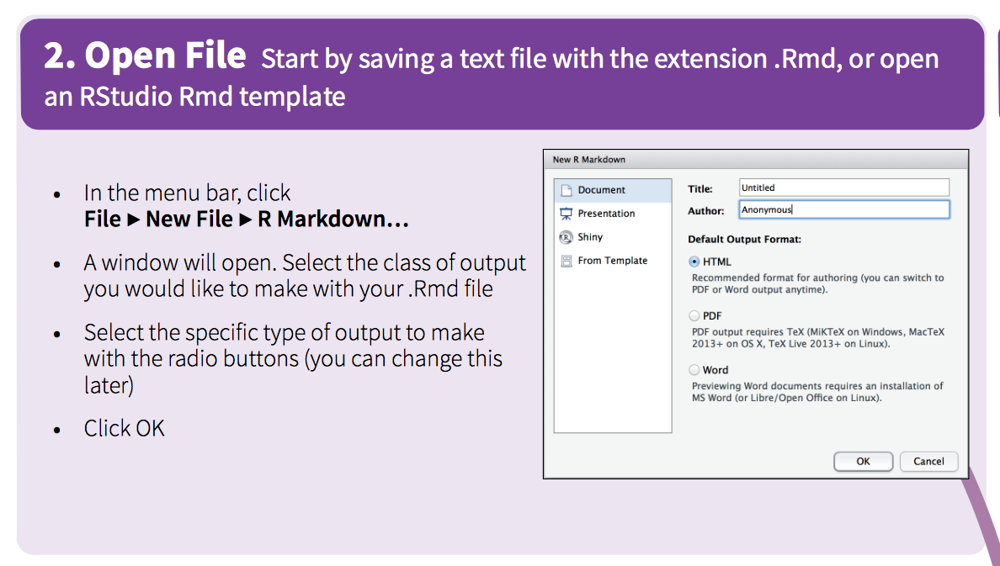

## RMarkdown: syntax
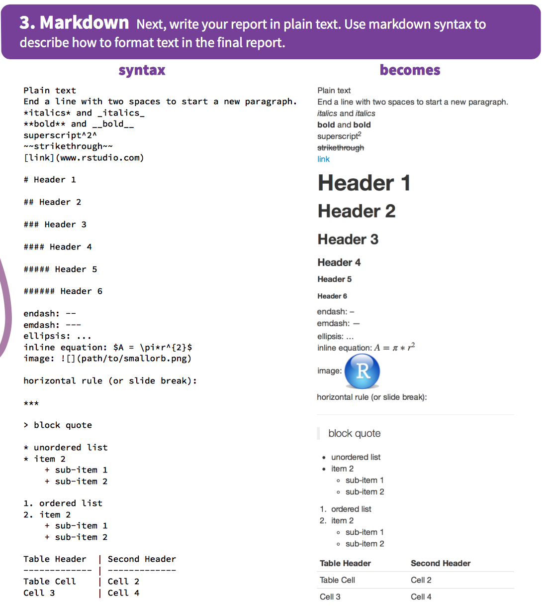

## RMarkdown: output
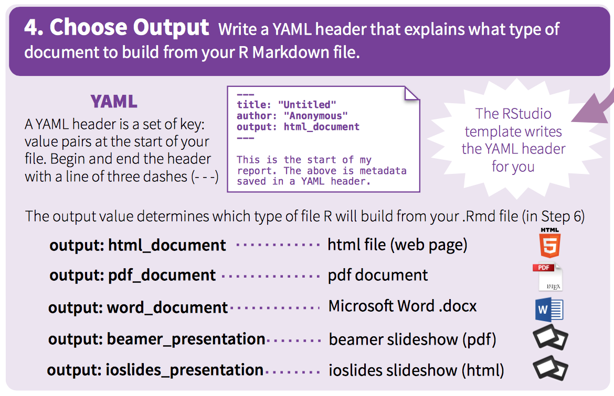

## RMarkdown: code
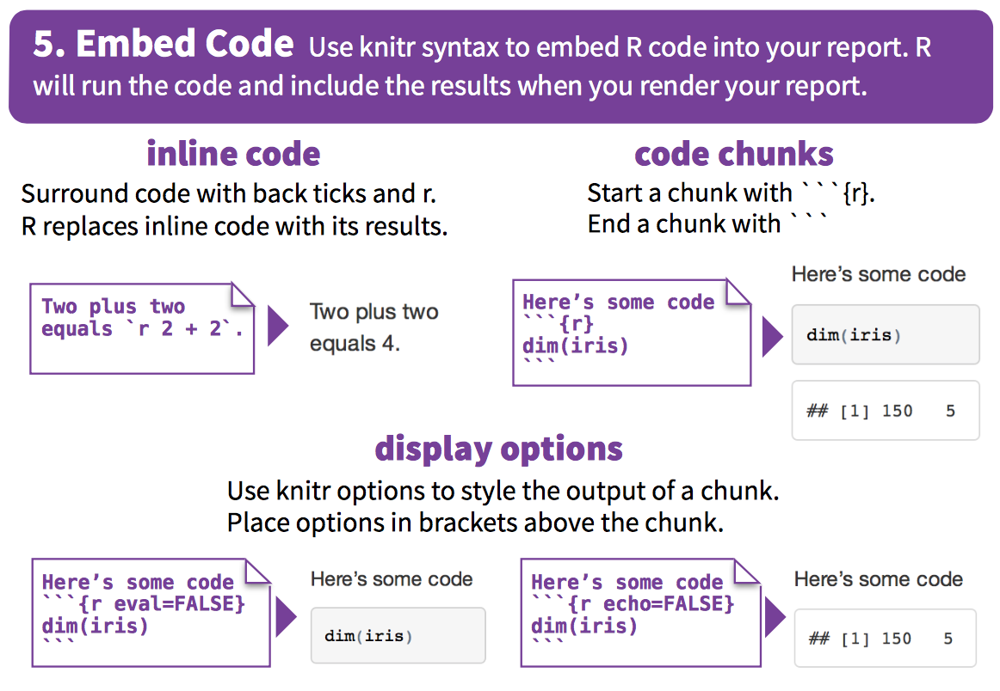

## RMarkdown: chunks
Option      default   effect
----        ---       ----
`eval`        `TRUE`      Evalute the code and include the results
`echo`        `TRUE`      Display the code along with its results
`warning`     `TRUE`      Display warnings
`error`       `FALSE`     Display errors
`message`     `TRUE`      Display messages
`tidy`        `FALSE`     Reformat code to make it 'tidy'
`results`     "markup"    "markup", "asis","hold","hide"
`cache`       `FALSE`     Cache results for future renders
`comment`     `"##"`      Comment character to preface results
`fig.width`   7           Width in inches for plots
`fig.height`  7           Height in inches for plots

## Chunk examples

R Code Chunks: Displaying Plots

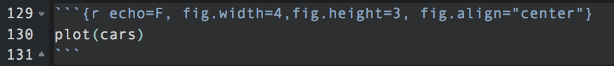

```{r echo=F, fig.width=4,fig.height=3, fig.align="center"}
plot(cars)
```

## Global chunk options

Use  chunk options throughout a document:
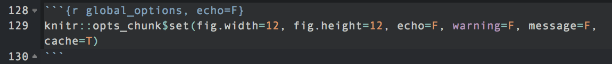


## RMarkdown: render

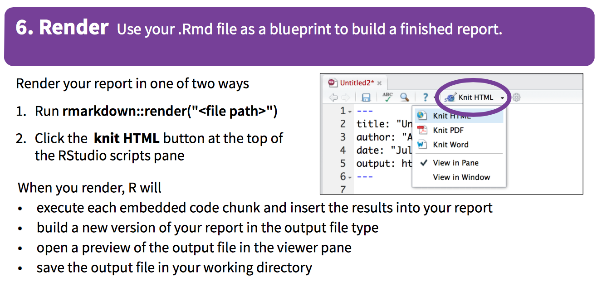


## Visualize .md on GitHub

Update the YAML header to keep the markdown file

From this:
```{r, eval=F}
title: "Untitled"
author: "Adam M. Wilson"
date: "September 21, 2015"
output: html_document
```

To this:
```{r, eval=F}
title: "Demo"
author: "Adam M. Wilson"
date: "September 21, 2015"
output: 
  html_document:
      keep_md: true
```

And click `knit HTML` to generate the output

## Visualize example
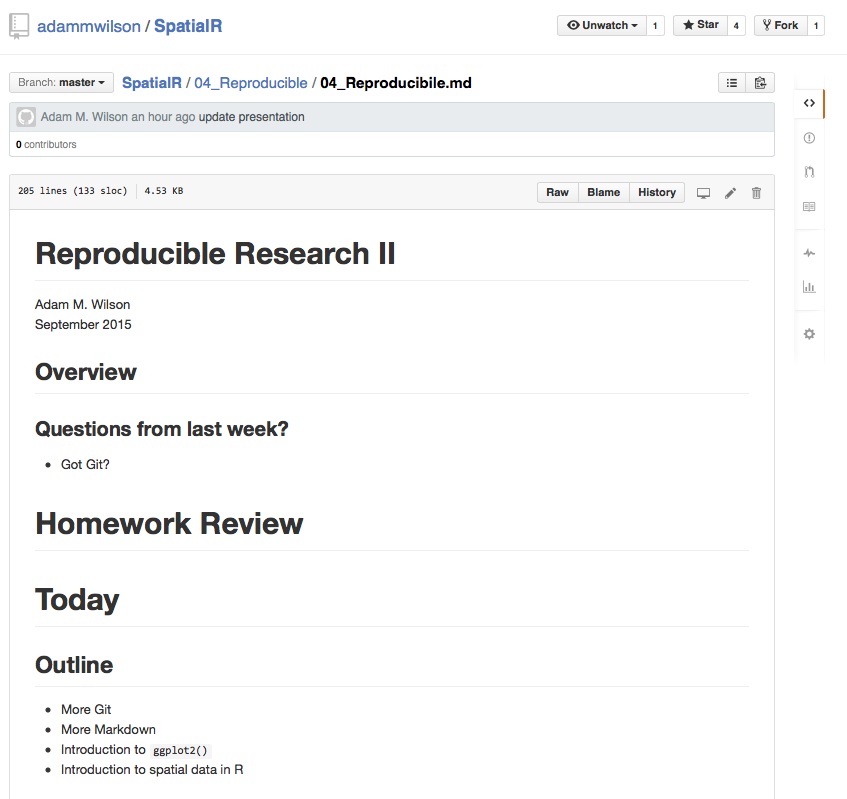


## Explore markdown<->Git

1. Use _File -> New File -> R Markdown_ to create a new markdown file.  
2. Use the Cheatsheet to add sections (`#` and `##`) and some example narrative.  
3. `Stage`, `Commit`, `Push`!
4. Make more changes then `Stage`, `Commit`, `Push`!
4. Explore the markdown file on your GitHub website.  

<br>

### Take 10 minutes & ask questions!


## Colophon

Licensing: 
* Presentation: [CC-BY-3.0 ](http://creativecommons.org/licenses/by/3.0/us/)
* Source code: [MIT](http://opensource.org/licenses/MIT) 

