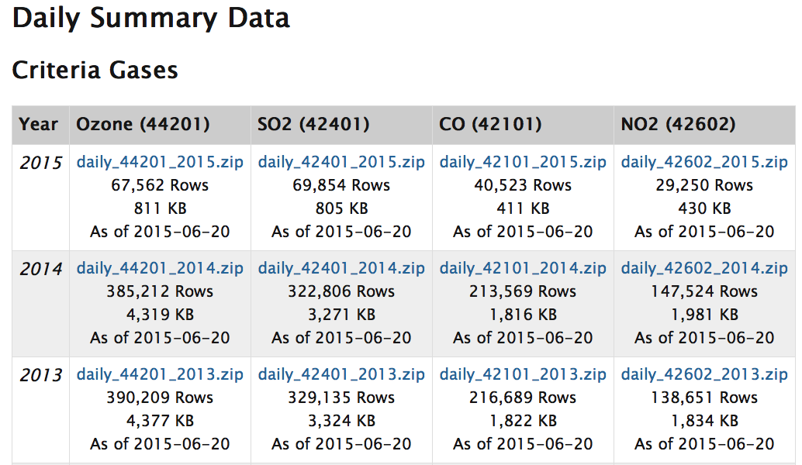
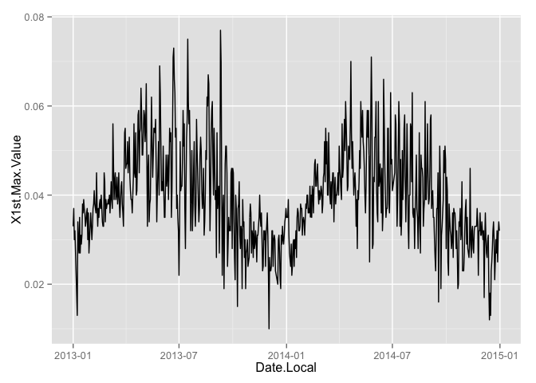
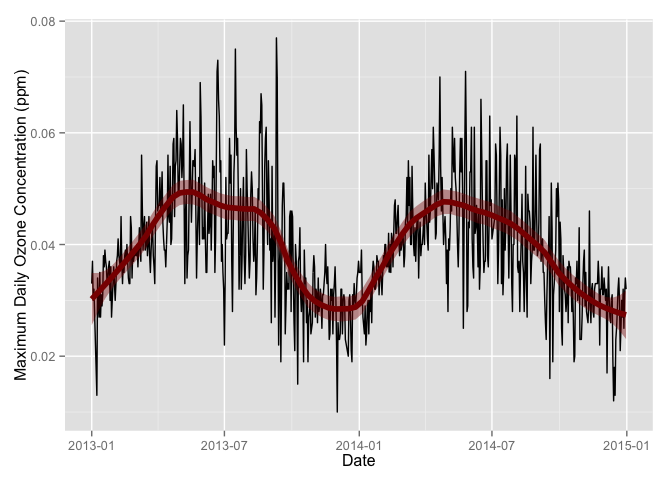
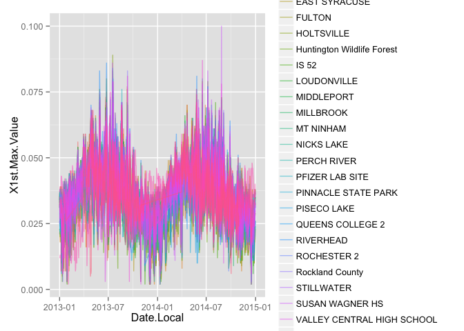
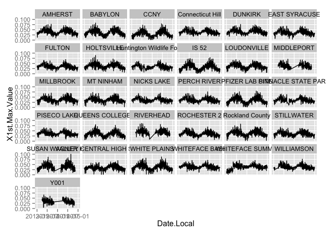
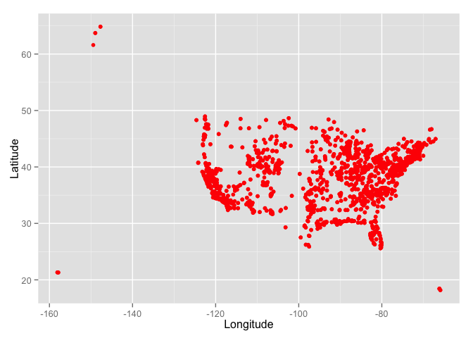
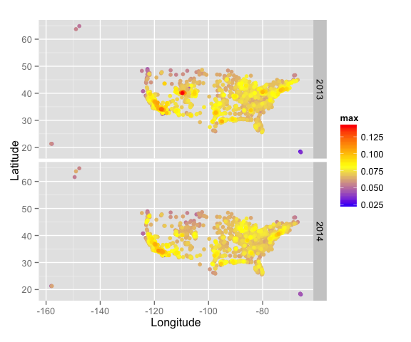
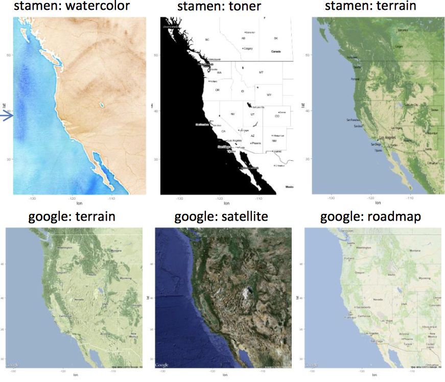
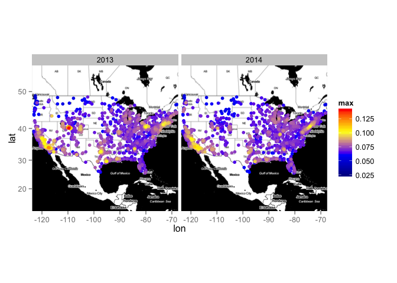

# Reproducible Research II
Adam M. Wilson  
September 2015  


## Today's Objectives

* Download and pre-process files from a website
* Loop through files and import them to R
* Summarize data as desired
* Plot timeseries & spatial distribution


## Load packages


```r
library(dplyr)
library(tidyr)
library(ggplot2)
library(maps)
library(ggmap)
```


# Download data

## EPA _AirData_
[AirData](http://www3.epa.gov/airquality/airdata/index.html) gives you access to air quality data collected at outdoor monitors across the United States.  


## Daily air quality observations
Daily data are available from AirData ([http://aqsdr1.epa.gov/aqsweb/aqstmp/airdata/download_files.html](http://aqsdr1.epa.gov/aqsweb/aqstmp/airdata/download_files.html)) from 1990 through 2015, but for now we'll just use 2013:2014.  If you want to extend the analysis, feel free to change this.  

You can access the associated metadata [here](http://aqsdr1.epa.gov/aqsweb/aqstmp/airdata/FileFormats.html).


Create a vector of years to download

```r
years=2013:2014
years
```

```
## [1] 2013 2014
```

Some data serving websites offer an Application programming interface (API) which allows local software to directly interact with servers.  

> [ROpenSci](https://ropensci.org) project builds libraries to interface with common data APIs.  


In this case we'll simple use the URL for the file we want (Daily Ozone 44201).  




To generate URLs for multiple years, you can use `paste()` with a vector.  For example:


```r
paste("File",years,sep="_")
```

```
## [1] "File_2013" "File_2014"
```

Now build the actual URL to the files:

```r
url="http://aqsdr1.epa.gov/aqsweb/aqstmp/airdata/"
files=paste0(url,"daily_44201_",years,".zip")

files
```

```
## [1] "http://aqsdr1.epa.gov/aqsweb/aqstmp/airdata/daily_44201_2013.zip"
## [2] "http://aqsdr1.epa.gov/aqsweb/aqstmp/airdata/daily_44201_2014.zip"
```

### Data directory
By default everything goes into working director (see `getwd()`), but we can append a path to put things somewhere else and keep our project organized.

> Be careful with large files inside your Git respository.  Best to keep them outside _or_ add them to .gitignore.


```r
datadir="data"
```

### Download Function

Write a simple download function to:

1. Check if file already exists
2. If needed, download the file.
3. Unzip the file into our `datadir`


For this we need a few new functions:

* `basename()`:  returns just the file name from a path.  e.g. 
* `file.path()`: assembles a file path from parts (adding "/" as necessary for OS)
* `file.exists()`:  tests whether a file exists on disk
* `unzip()`: unzips a file
* `file.remove()`: deletes a file on disk


```r
downloadData=function(file,overwrite=F){
  cfile=sub("zip","csv",file)%>%basename()  #get filename
  if(file.exists(file.path(datadir,cfile))) {
    return("File exists")
  }
  temp <- tempfile()  # make a filename for a temporary file
  download.file(file,temp)  # download the zipped file from the website
  unzip(temp,exdir=datadir)  # unzip the data to our datadir
  file.remove(temp)  # remove the zipped file
}
```
  

Try running that for just one year:

```r
downloadData(files[1])
```

```
## [1] "File exists"
```

### Download all desired years with a simple `for()` loop


```r
for(f in files){
  downloadData(f)
}
```

### Or use `lapply()`
`lapply()`: Apply a Function over a List or Vector


```r
lapply(files, downloadData)
```

```
## [[1]]
## [1] "File exists"
## 
## [[2]]
## [1] "File exists"
```


## Load Data

### Another function to load all available datasets

```r
loadData <- function(path) { 
  files <- list.files(path, pattern = '[.]csv', full.names = TRUE) # get list of downloaded files
  tables <- lapply(files, read.csv, stringsAsFactors=F)    # loop over list and read in the files
  dplyr::bind_rows(tables)    #row bind the tables 
}
```

> Use two colons (`::`) to call a function from a package without explicitly loading the package.

### Import the data


```r
d=loadData(datadir)

d
```

```
## Source: local data frame [775,421 x 29]
## 
##    State.Code County.Code Site.Num Parameter.Code   POC Latitude Longitude
##         (int)       (int)    (int)          (int) (int)    (dbl)     (dbl)
## 1           1           3       10          44201     1   30.498 -87.88141
## 2           1           3       10          44201     1   30.498 -87.88141
## 3           1           3       10          44201     1   30.498 -87.88141
## 4           1           3       10          44201     1   30.498 -87.88141
## 5           1           3       10          44201     1   30.498 -87.88141
## 6           1           3       10          44201     1   30.498 -87.88141
## 7           1           3       10          44201     1   30.498 -87.88141
## 8           1           3       10          44201     1   30.498 -87.88141
## 9           1           3       10          44201     1   30.498 -87.88141
## 10          1           3       10          44201     1   30.498 -87.88141
## ..        ...         ...      ...            ...   ...      ...       ...
## Variables not shown: Datum (chr), Parameter.Name (chr), Sample.Duration
##   (chr), Pollutant.Standard (chr), Date.Local (chr), Units.of.Measure
##   (chr), Event.Type (chr), Observation.Count (int), Observation.Percent
##   (dbl), Arithmetic.Mean (dbl), X1st.Max.Value (dbl), X1st.Max.Hour (int),
##   AQI (int), Method.Code (lgl), Method.Name (chr), Local.Site.Name (chr),
##   Address (chr), State.Name (chr), County.Name (chr), City.Name (chr),
##   CBSA.Name (chr), Date.of.Last.Change (chr)
```

> If you do not have enough RAM to hold the two files (or it is too slow), you can limit the number of lines you read in by adding `nrow=1000` to the `lapply()` function above.

## Convert Date.Local to R date class
R has a special class to handle dates.  If the data are in a standardized format (e.g. `2014-01-13`), it's easy to convert with `as.Date()`.  


```r
d$Date.Local=as.Date(d$Date.Local)
```

Once in a date format, you can extract and change the format easily with `format()`.  For example:


```r
tdate=d$Date.Local[1:5]
tdate
```

```
## [1] "2013-02-28" "2013-03-01" "2013-03-02" "2013-03-03" "2013-03-04"
```

```r
format(tdate,"%Y")  # Y: Year
```

```
## [1] "2013" "2013" "2013" "2013" "2013"
```

```r
format(tdate,"%m")  # m: 2-digit month
```

```
## [1] "02" "03" "03" "03" "03"
```

```r
format(tdate,"%m-%d-%y")  # American date format
```

```
## [1] "02-28-13" "03-01-13" "03-02-13" "03-03-13" "03-04-13"
```

See all the `format()` codes with `?strptime`.  For example:

* `%a`  Abbreviated weekday name
* `%A`  Full weekday name
* `%b`  Abbreviated month name
* `%B`  Full month name
* `%C`  Century (00–99): the integer part of the year divided by 100.
* `%e`  Day of the month as decimal number (1–31), with a leading space for a single-digit number.


### Date math

```r
tdate+5
```

```
## [1] "2013-03-05" "2013-03-06" "2013-03-07" "2013-03-08" "2013-03-09"
```

```r
Sys.Date()-tdate
```

```
## Time differences in days
## [1] 941 940 939 938 937
```

### Add year and month to dataset

Add year and month columns for easy summarizing later:

```r
d=mutate(d, 
         year=as.numeric(format(Date.Local,"%Y")),
         month=as.numeric(format(Date.Local,"%m"))
         )
```

## Brief introduction to [`ggplot2`](http://ggplot2.org)
The _grammar of graphics_:  consistent aesthetics, multidimensional conditioning, and step-by-step plot building.


* **dataset** with mappings from variables to aesthetics
* one or more **layers**, each with one geometric object, one statistical transformation, one position adjustment
* one **scale** for each aesthetic mapping
* a **coordinate** system,
* the **facet** specification (conditioning)

> More on `ggplot2` next week...

### Daily Ozone Timeseries for Amherst, NY
Use `filter()` to select just the station in Amherst


```r
d_amherst=filter(d, City.Name=="Amherst",State.Name=="New York")

p1=ggplot(d_amherst,                            #specify the dataset
          aes(x=Date.Local,y=X1st.Max.Value))+  # Specify data and aesthetics (aes)
  geom_line(col="black")                        # add a geometry

p1
```

 
You can easily build upon saved graphics with `+`.  For example, let's add a smoothed line and update the axis labels.

```r
p1+
  geom_smooth(span=.2,col="darkred",fill="darkred",size=2)+
  ylab("Maximum Daily Ozone Concentration (ppm)")+
  xlab("Date")
```

```
## geom_smooth: method="auto" and size of largest group is <1000, so using loess. Use 'method = x' to change the smoothing method.
```

 
see `?geom_smooth()` and `?stat_smooth` for details and options of the smoothing algorithm.  

##  Explore multiple sites

First filter to all New York stations.

```r
d_ny=filter(d, State.Name=="New York")
```

### Aesthetics


```r
ggplot(d_ny,
          aes(x=Date.Local,y=X1st.Max.Value,colour=Local.Site.Name))+
  geom_line(alpha=.5)
```

 

### Conditioning with `facets`


```r
ggplot(d_ny,                            #specify the dataset
          aes(x=Date.Local,y=X1st.Max.Value))+  # Specify data and aesthetics (aes)
  geom_line(col="black")+                        # add a geometry
  facet_wrap(~Local.Site.Name)
```

 


## Annual metrics
Now let's use `dplyr` functions to process the daily data into various annual metrics.  


```r
dSummary=d%>%
  group_by(Latitude,Longitude,year)%>%
  summarise(
    mean=mean(Arithmetic.Mean,na.rm=T),
    max=max(X1st.Max.Value))
```


### Plot annual metrics spatially

```r
ggplot(dSummary,aes(x=Longitude,y=Latitude))+   # Specify data and aesthetics (aes)
  geom_point(col="red")                    # add a geometry
```

 


```r
ggplot(dSummary,aes(x=Longitude,y=Latitude,col=max,order=max))+
  scale_color_gradientn(colours=c("blue","yellow","red"))+
  facet_grid(year~.)+
  geom_point()+
  coord_equal()
```

 


## Brief introduction to [`ggmap`](https://cran.r-project.org/web/packages/ggmap/index.html)

Functions to visualize spatial data and models on top of maps from various online sources (e.g Google Maps and [Stamen Maps](http://stamen.com)). 

### Example Styles:

 from [ggmap cheatsheet](https://www.nceas.ucsb.edu/~frazier/RSpatialGuides/ggmap/ggmapCheatsheet.pdf)
Use `get_map()` to download the map:

```r
map <- get_map(location = 'USA', zoom = 4, source="stamen", maptype="toner")
```


Plot it with `ggmap()`

```r
ggmap(map) +
  geom_point(data=dSummary,aes(x=Longitude,y=Latitude,col=max,order=max))+
  scale_color_gradientn(colours=c("darkblue","blue","yellow","red"))+
  facet_wrap(~year)
```

 


## Exercise: Explore markdown functions

1. Clean up this .Rmd file as a simple descriptive report about Ozone in the US.  
2. Use the Markdown cheatsheet to add sections and some example narrative.  
3. Try changing changing the summaries or plots and re-run the report.  
4. Stage, Commit, Push!
5. Explore the markdown file on the GitHub website.  

## Next week:

* Spatial data classes
* More `ggplot2`


## Colophon

### Licensing: 
* Presentation: [CC-BY-3.0 ](http://creativecommons.org/licenses/by/3.0/us/)
* Source code: [MIT](http://opensource.org/licenses/MIT) 
