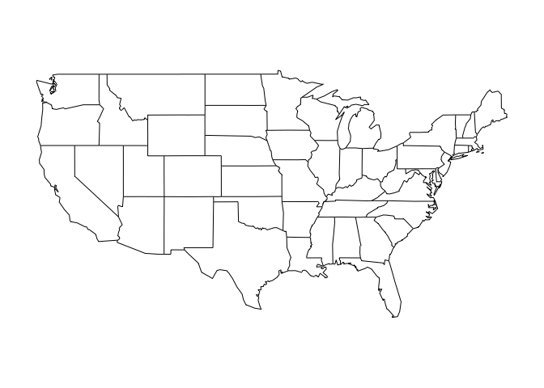

# Reproducible Research II
Adam M. Wilson  
September 2015  


Load these packages in a code chunk:


```r
library(dplyr)
library(tidyr)
library(ggplot2)
library(maps)
library(spocc)
```


# Download data

## Daily ozone data from the EPA
The data are available from 1990 through 2015, but for now we'll just use 2013:2014.  If you want to extend the analysis, feel free to change this.  

```r
years=2013:2014

files=paste0("http://aqsdr1.epa.gov/aqsweb/aqstmp/airdata/daily_44201_",years,".zip")

files
```

```
## [1] "http://aqsdr1.epa.gov/aqsweb/aqstmp/airdata/daily_44201_2013.zip"
## [2] "http://aqsdr1.epa.gov/aqsweb/aqstmp/airdata/daily_44201_2014.zip"
```

### Create a directory to hold the data.

```r
datadir="data"
```

### Write a simple download function

1. Checks if file already exists
2. If needed, downloads the file.
3. Unzips the file into our `datadir`


```r
downloadData=function(file,overwrite=F){
  cfile=sub("zip","csv",file)%>%basename()  #get filename
  if(file.exists(file.path(datadir,cfile))) {
    return("File exists")
  }
  temp <- tempfile()  # make a filename for a temporary file
  download.file(file,temp)  # download the zipped file from the website
  unzip(temp,exdir=datadir)  # unzip the data to our datadir
  file.remove(temp)  # remove the zipped file
}
```
  

Try running that for just one year:

```r
downloadData(files[1])
```

```
## [1] "File exists"
```

### Download all desired years with a simple `for()` loop


```r
for(f in files){
  downloadData(f)
}
```


## Load Data

### Another function to load all available datasets

```r
loadData <- function(path) { 
  files <- dir(path, pattern = '\\.csv', full.names = TRUE)
  tables <- lapply(files, read.csv, stringsAsFactors=F)
  dplyr::bind_rows(tables)
}
```

> Use two colons (`::`) to call a function from a package without explicitly loading the package.

### Import the data


```r
d=loadData(datadir)

d
```

```
## Source: local data frame [775,421 x 29]
## 
##    State.Code County.Code Site.Num Parameter.Code   POC Latitude Longitude
##         (int)       (int)    (int)          (int) (int)    (dbl)     (dbl)
## 1           1           3       10          44201     1   30.498 -87.88141
## 2           1           3       10          44201     1   30.498 -87.88141
## 3           1           3       10          44201     1   30.498 -87.88141
## 4           1           3       10          44201     1   30.498 -87.88141
## 5           1           3       10          44201     1   30.498 -87.88141
## 6           1           3       10          44201     1   30.498 -87.88141
## 7           1           3       10          44201     1   30.498 -87.88141
## 8           1           3       10          44201     1   30.498 -87.88141
## 9           1           3       10          44201     1   30.498 -87.88141
## 10          1           3       10          44201     1   30.498 -87.88141
## ..        ...         ...      ...            ...   ...      ...       ...
## Variables not shown: Datum (chr), Parameter.Name (chr), Sample.Duration
##   (chr), Pollutant.Standard (chr), Date.Local (chr), Units.of.Measure
##   (chr), Event.Type (chr), Observation.Count (int), Observation.Percent
##   (dbl), Arithmetic.Mean (dbl), X1st.Max.Value (dbl), X1st.Max.Hour (int),
##   AQI (int), Method.Code (lgl), Method.Name (chr), Local.Site.Name (chr),
##   Address (chr), State.Name (chr), County.Name (chr), City.Name (chr),
##   CBSA.Name (chr), Date.of.Last.Change (chr)
```


```r
d%>%
  separate(col=Date.Local,into=c("year","month","day"),sep="-")%>%
  group_by(Latitude,Longitude,year)%>%
  summarise(mean=mean(Arithmetic.Mean,na.rm=T))
```

```
## Source: local data frame [2,596 x 4]
## Groups: Latitude, Longitude [?]
## 
##    Latitude  Longitude  year        mean
##       (dbl)      (dbl) (chr)       (dbl)
## 1  18.17794  -65.91548  2013 0.005603086
## 2  18.17794  -65.91548  2014 0.013053035
## 3  18.42009  -66.15062  2014 0.008434862
## 4  18.44077  -66.12653  2013 0.006676850
## 5  18.44077  -66.12653  2014 0.004670354
## 6  21.30338 -157.87117  2013 0.020411669
## 7  21.30338 -157.87117  2014 0.021360855
## 8  21.32374 -158.08861  2013 0.026238105
## 9  21.32374 -158.08861  2014 0.021141490
## 10 25.58638  -80.32681  2013 0.027426165
## ..      ...        ...   ...         ...
```


## Get polygon layer of states

```r
usa=map("state")
```

 

```r
d%>%filter(State.Name=="New York")%>%
  select(Latitude, Longitude, County.Name, Address)%>% distinct()
```

```
## Source: local data frame [31 x 4]
## 
##    Latitude Longitude County.Name
##       (dbl)     (dbl)       (chr)
## 1  42.68075 -73.75733      Albany
## 2  40.81618 -73.90200       Bronx
## 3  40.86790 -73.87809       Bronx
## 4  42.49963 -79.31881  Chautauqua
## 5  41.78555 -73.74136    Dutchess
## 6  42.99328 -78.77153        Erie
## 7  44.36608 -73.90312       Essex
## 8  44.39308 -73.85890       Essex
## 9  43.97310 -74.22320       Essex
## 10 44.98058 -74.69500    Franklin
## ..      ...       ...         ...
## Variables not shown: Address (chr)
```

## Step 2: Load data


```r
## define which species to query
sp='Turdus migratorius'
```
This can take a few seconds.

## Step 3: Map it


```r
# Load coastline
map=map_data("world")

#ggplot(d,aes(x=longitude,y=latitude))+
##  geom_polygon(aes(x=long,y=lat,group=group,order=order),data=map)+
#  geom_point(col="red")+
#  coord_equal()
```


## Step 6:  Explore markdown functions

1. Use the Cheatsheet to add sections and some example narrative.  
2. Try changing changing the species name to your favorite species and re-run the report.  
3. Stage, Commit, Push!
4. Explore the markdown file on the GitHub website.  


## Colophon

Licensing: 
* Presentation: [CC-BY-3.0 ](http://creativecommons.org/licenses/by/3.0/us/)
* Source code: [MIT](http://opensource.org/licenses/MIT) 


## References

See Rmd file for full references and sources
