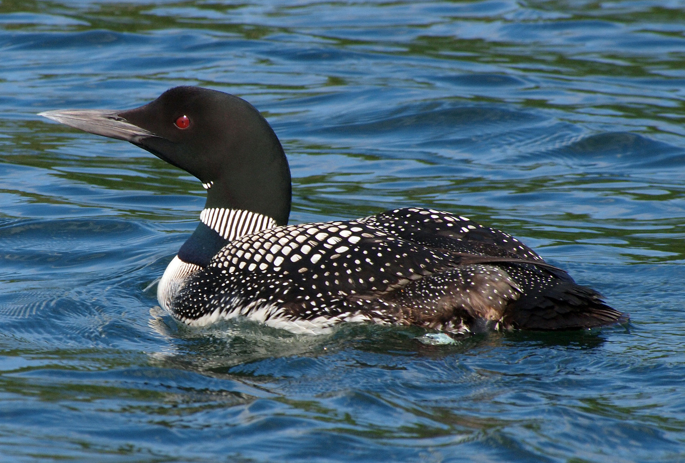
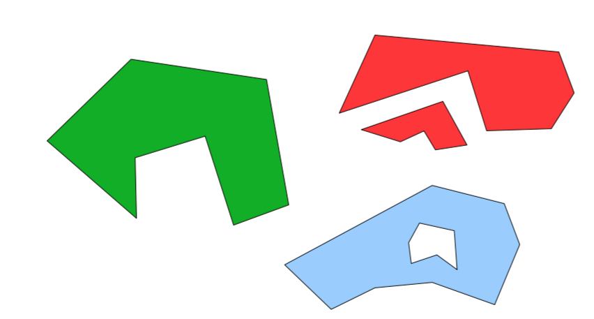

```{r, echo=FALSE, message=FALSE, results='hide', purl=FALSE}
## This chunk automatically generates a text .R version of this script when running within knitr.  You do not need to run this...
input  = knitr::current_input()  # filename of input document
output = paste(tools::file_path_sans_ext(input), 'R', sep = '.')
knitr::purl(input,output,documentation=2,quiet=T)
knitr::opts_chunk$set(cache=T,fig.width=7,fig.height=3,dpi=250)
```

# Setup

## Load packages
```{r,messages=F}
library(sp)
library(ggplot2)
library(dplyr)
library(tidyr)
```

# Point data

## Generate some random data
```{r}
coords = data.frame(
  x=rnorm(100),
  y=rnorm(100)
)
str(coords)
```

---

```{r}
plot(coords)
```

---

## Convert to `SpatialPoints`
```{r}
sp = SpatialPoints(coords)
str(sp)
```

---

## Create a `SpatialPointsDataFrame`

First generate a dataframe (analagous to the _attribute table_ in a shapefile)
```{r}
data=data.frame(ID=1:100,group=letters[1:20])
head(data)
```

---

Combine the coordinates with the data
```{r}
spdf = SpatialPointsDataFrame(coords, data)
spdf = SpatialPointsDataFrame(sp, data)

str(spdf)
```
Note the use of _slots_ designated with a `@`.  See `?slot` for more. 


## Promote a data frame with `coordinates()`
```{r}
coordinates(data) = cbind(coords$x, coords$y) 
```

```{r}
str(spdf)
```

## Subset data

```{r}
subset(spdf, group=="a")
```

Or using `[]`
```{r}
spdf[spdf$group=="a",]
```

Unfortunately, `dplyr` functions do not directly filter spatial objects.


## Extract point data from GBIF using `spocc` package

Use the `occ()` function to download all the _occurrence_ records for the Great Northern loon (_Gavia immer_) from eBird.



<small><small><small>Licensed under CC BY-SA 3.0 via [Wikimedia Commons](https://en.wikipedia.org/wiki/Great_northern_loon#/media/File:Gavia_immer_-Minocqua,_Wisconsin,_USA_-swimming-8.jpg)</small></small></small>

---

```{r} 
## define which species to query
library(spocc)
sp='Gavia immer'

## run the query and convert to data.frame()
d = occ(query=sp, from='ebird',limit = 1000) %>% occ2df()
```
This can take a few seconds.

## Your turn
_Promote_ the `d` object to a spatial points data.frame with `coordinates()`.

---

```{r,purl=F}
coordinates(d)=cbind(d$longitude,d$latitude)
#OR   coordinates(d)=c("longitude","latitude")
str(d)
```

---

Plot it with a world map
```{r, fig.height=2}
# Load coastline
map=map_data("world")

  ggplot(as.data.frame(d),aes(x=longitude,y=latitude))+
    geom_polygon(aes(x=long,y=lat,group=group,order=order),data=map)+
    geom_point(col="red")+
    coord_equal()
```

Note that `ggplot` works only with data.frames.  Convert with `as.data.frame()` or `fortify()`.

# Lines

---

### A `Line` is a single chain of points.

```{r}
L1 = Line(cbind(rnorm(5),rnorm(5)))
L2 = Line(cbind(rnorm(5),rnorm(5)))
L3 = Line(cbind(rnorm(5),rnorm(5)))
L1
```

---

```{r}
plot(coordinates(L1),type="l")
```

---

### A `Lines` is a list of chains with an ID

```{r}
Ls1 = Lines(list(L1),ID="a")
Ls2 = Lines(list(L2,L3),ID="b")
Ls2
```

---

### A `SpatialLines` is a list of Lines

```{r}
SL12 = SpatialLines(list(Ls1,Ls2))
plot(SL12)
```

---

### A `SpatialLinesDataFrame` is a `SpatialLines` with a matching `DataFrame`

```{r}
SLDF = SpatialLinesDataFrame(
  SL12,
  data.frame(
  Z=c("road","river"),
  row.names=c("a","b")
))
str(SLDF)
```

# Polygons

## Getting complicated



### Issues

* Multipart Polygons
* Holes

Rarely construct _by hand_...

# Importing data

## Geospatial Data Abstraction Library ([GDAL](gdal.org))

`rgdal` package for importing/exporting/manipulating spatial data:

* `readOGR()` and `writeOGR()`: Vector data
* `readGDAL()` and `writeGDAL()`: Raster data

Also the `gdalUtils` package for reprojecting, transforming, reclassifying, etc.

## maptools package

* `readShapeSpatial`

```{r}
file=system.file("shapes/sids.shp", package="maptools")
sids <- readShapeSpatial(file)
summary(sids)
```

# Coordinate Systems

* Earth isn't flat
* But small parts of it are near enough
* Many coordinate systems exist
* Anything `Spatial*` (or `raster*`) can have one

## Specifying the coordinate system

### The [Proj.4](https://trac.osgeo.org/proj/) library
Library for performing conversions between cartographic projections. 

See [http://spatialreference.org](http://spatialreference.org) for information on specifying projections. For example, 

---

#### Specifying coordinate systems 

**WGS 84**:

* proj4: <br><small>`+proj=longlat +ellps=WGS84 +datum=WGS84 +no_defs`</small>
* .prj / ESRI WKT: <small>`GEOGCS["GCS_WGS_1984",DATUM["D_WGS_1984",`<br>`
SPHEROID["WGS_1984",6378137,298.257223563]],`<br>`
PRIMEM["Greenwich",0],UNIT["Degree",0.017453292519943295]]`</small>
* EPSG:`4326`

---

No Projection specified:

```{r}
 sp = SpatialPoints(coords)
```

Specify at construction time:
```{r}
 sp = SpatialPoints(
          coords,
          proj4string = CRS("+init=epsg:4326")
       )

str(sp)
```

---

Specify after loading:
```{r}
 proj4string(sp) = CRS("+init=epsg:4326")
```


## Spatial Transform

Assigning a CRS doesn't change the numbers
So assigning the wrong CRS really messes things up


Transform (_warp_) projection from one to another with `spTransform`

---

The _eBird_ data should all be from GPS (WGS84):

```{r}
proj4string(d)=CRS("+init=epsg:4326")
```

Project it to the US National Atlas Equal Area (Lambert azimuthal equal-area projection):
```{r}
dUS = spTransform(d,CRS("+proj=laea +lat_0=45 +lon_0=-100 +x_0=0 +y_0=0 +a=6370997 +b=6370997 +units=m +no_defs"))
```

Compare the _bounding box_:
```{r}
bbox(d)
bbox(dUS)
```

# Summary

Coming up:  `Raster` package for working with raster data


## Colophon

Sources:

* [UseR 2012 Spatial Data Workshop](http://www.maths.lancs.ac.uk/~rowlings/Teaching/UseR2012/index.html) by Barry Rowlingson

Licensing: 

* Presentation: [CC-BY-3.0 ](http://creativecommons.org/licenses/by/3.0/us/)
* Source code: [MIT](http://opensource.org/licenses/MIT) 

