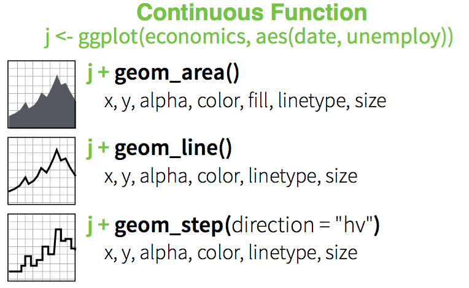
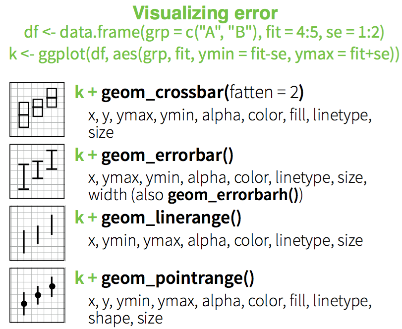
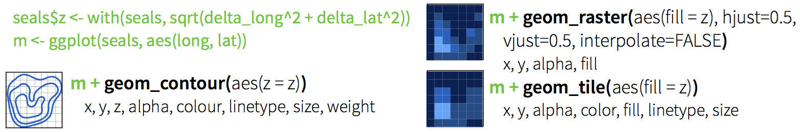
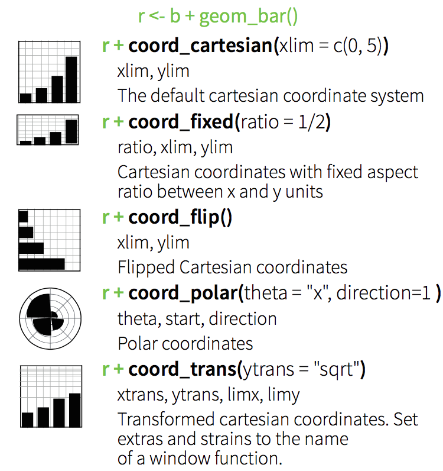

```{r, echo=FALSE, message=FALSE, results='hide', purl=FALSE}
## This chunk automatically generates a text .R version of this script when running within knitr.  You do not need to run this...
input  = knitr::current_input()  # filename of input document
output = paste(tools::file_path_sans_ext(input), 'R', sep = '.')
knitr::purl(input,output,documentation=2,quiet=T)
knitr::opts_chunk$set(cache=T,fig.width=7,fig.height=3,dpi=250)
```

## [`ggplot2`](http://ggplot2.org)
The _grammar of graphics_:  consistent aesthetics, multidimensional conditioning, and step-by-step plot building.

* **dataset** with mappings from variables to aesthetics
* one or more **layers**
* one **scale** for each aesthetic mapping
* a **coordinate** system,
* the **facet** specification (conditioning)

```{r}
library(ggplot2)
```

---


---


```{r,fig.width=7,fig.height=3}
p <- ggplot(mpg, aes(x=hwy, y=cty))
p + geom_point()
```

---


## Simple scatterplot

```{r}
p <- ggplot(mtcars, aes(x=wt, y=mpg))
p + geom_point()
```

## Add aesthetic mappings

### Set color by # of cylinders
```{r}
p + geom_point(aes(colour = factor(cyl)))
```

---

### Set shape using # of cylinders 
```{r}
p + geom_point(aes(shape = factor(cyl)))
```

---

### Adjust size by `qsec` 
```{r}
p + geom_point(aes(size = qsec))
```

---

### Add a linear model
```{r}
p + geom_point() + geom_smooth(method="lm")
```

---

### Change scale color

```{r}
p + geom_point(aes(colour = cyl)) + scale_colour_gradient(low = "blue")
```

---

### Change scale shapes

```{r}
p + geom_point(aes(shape = factor(cyl))) + scale_shape(solid = FALSE)
```

---

### Set aesthetics to fixed value
```{r}
ggplot(mtcars, aes(wt, mpg)) + geom_point(colour = "red", size = 3)
```


## Transparancy
Varying alpha is useful for large datasets
```{r}
d <- ggplot(diamonds, aes(carat, price))
d + geom_point(alpha = 1/10)
```

---

```{r}
d + geom_point(alpha = 1/20)
```

--- 

```{r}
d + geom_point(alpha = 1/100)
```

## Other Plot types

---


---



---


---


---



---

### Three Variables


---

### Stats
Visualize a data transformation


* Each stat creates additional variables with a common ``..name..`` syntax
* Often two ways: `stat_bin(geom="bar")`  OR  `geom_bar(stat="bin")`

---


---


## Specifying Scales


---

### Discrete color: default

```{r}
b=ggplot(mpg,aes(fl))+geom_bar( aes(fill = fl)); b
```

---

### Discrete color: brewer

```{r}
b+scale_fill_brewer( palette = "Blues")
```


---

### Discrete color: greys

```{r}
b+scale_fill_grey( start = 0.2, end = 0.8, na.value = "red")
```

---

### Continuous color: defaults

```{r}
a <- ggplot(mpg, aes(hwy)) + geom_dotplot( aes(fill = ..x..)); a
```

---

### Continuous color: `gradient`

```{r}
a + scale_fill_gradient( low = "red", high = "yellow")
```

---

### Continuous color: `gradient2`

```{r}
a + scale_fill_gradient2(low = "red", high = "blue", mid = "white", midpoint = 25)
```

---

### Continuous color: `gradientn`

```{r}
a + scale_fill_gradientn( colours = rainbow(10))
```

## Coordinate Systems



## Position


## Themes


## Colophon

Sources:
*  [ggplot cheatsheet](https://www.rstudio.com/wp-content/uploads/2015/03/ggplot2-cheatsheet.pdf)
* 

Licensing: 
* Presentation: [CC-BY-3.0 ](http://creativecommons.org/licenses/by/3.0/us/)
* Source code: [MIT](http://opensource.org/licenses/MIT) 

