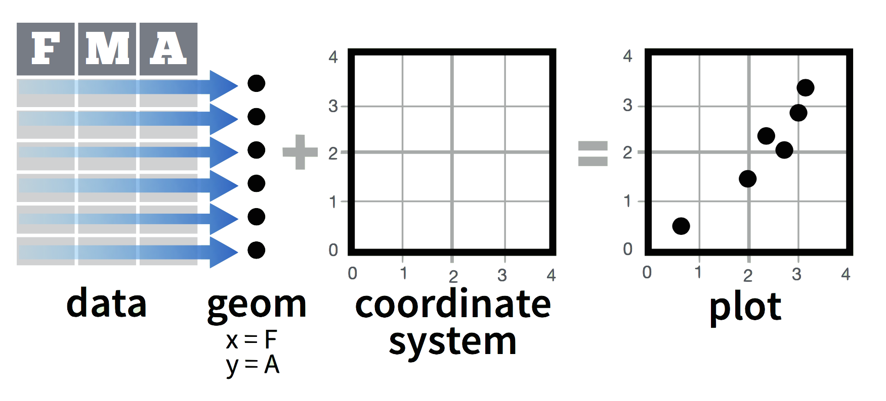
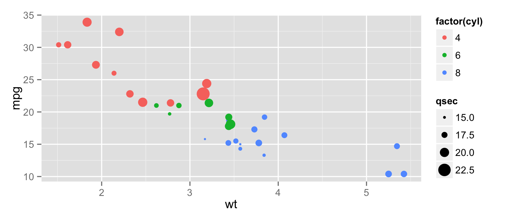
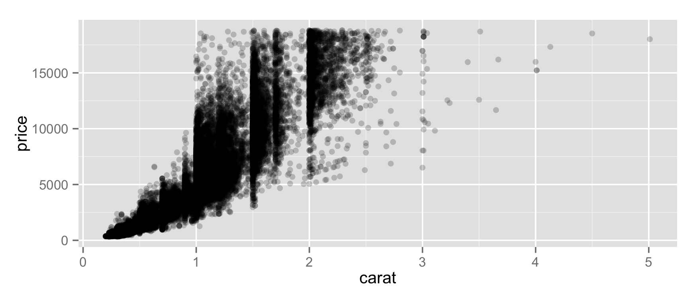

# Introduction to ggplot2
Adam M. Wilson  
September 2015  


## [`ggplot2`](http://ggplot2.org)
The _grammar of graphics_:  consistent aesthetics, multidimensional conditioning, and step-by-step plot building.

* **dataset** with mappings from variables to aesthetics
* one or more **layers**
* one **scale** for each aesthetic mapping
* a **coordinate** system,
* the **facet** specification (conditioning)


```r
library(ggplot2)
```

---



---


```r
p <- ggplot(mpg, aes(x=hwy, y=cty))
p + geom_point()
```

 

---


## Simple scatterplot


```r
p <- ggplot(mtcars, aes(x=wt, y=mpg))
p + geom_point()
```

 

## Add aesthetic mappings

### Set color by # of cylinders

```r
p + geom_point(aes(colour = factor(cyl)))
```

 

---

### Set shape using # of cylinders 

```r
p + geom_point(aes(shape = factor(cyl)))
```

 

---

### Adjust size by `qsec` 

```r
p + geom_point(aes(size = qsec))
```

 

---

### Add a linear model

```r
p + geom_point() + geom_smooth(method="lm")
```

 

---

### Change scale color


```r
p + geom_point(aes(colour = cyl)) + scale_colour_gradient(low = "blue")
```

 

---

### Change scale shapes


```r
p + geom_point(aes(shape = factor(cyl))) + scale_shape(solid = FALSE)
```

 

---

### Set aesthetics to fixed value

```r
ggplot(mtcars, aes(wt, mpg)) + geom_point(colour = "red", size = 3)
```

 


## Transparancy
Varying alpha is useful for large datasets

```r
d <- ggplot(diamonds, aes(carat, price))
d + geom_point(alpha = 1/10)
```

 

---


```r
d + geom_point(alpha = 1/20)
```

 

--- 


```r
d + geom_point(alpha = 1/100)
```

 

## Other Plot types

---


---


---


---


---


---

### Three Variables


---

### Stats
Visualize a data transformation


* Each stat creates additional variables with a common ``..name..`` syntax
* Often two ways: `stat_bin(geom="bar")`  OR  `geom_bar(stat="bin")`

---


---


## Specifying Scales


---

### Discrete color: default


```r
b=ggplot(mpg,aes(fl))+geom_bar( aes(fill = fl)); b
```

 

---

### Discrete color: brewer


```r
b+scale_fill_brewer( palette = "Blues")
```

 


---

### Discrete color: greys


```r
b+scale_fill_grey( start = 0.2, end = 0.8, na.value = "red")
```

 

---

### Continuous color: defaults


```r
a <- ggplot(mpg, aes(hwy)) + geom_dotplot( aes(fill = ..x..)); a
```

```
## stat_bindot: binwidth defaulted to range/30. Use 'binwidth = x' to adjust this.
```

 

---

### Continuous color: `gradient`


```r
a + scale_fill_gradient( low = "red", high = "yellow")
```

```
## stat_bindot: binwidth defaulted to range/30. Use 'binwidth = x' to adjust this.
```

 

---

### Continuous color: `gradient2`


```r
a + scale_fill_gradient2(low = "red", high = "blue", mid = "white", midpoint = 25)
```

```
## stat_bindot: binwidth defaulted to range/30. Use 'binwidth = x' to adjust this.
```

 

---

### Continuous color: `gradientn`


```r
a + scale_fill_gradientn( colours = rainbow(10))
```

```
## stat_bindot: binwidth defaulted to range/30. Use 'binwidth = x' to adjust this.
```

 

## Coordinate Systems


## Position


## Themes


## Colophon

Sources:
*  [ggplot cheatsheet](https://www.rstudio.com/wp-content/uploads/2015/03/ggplot2-cheatsheet.pdf)
* 

Licensing: 
* Presentation: [CC-BY-3.0 ](http://creativecommons.org/licenses/by/3.0/us/)
* Source code: [MIT](http://opensource.org/licenses/MIT) 

