# Introduction to Raster Package
Adam M. Wilson  
October 2015  


## Today

* More vector analysis and plotting
* Introduction to Raster data processing

> Shifting to longer in-class excercises


## Libraries


```r
library(dplyr)
library(tidyr)
library(sp)
library(ggplot2)

# Three new libraries
library(rgeos)
library(raster)
library(rasterVis)  #visualization library for raster
```

# RGEOS

## RGEOS package for polygon operations

* Area calculations (`gArea`)
* Centroids (`gCentroid`)
* Convex Hull (`gConvexHull`)
* Intersections (`gIntersection`)
* Unions (`gUnion`)
* Simplification (`gSimplify`)

If you have trouble installing `rgeos` on OS X, look [here](http://dyerlab.bio.vcu.edu/2015/03/31/install-rgeos-on-osx/)


## Example: gSimplify

Make up some lines and polygons:

```r
p = readWKT(paste("POLYGON((0 40,10 50,0 60,40 60,40 100,50 90,60 100,60",
 "60,100 60,90 50,100 40,60 40,60 0,50 10,40 0,40 40,0 40))"))
l = readWKT("LINESTRING(0 7,1 6,2 1,3 4,4 1,5 7,6 6,7 4,8 6,9 4)")
```

---


```r
par(mfrow=c(2,4))
plot(p);title("Original")
plot(gSimplify(p,tol=10));title("tol: 10")
plot(gSimplify(p,tol=20));title("tol: 20")
plot(gSimplify(p,tol=25));title("tol: 25")

plot(l);title("Original")
plot(gSimplify(l,tol=3));title("tol: 3")
plot(gSimplify(l,tol=5));title("tol: 5")
plot(gSimplify(l,tol=7));title("tol: 7")
```

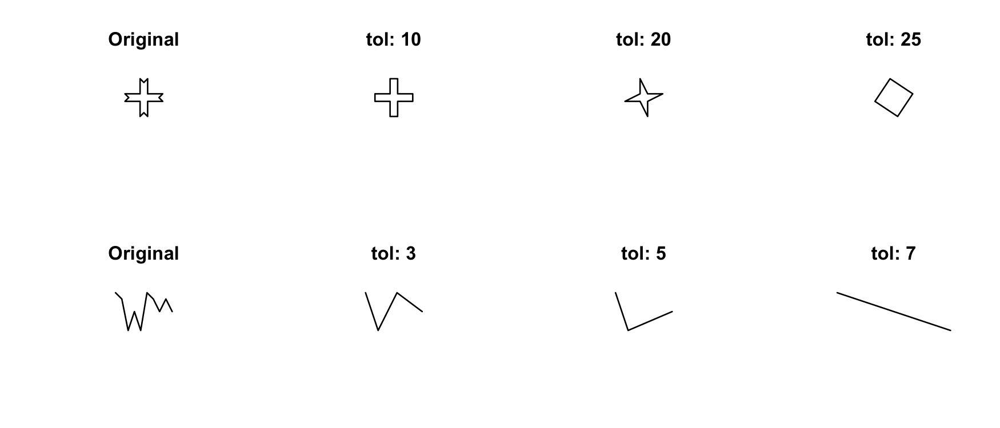 

```r
par(mfrow=c(1,1))
```

# Raster Package

## getData

Raster package includes access to some useful datasets with `getData()`:

* Elevation (SRTM 90m resolution)
* World Climate (Tmin, Tmax, Precip, BioClim)
* Countries from CIA factsheet (vector!)
* Global Admin boundaries (vector!)

---

`getData()` Steps:

1. _Select Dataset_: ‘GADM’ returns the global administrative boundaries.
2. _Select country_: Country name of the boundaries using its ISO A3 country code
3. _Specify level_: Level of of administrative subdivision (0=country, 1=first level subdivision).


## GADM:  Global Administrative Areas
Administrative areas in this database are countries and lower level subdivisions.  

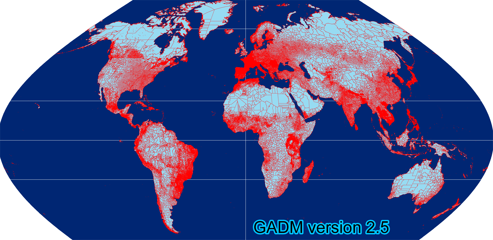

---

Divided by country (see website for full dataset).  Explore country list:

```r
getData("ISO3")%>%
  as.data.frame%>%
  filter(NAME=="South Africa")
```

```
##   ISO3         NAME
## 1  ZAF South Africa
```

---

Download data for South Africa


```r
za=getData('GADM', country='ZAF', level=1)
```


```r
plot(za)
```

 

Danger: `plot()` works, but can be slow for complex polygons.

---

### Check out attribute table


```r
za@data
```

```
##     PID ID_0 ISO       NAME_0 ID_1                NAME_1 NL_NAME_1
## 1  2725  209 ZAF South Africa    1          Eastern Cape          
## 2  2726  209 ZAF South Africa    2               Gauteng          
## 3  2727  209 ZAF South Africa    3         KwaZulu-Natal          
## 4  2728  209 ZAF South Africa    4               Limpopo          
## 5  2729  209 ZAF South Africa    5            Mpumalanga          
## 6  2730  209 ZAF South Africa    6            North West          
## 7  2731  209 ZAF South Africa    7         Northern Cape          
## 8  2732  209 ZAF South Africa    8     Orange Free State          
## 9  2733  209 ZAF South Africa    9 Prince Edward Islands          
## 10 2734  209 ZAF South Africa   10          Western Cape          
##                                                    VARNAME_1    TYPE_1
## 1                                                   Oos-Kaap Provinsie
## 2                                Pretoria/Witwatersrand/Vaal Provinsie
## 3                                         Natal and Zululand Provinsie
## 4  Noordelike Provinsie|Northern Transvaal|Northern Province Provinsie
## 5                                          Eastern Transvaal Provinsie
## 6                                        North-West|Noordwes Provinsie
## 7                                                 Noord-Kaap Provinsie
## 8                                        Free State|Vrystaat Provinsie
## 9                                                                     
## 10                                                  Wes-Kaap Provinsie
##    ENGTYPE_1
## 1   Province
## 2   Province
## 3   Province
## 4   Province
## 5   Province
## 6   Province
## 7   Province
## 8   Province
## 9           
## 10  Province
```

---


```r
za=subset(za,NAME_1!="Prince Edward Islands")
plot(za)
```

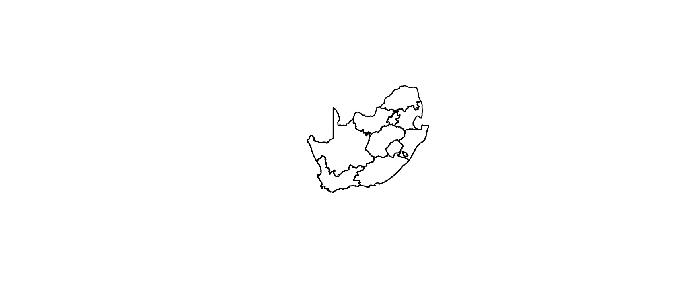 

---

## Your turn

Use the method above to download and plot the boundaries for a country of your choice.

---


```r
getData("ISO3")%>%
  as.data.frame%>%
  filter(NAME=="Tunisia")
```

```
##   ISO3    NAME
## 1  TUN Tunisia
```

```r
tun=getData('GADM', country='TUN', level=1)
plot(tun)
```

 

---

## Simplify polygons with RGEOS


```r
za2=gSimplify(za,tol = 0.1,topologyPreserve=T)
plot(za,lwd=2)
plot(za2,border="red",add=T)
```

## Calculate area by province


```r
za$area=gArea(za,byid = T)
```

```
## Warning in RGEOSMiscFunc(spgeom, byid, "rgeos_area"): Spatial object is not
## projected; GEOS expects planar coordinates
```

---

## Selecting a Projection
For help selecting a projection, see the [projection wizard](http://projectionwizard.org)

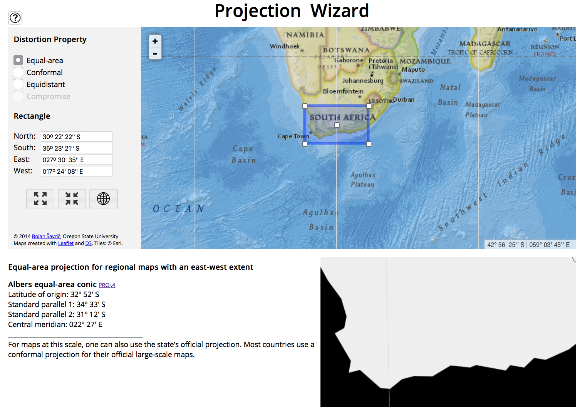

---

### Plot by area with `spplot()`


```r
za$area=
  spTransform(za,CRS("+proj=aea +lat_1=-34.55302083711272 +lat_2=-31.208904317916957 +lon_0=22.4560546875"))%>%
  gArea(byid = T)/(1000*1000)

spplot(za,zcol="area")
```

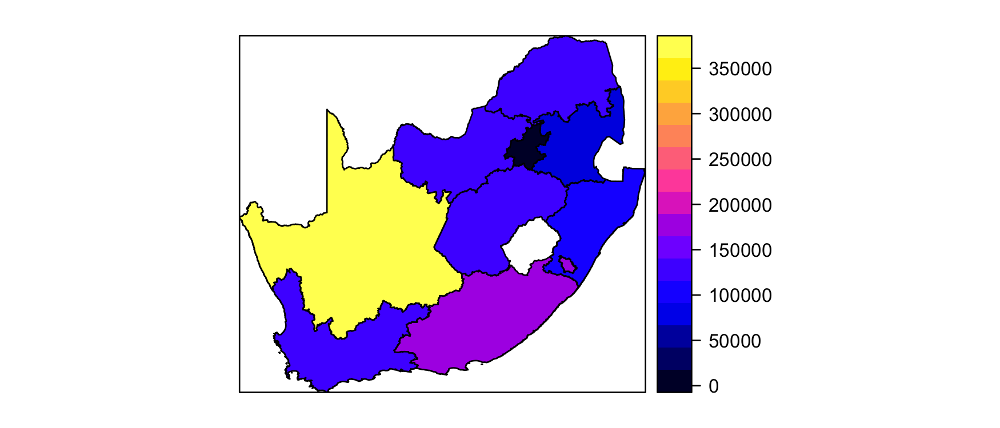 


## Union

Merge sub-geometries together with `gUnionCascaded()`


```r
za2=gUnionCascaded(za)
```

## Plotting vectors with ggplot

`fortify()` in `ggplot` useful for converting `Spatial*` objects into plottable data.frames.  


```r
head(fortify(za))
```

```
##       long       lat order  hole piece group id
## 1 29.12268 -30.10995     1 FALSE     1   1.1  1
## 2 29.12222 -30.11361     2 FALSE     1   1.1  1
## 3 29.11806 -30.11778     3 FALSE     1   1.1  1
## 4 29.11472 -30.12111     4 FALSE     1   1.1  1
## 5 29.10917 -30.12444     5 FALSE     1   1.1  1
## 6 29.10772 -30.12532     6 FALSE     1   1.1  1
```

---


```r
ggplot(fortify(za),aes(x=long,y=lat,group=group,order=order))+
  geom_path()+
  geom_path(data=fortify(za2),
            mapping=aes(x=long,y=lat,
                        group=group,order=order),
            col="red")+
  coord_equal()
```

```
## Regions defined for each Polygons
```

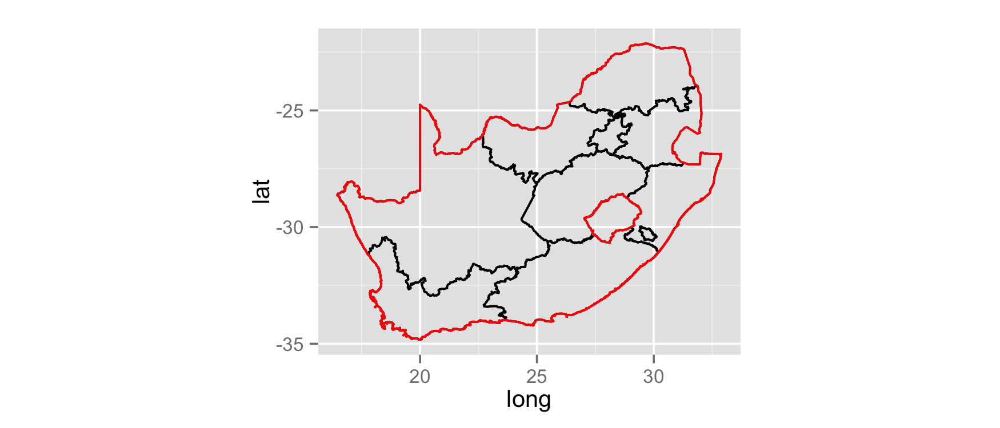 

# Raster Data

## Raster introduction

Spatial data structure dividing region ('grid') into rectangles (’cells’ or ’pixels’) storing one or more values each.

<small> Some examples from the [Raster vignette](http://cran.r-project.org/web/packages/raster/vignettes/Raster.pdf) by Robert J. Hijmans. </small>

* `rasterLayer`: 1 band
* `rasterStack`: Multiple Bands
* `rasterBrick`: Multiple Bands of _same_ thing.

---


```r
x <- raster()
x
```

```
## class       : RasterLayer 
## dimensions  : 180, 360, 64800  (nrow, ncol, ncell)
## resolution  : 1, 1  (x, y)
## extent      : -180, 180, -90, 90  (xmin, xmax, ymin, ymax)
## coord. ref. : +proj=longlat +datum=WGS84 +ellps=WGS84 +towgs84=0,0,0
```


```r
str(x)
```

```
## Formal class 'RasterLayer' [package "raster"] with 12 slots
##   ..@ file    :Formal class '.RasterFile' [package "raster"] with 13 slots
##   .. .. ..@ name        : chr ""
##   .. .. ..@ datanotation: chr "FLT4S"
##   .. .. ..@ byteorder   : chr "little"
##   .. .. ..@ nodatavalue : num -Inf
##   .. .. ..@ NAchanged   : logi FALSE
##   .. .. ..@ nbands      : int 1
##   .. .. ..@ bandorder   : chr "BIL"
##   .. .. ..@ offset      : int 0
##   .. .. ..@ toptobottom : logi TRUE
##   .. .. ..@ blockrows   : int 0
##   .. .. ..@ blockcols   : int 0
##   .. .. ..@ driver      : chr ""
##   .. .. ..@ open        : logi FALSE
##   ..@ data    :Formal class '.SingleLayerData' [package "raster"] with 13 slots
##   .. .. ..@ values    : logi(0) 
##   .. .. ..@ offset    : num 0
##   .. .. ..@ gain      : num 1
##   .. .. ..@ inmemory  : logi FALSE
##   .. .. ..@ fromdisk  : logi FALSE
##   .. .. ..@ isfactor  : logi FALSE
##   .. .. ..@ attributes: list()
##   .. .. ..@ haveminmax: logi FALSE
##   .. .. ..@ min       : num Inf
##   .. .. ..@ max       : num -Inf
##   .. .. ..@ band      : int 1
##   .. .. ..@ unit      : chr ""
##   .. .. ..@ names     : chr ""
##   ..@ legend  :Formal class '.RasterLegend' [package "raster"] with 5 slots
##   .. .. ..@ type      : chr(0) 
##   .. .. ..@ values    : logi(0) 
##   .. .. ..@ color     : logi(0) 
##   .. .. ..@ names     : logi(0) 
##   .. .. ..@ colortable: logi(0) 
##   ..@ title   : chr(0) 
##   ..@ extent  :Formal class 'Extent' [package "raster"] with 4 slots
##   .. .. ..@ xmin: num -180
##   .. .. ..@ xmax: num 180
##   .. .. ..@ ymin: num -90
##   .. .. ..@ ymax: num 90
##   ..@ rotated : logi FALSE
##   ..@ rotation:Formal class '.Rotation' [package "raster"] with 2 slots
##   .. .. ..@ geotrans: num(0) 
##   .. .. ..@ transfun:function ()  
##   ..@ ncols   : int 360
##   ..@ nrows   : int 180
##   ..@ crs     :Formal class 'CRS' [package "sp"] with 1 slot
##   .. .. ..@ projargs: chr "+proj=longlat +datum=WGS84 +ellps=WGS84 +towgs84=0,0,0"
##   ..@ history : list()
##   ..@ z       : list()
```

---


```r
x <- raster(ncol=36, nrow=18, xmn=-1000, xmx=1000, ymn=-100, ymx=900)
res(x)
```

```
## [1] 55.55556 55.55556
```

```r
res(x) <- 100
res(x)
```

```
## [1] 100 100
```

```r
ncol(x)
```

```
## [1] 20
```

---


```r
# change the numer of columns (affects resolution)
ncol(x) <- 18
ncol(x)
```

```
## [1] 18
```

```r
res(x)
```

```
## [1] 111.1111 100.0000
```

## Raster data storage


```r
r <- raster(ncol=10, nrow=10)
ncell(r)
```

```
## [1] 100
```
But it is an empty raster

```r
hasValues(r)
```

```
## [1] FALSE
```

---

Use `values()` function:

```r
values(r) <- 1:ncell(r)
hasValues(r)
```

```
## [1] TRUE
```

```r
values(r)[1:10]
```

```
##  [1]  1  2  3  4  5  6  7  8  9 10
```


## Your Turn

Create and then plot a new raster with:

1. 100 rows
2. 50 columns
3. Fill it with random values (`rnorm()`)

---


```r
x=raster(nrow=100,ncol=50,vals=rnorm(100*50))
# OR
x= raster(nrow=100,ncol=50)
values(x)= rnorm(5000)

plot(x)
```

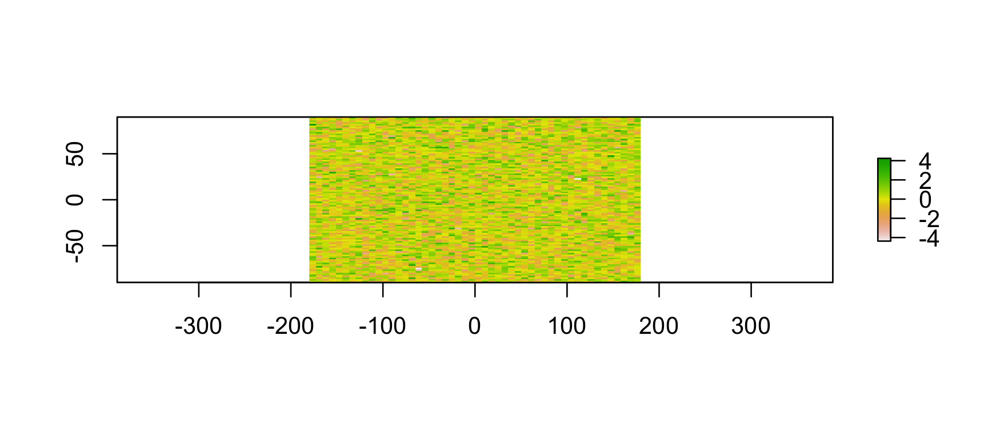 

---

Raster memory usage


```r
inMemory(r)
```

```
## [1] TRUE
```
> You can change the memory options using the `maxmemory` option in `rasterOptions()` 

## Raster Plotting

Plotting is easy (but slow) with `plot`.


```r
plot(r, main='Raster with 100 cells')
```

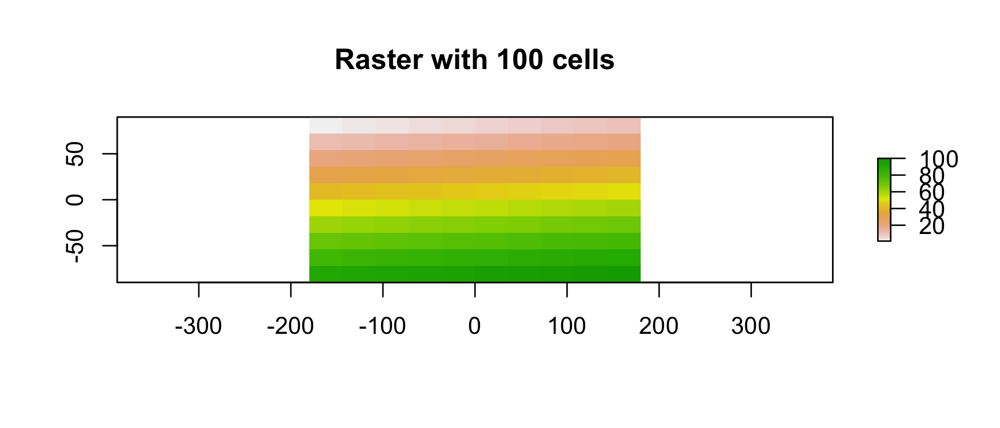 

---

### ggplot and rasterVis

rasterVis package has `gplot()` for plotting raster data


```r
gplot(r,maxpixels=50000)+
  geom_raster(aes(fill=value))
```

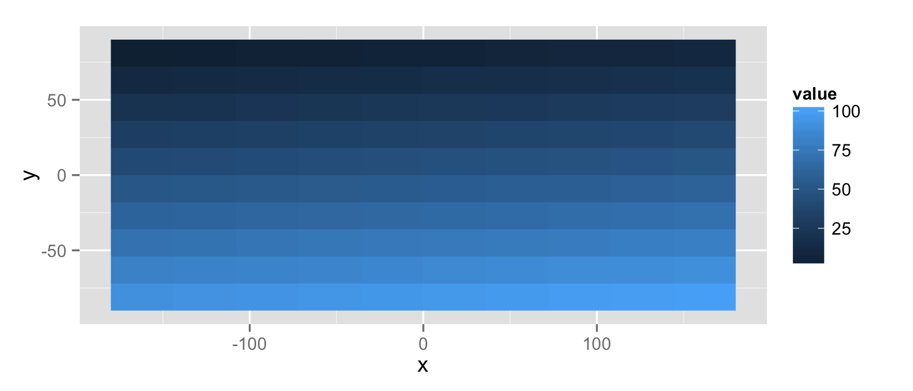 

---

Adjust `maxpixels` for faster plotting of large datasets.


```r
gplot(r,maxpixels=10)+
  geom_raster(aes(fill=value))
```

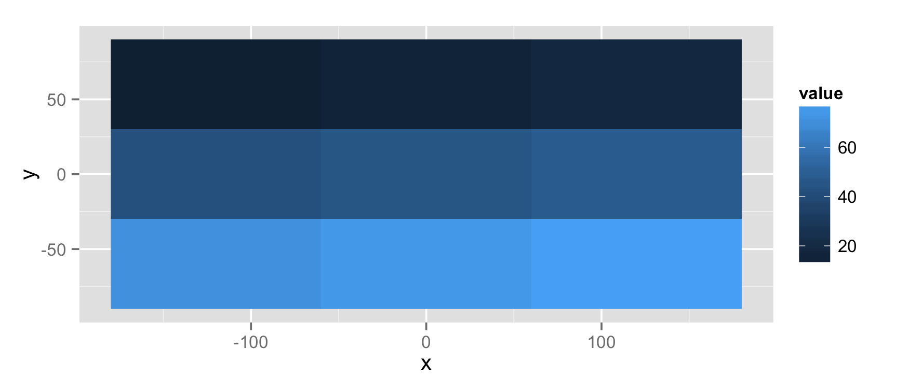 

---

Can use all the `ggplot` color ramps, etc.


```r
gplot(r)+geom_raster(aes(fill=value))+
    scale_fill_distiller(palette="OrRd")
```

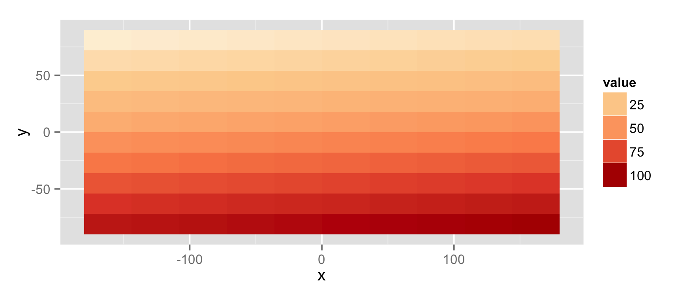 


## Spatial Projections

Raster package uses standard [coordinate reference system (CRS)](http://www.spatialreference.org).  

For example, see the projection format for the [_standard_ WGS84](http://www.spatialreference.org/ref/epsg/4326/).

```r
projection(r)
```

```
## [1] "+proj=longlat +datum=WGS84 +ellps=WGS84 +towgs84=0,0,0"
```

## Warping rasters

Use `projectRaster()` to _warp_ to a different projection.

`method=` `ngb` (for categorical) or `bilinear` (continuous)


```r
r2=projectRaster(r,crs="+proj=sinu +lon_0=0",method = )
```

```
## Warning in rgdal::rawTransform(projto_int, projfrom, nrow(xy), xy[, 1], :
## 48 projected point(s) not finite
```

```r
par(mfrow=c(1,2));plot(r);plot(r2)
```

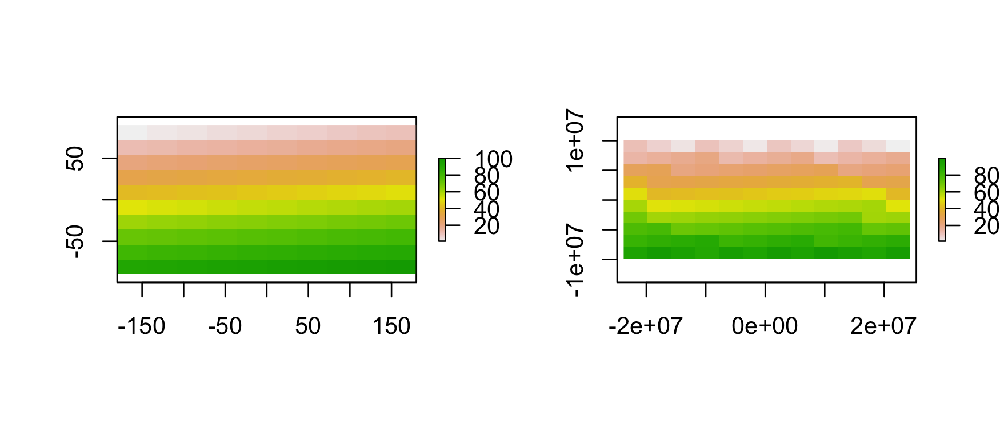 


# WorldClim

## Overview of WorldClim

Mean monthly climate and derived variables interpolated from weather stations on a 30 arc-second (~1km) grid.
See [worldclim.org](http://www.worldclim.org/methods)

---

## Bioclim variables

<small>

Variable      Description
----------    -------------
BIO1          Annual Mean Temperature
BIO2          Mean Diurnal Range (Mean of monthly (max temp – min temp))
BIO3          Isothermality (BIO2/BIO7) (* 100)
BIO4          Temperature Seasonality (standard deviation *100)
BIO5          Max Temperature of Warmest Month
BIO6          Min Temperature of Coldest Month
BIO7          Temperature Annual Range (BIO5-BIO6)
BIO8          Mean Temperature of Wettest Quarter
BIO9          Mean Temperature of Driest Quarter
BIO10         Mean Temperature of Warmest Quarter
BIO11         Mean Temperature of Coldest Quarter
BIO12         Annual Precipitation
BIO13         Precipitation of Wettest Month
BIO14         Precipitation of Driest Month
BIO15         Precipitation Seasonality (Coefficient of Variation)
BIO16         Precipitation of Wettest Quarter
BIO17         Precipitation of Driest Quarter
BIO18         Precipitation of Warmest Quarter
BIO19         Precipitation of Coldest Quarter

</small>


## Download climate data

Download the data:


```r
clim=getData('worldclim', var='bio', res=10)
```

`res` is resolution (0.5, 2.5, 5, and 10 minutes of a degree)

---

### Gain and Offset


```r
clim
```

```
## class       : RasterStack 
## dimensions  : 900, 2160, 1944000, 19  (nrow, ncol, ncell, nlayers)
## resolution  : 0.1666667, 0.1666667  (x, y)
## extent      : -180, 180, -60, 90  (xmin, xmax, ymin, ymax)
## coord. ref. : +proj=longlat +datum=WGS84 +ellps=WGS84 +towgs84=0,0,0 
## names       :  bio1,  bio2,  bio3,  bio4,  bio5,  bio6,  bio7,  bio8,  bio9, bio10, bio11, bio12, bio13, bio14, bio15, ... 
## min values  :  -269,     9,     8,    72,   -59,  -547,    53,  -251,  -450,   -97,  -488,     0,     0,     0,     0, ... 
## max values  :   314,   211,    95, 22673,   489,   258,   725,   375,   364,   380,   289,  9916,  2088,   652,   261, ...
```

Note the min/max of the raster.  What are the units?  Always check metadata, the [WorldClim temperature dataset](http://www.worldclim.org/formats) has a `gain` of 0.1, meaning that it must be multipled by 0.1 to convert back to degrees Celsius. Precipitation is in mm, so a gain of 0.1 would turn that into cm.


```r
gain(clim)=0.1
```

---

### Plot with `plot()`


```r
plot(clim)
```

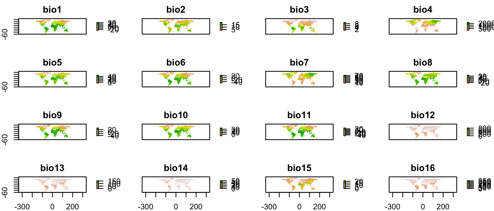 

--- 

## Faceting in ggplot

Or use `rasterVis` methods with gplot

```r
gplot(clim[[13:19]])+geom_raster(aes(fill=value))+
  facet_wrap(~variable)+
  scale_fill_gradientn(colours=c("brown","red","yellow","darkgreen","green"),trans="log10")+
  coord_equal()
```

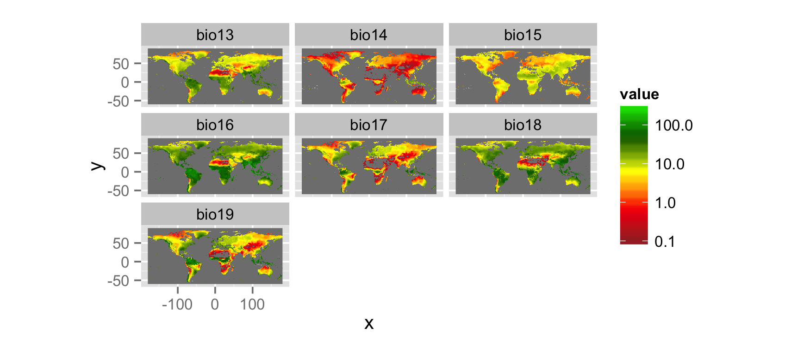 

---

Let's dig a little deeper into the data object:


```r
## is it held in RAM?
inMemory(clim)
```

```
## [1] FALSE
```

```r
## How big is it?
object.size(clim)
```

```
## 227920 bytes
```

```r
## can we work with it directly in RAM?
canProcessInMemory(clim)
```

```
## [1] TRUE
```


## Subsetting and spatial cropping

Use `[[1:3]]` to select raster layers from raster stack.


```r
r1 <- crop(clim[[1]], bbox(za))
## crop to a latitude/longitude box
r1 <- crop(clim[[1]], extent(10,35,-35,-20))
```

---


```r
r1
```

```
## class       : RasterLayer 
## dimensions  : 90, 150, 13500  (nrow, ncol, ncell)
## resolution  : 0.1666667, 0.1666667  (x, y)
## extent      : 10, 35, -35, -20  (xmin, xmax, ymin, ymax)
## coord. ref. : +proj=longlat +datum=WGS84 +ellps=WGS84 +towgs84=0,0,0 
## data source : in memory
## names       : bio1 
## values      : 5.8, 24.8  (min, max)
```

```r
plot(r1)
```

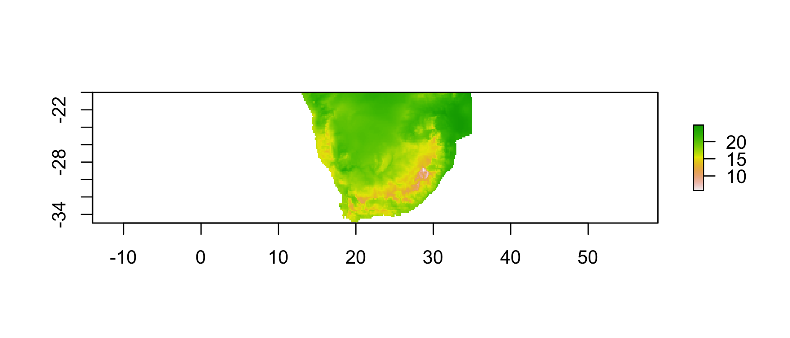 

## Spatial aggregation

```r
## aggregate using a function
aggregate(r1, 3, fun=mean) %>%
  plot()
```

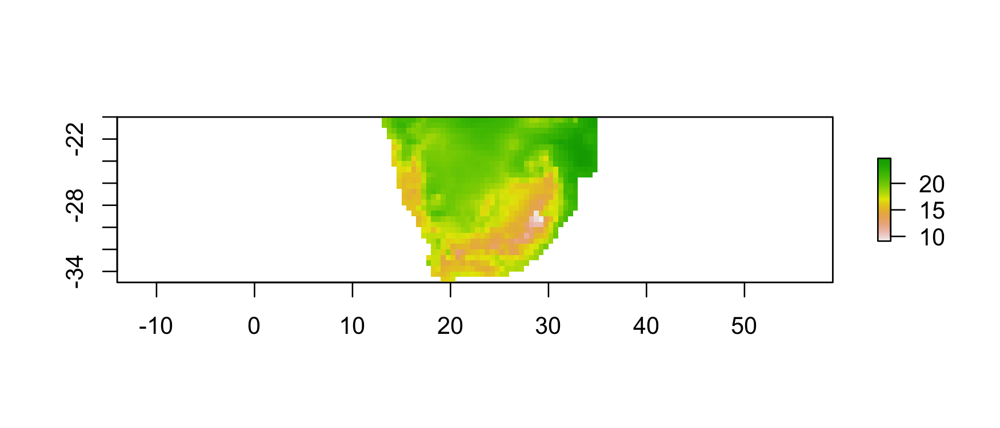 

## Your turn

Create a new raster by aggregating to the minimum (`min`) value of `r1` within a 10 pixel window

---


```r
aggregate(r1, 10, fun=min) %>%
  plot()
```

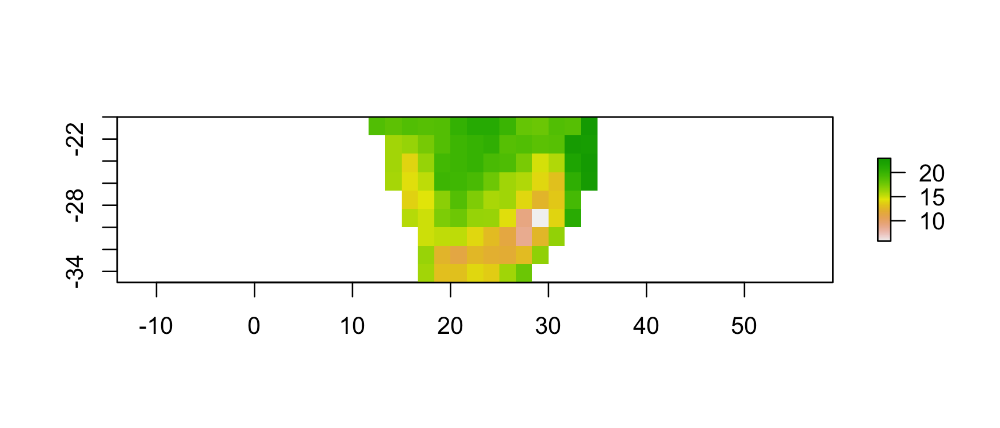 


## Focal ("moving window")

```r
## apply a function over a moving window
focal(r1, w=matrix(1,3,3), fun=mean) %>% 
  plot()
```

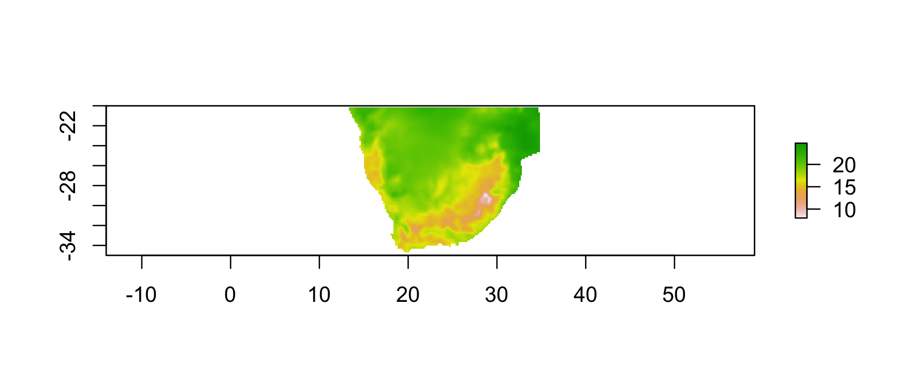 

---


```r
## apply a function over a moving window
rf_min <- focal(r1, w=matrix(1,11,11), fun=min)
rf_max <- focal(r1, w=matrix(1,11,11), fun=max)
rf_range=rf_max-rf_min

## or just use the range function
rf_range2 <- focal(r1, w=matrix(1,11,11), fun=range)
plot(rf_range2)
```

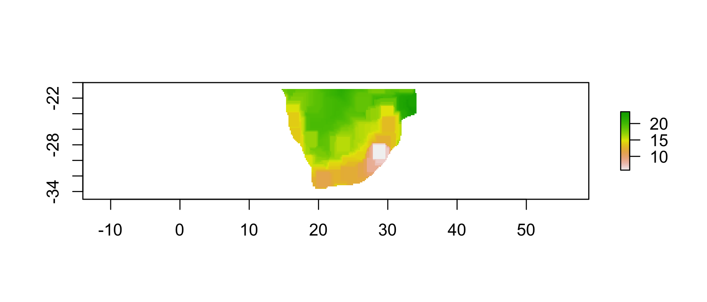 

## Your turn

Plot the focal standard deviation of `r1` over a 3x3 window.

---

```r
focal(r1,w=matrix(1,3,3),fun=sd)%>%
  plot()
```

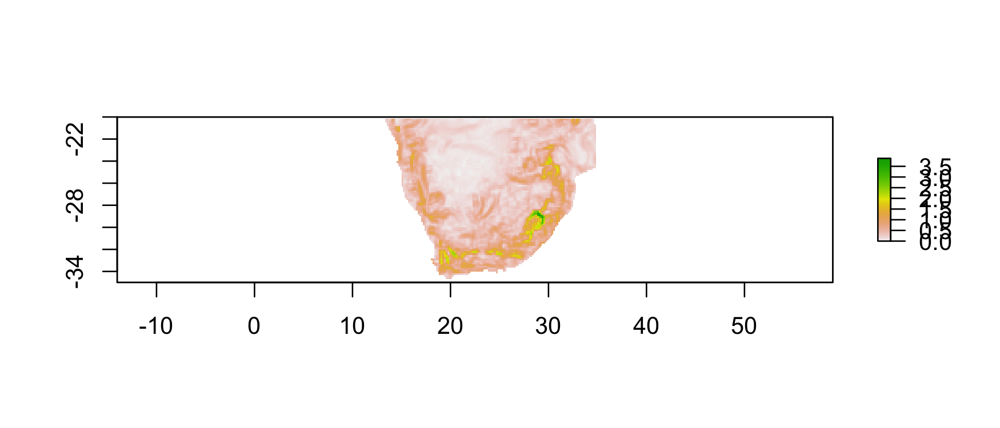 


## Raster calculations

the `raster` package has many options for _raster algebra_, including `+`, `-`, `*`, `/`, logical operators such as `>`, `>=`, `<`, `==`, `!` and functions such as `abs`, `round`, `ceiling`, `floor`, `trunc`, `sqrt`, `log`, `log10`, `exp`, `cos`, `sin`, `max`, `min`, `range`, `prod`, `sum`, `any`, `all`.

So, for example, you can 

```r
cellStats(r1,range)
```

```
## [1]  5.8 24.8
```

```r
## add 10
s = r1 + 10
cellStats(s,range)
```

```
## [1] 15.8 34.8
```

---


```r
## take the square root
s = sqrt(r1)
cellStats(s,range)
```

```
## [1] 2.408319 4.979960
```

```r
# round values
r = round(r1)
cellStats(r,range)
```

```
## [1]  6 25
```

```r
# find cells with values less than 15 degrees C
r = r1 < 15
plot(r)
```

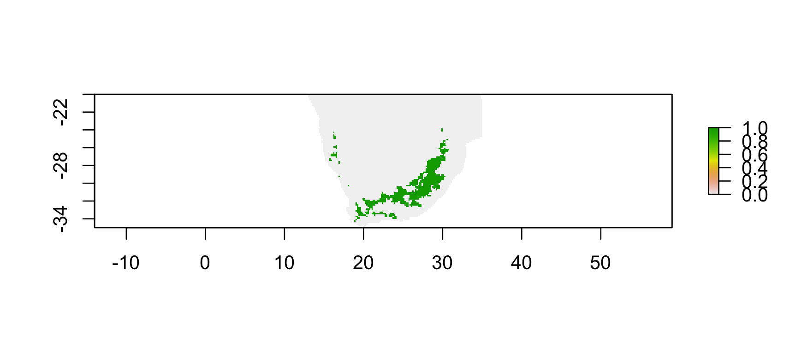 

---

### Apply algebraic functions

```r
# multiply s times r and add 5
s = s * r1 + 5
cellStats(s,range)
```

```
## [1]  18.96825 128.50300
```

## Extracting Raster Data

* points
* lines
* polygons
* extent (rectangle)
* cell numbers

Extract all intersecting values OR apply a summarizing function with `fun`.

---

### Point data

```r
## define which species to query
library(spocc)
sp='Protea repens'

## run the query and convert to data.frame()
d = occ(query=sp, from='gbif',limit = 1000, has_coords=T) %>% occ2df()
coordinates(d)=c("longitude","latitude")
projection(d)="+proj=longlat +ellps=WGS84 +datum=WGS84 +no_defs"
dc=raster::extract(clim[[1:4]],d,df=T)
head(dc)
```

```
##   ID bio1 bio2 bio3  bio4
## 1  1 14.9 10.8  5.7 264.5
## 2  2 15.0 13.6  5.3 411.4
## 3  3 17.2 10.3  5.5 265.7
## 4  4 16.3 14.3  5.4 424.4
## 5  5 17.1 13.8  6.0 315.3
## 6  6 14.5 13.0  5.3 387.1
```
> Use `package::function` to avoid confusion with similar functions.

---


```r
gplot(r1)+geom_raster(aes(fill=value))+
  geom_point(data=as.data.frame(d),
             aes(x=longitude,y=latitude),col="red")+
  coord_equal()
```

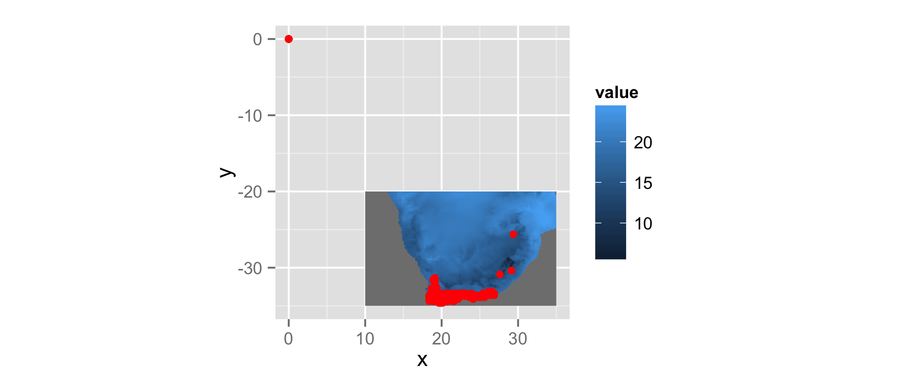 

---


```r
d2=dc%>%
  gather(ID)
colnames(d2)[1]="cell"

ggplot(d2,aes(x=value))+
  geom_density()+
  facet_wrap(~ID,scales="free")
```

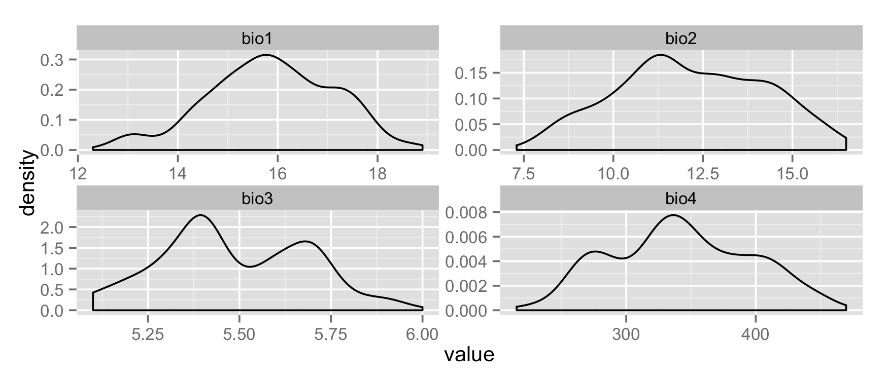 

---


### Lines

Extract values along a transect.  

```r
transect = SpatialLinesDataFrame(
  SpatialLines(list(Lines(list(Line(
    cbind(c(19, 26),c(-33.5, -33.5)))), ID = "ZAF"))),
  data.frame(Z = c("transect"), row.names = c("ZAF")))

gplot(r1)+geom_tile(aes(fill=value))+
  geom_line(aes(x=long,y=lat),data=fortify(transect))
```

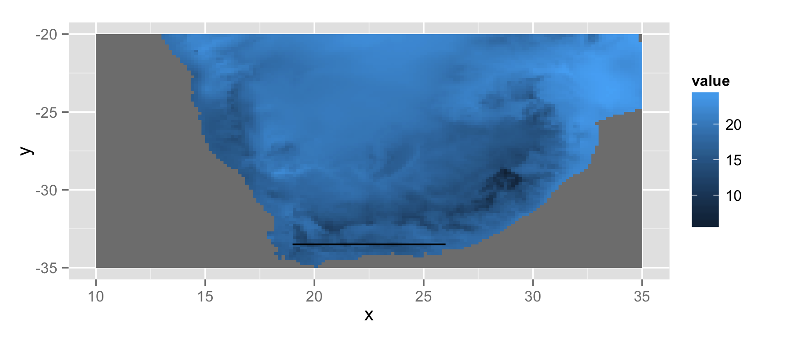 

---

### Plot Transect


```r
trans=raster::extract(clim,transect,along=T,cellnumbers=T)%>% 
  as.data.frame()
trans[,c("lon","lat")]=coordinates(clim)[trans$cell]
trans$order=as.integer(rownames(trans))
  
transl=group_by(trans,lon,lat)%>%
  gather(variable, value, -lon, -lat, -cell, -order)

ggplot(transl,aes(x=lon,y=value,
                  colour=variable,group=variable,
                  order=order))+
  geom_line()
```

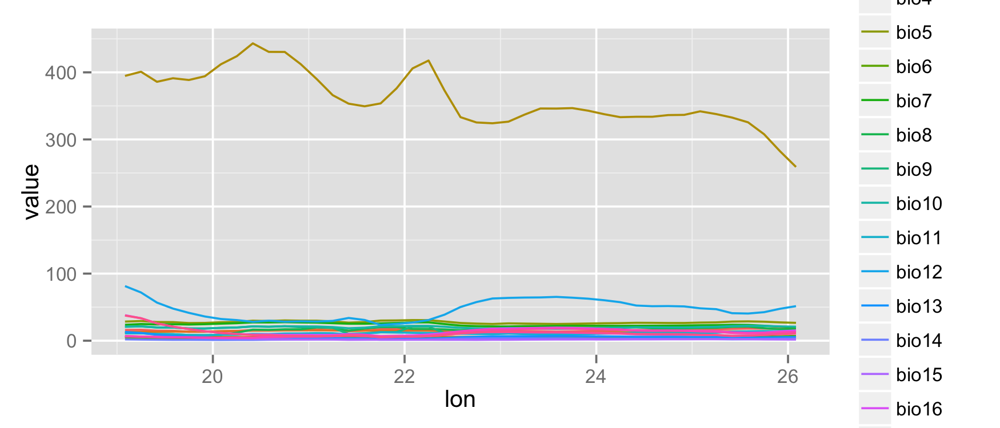 

---

### _Zonal_ statistics


```r
rsp=raster::extract(r1,za,mean,sp=T)
spplot(rsp,zcol="bio1")
```

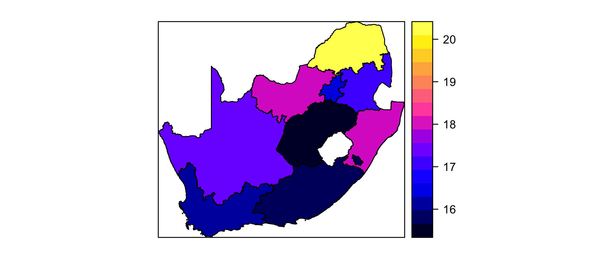 

## Your turn

1. Download the Maximum Temperature dataset using `getData()`
2. Crop it to the country you downloaded (or ZA?)
2. Calculate the overall range for each variable with `cellStats()`
3. Calculate the focal median with an 11x11 window with `focal()`
4. Create a transect across the region and extract the temperature data.


## Example

1. Download the Maximum Temperature dataset using `getData()`
2. Crop it to the country you downloaded (or ZA?)
2. Calculate the overall range for each variable with `cellStats()`


```r
tun=getData('GADM', country='TUN', level=1)
tmax=getData('worldclim', var='tmax', res=10)
gain(tmax)=0.1
tmax_tun=crop(tmax,tun)

cellStats(tmax_tun,"range")
```

```
##      tmax1 tmax2 tmax3 tmax4 tmax5 tmax6 tmax7 tmax8 tmax9 tmax10 tmax11
## [1,]   8.4  10.1  13.8  17.4  21.9  26.4  29.6  30.3  26.6   19.7   14.1
## [2,]  18.1  21.2  25.6  31.2  35.9  41.4  43.3  42.6  38.5   31.9   24.5
##      tmax12
## [1,]    9.6
## [2,]   18.9
```

---

3. Calculate the focal median with an 11x11 window with `focal()`
4. Create a transect across the region and extract the temperature data.


```r
tmax_tunf=list()
for(i in 1:nlayers(tmax_tun))
  tmax_tunf[[i]]=focal(tmax_tun[[i]],w=matrix(1,11,11),fun=median)
tmax_tunf=stack(tmax_tunf)

# Transect
transect = SpatialLinesDataFrame(
  SpatialLines(list(Lines(list(Line(
    cbind(c(8, 10),c(36, 36)))), ID = "TUN"))),
  data.frame(Z = c("transect"), row.names = c("TUN")))
```

---


```r
gplot(tmax_tun)+geom_tile(aes(fill=value))+
  facet_wrap(~variable)+
  geom_path(data=fortify(tun),
            mapping=aes(x=long,y=lat,
                        group=group,order=order))+
  geom_line(aes(x=long,y=lat),
            data=fortify(transect),col="red")+
  coord_equal()
```

```
## Regions defined for each Polygons
```

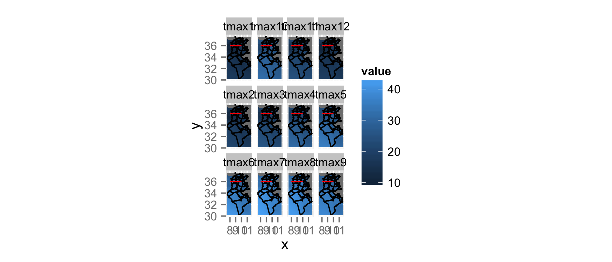 

---


```r
trans=raster::extract(tmax_tun,transect,along=T,cellnumbers=T)%>% 
  as.data.frame()
trans[,c("lon","lat")]=coordinates(clim)[trans$cell]
trans$order=as.integer(rownames(trans))
  
transl=group_by(trans,lon,lat)%>%
  gather(variable, value, -lon, -lat, -cell, -order)

ggplot(transl,aes(x=lon,y=value,
                  colour=variable,group=variable,
                  order=order))+
  geom_line()
```

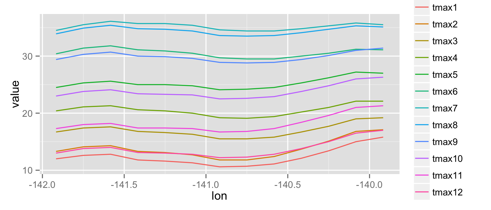 


## Raster Processing

Things to consider:

* RAM limitations
* Disk space and temporary files
* Use of external programs (e.g. GDAL)
* Use of external GIS viewer (e.g. QGIS)


