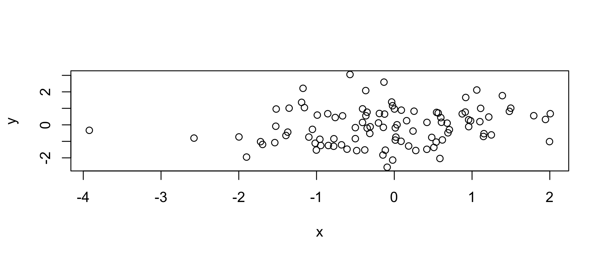
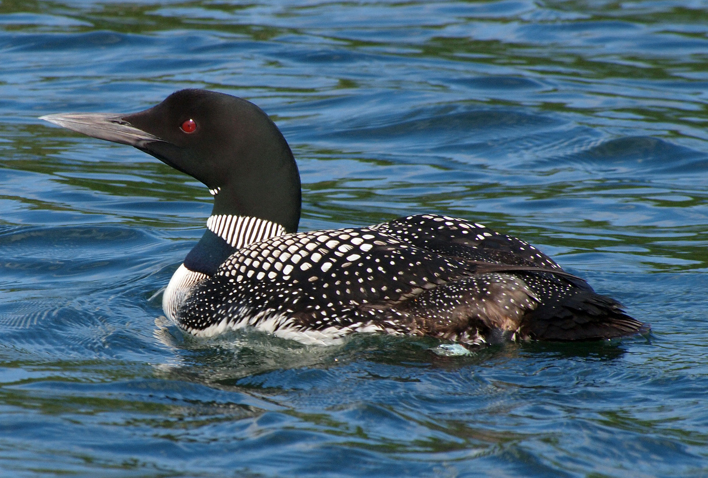
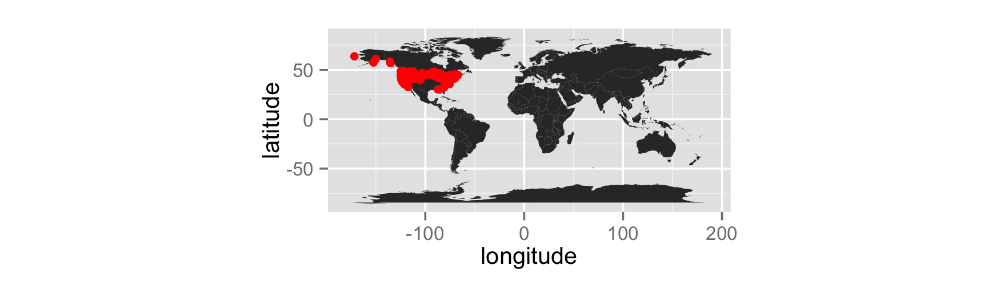
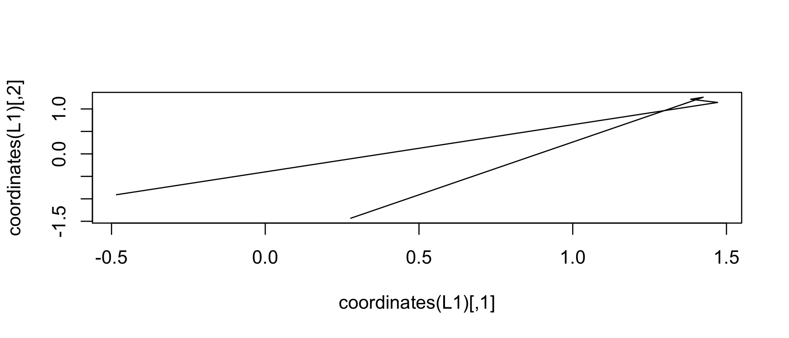

# Introduction to Spatial Data
Adam M. Wilson  
October 2015  


# Setup

## Load packages

```r
library(sp)
library(ggplot2)
library(dplyr)
library(tidyr)
```

# Point data

## Generate some random data

```r
coords = data.frame(
  x=rnorm(100),
  y=rnorm(100)
)
str(coords)
```

```
## 'data.frame':	100 obs. of  2 variables:
##  $ x: num  -0.0916 -1.1556 0.241 -0.1408 -0.7768 ...
##  $ y: num  -2.569 1.044 -0.377 -0.153 -0.843 ...
```

---


```r
plot(coords)
```

 

---

## Convert to `SpatialPoints`

```r
sp = SpatialPoints(coords)
str(sp)
```

```
## Formal class 'SpatialPoints' [package "sp"] with 3 slots
##   ..@ coords     : num [1:100, 1:2] -0.0916 -1.1556 0.241 -0.1408 -0.7768 ...
##   .. ..- attr(*, "dimnames")=List of 2
##   .. .. ..$ : NULL
##   .. .. ..$ : chr [1:2] "x" "y"
##   ..@ bbox       : num [1:2, 1:2] -3.92 -2.57 2.01 3.05
##   .. ..- attr(*, "dimnames")=List of 2
##   .. .. ..$ : chr [1:2] "x" "y"
##   .. .. ..$ : chr [1:2] "min" "max"
##   ..@ proj4string:Formal class 'CRS' [package "sp"] with 1 slot
##   .. .. ..@ projargs: chr NA
```

---

## Create a `SpatialPointsDataFrame`

First generate a dataframe (analagous to the _attribute table_ in a shapefile)

```r
data=data.frame(ID=1:100,group=letters[1:20])
head(data)
```

```
##   ID group
## 1  1     a
## 2  2     b
## 3  3     c
## 4  4     d
## 5  5     e
## 6  6     f
```

---

Combine the coordinates with the data

```r
spdf = SpatialPointsDataFrame(coords, data)
spdf = SpatialPointsDataFrame(sp, data)

str(spdf)
```

```
## Formal class 'SpatialPointsDataFrame' [package "sp"] with 5 slots
##   ..@ data       :'data.frame':	100 obs. of  2 variables:
##   .. ..$ ID   : int [1:100] 1 2 3 4 5 6 7 8 9 10 ...
##   .. ..$ group: Factor w/ 20 levels "a","b","c","d",..: 1 2 3 4 5 6 7 8 9 10 ...
##   ..@ coords.nrs : num(0) 
##   ..@ coords     : num [1:100, 1:2] -0.0916 -1.1556 0.241 -0.1408 -0.7768 ...
##   .. ..- attr(*, "dimnames")=List of 2
##   .. .. ..$ : NULL
##   .. .. ..$ : chr [1:2] "x" "y"
##   ..@ bbox       : num [1:2, 1:2] -3.92 -2.57 2.01 3.05
##   .. ..- attr(*, "dimnames")=List of 2
##   .. .. ..$ : chr [1:2] "x" "y"
##   .. .. ..$ : chr [1:2] "min" "max"
##   ..@ proj4string:Formal class 'CRS' [package "sp"] with 1 slot
##   .. .. ..@ projargs: chr NA
```
Note the use of _slots_ designated with a `@`.  See `?slot` for more. 


## Promote a data frame with `coordinates()`

```r
coordinates(data) = cbind(coords$x, coords$y) 
```


```r
str(spdf)
```

```
## Formal class 'SpatialPointsDataFrame' [package "sp"] with 5 slots
##   ..@ data       :'data.frame':	100 obs. of  2 variables:
##   .. ..$ ID   : int [1:100] 1 2 3 4 5 6 7 8 9 10 ...
##   .. ..$ group: Factor w/ 20 levels "a","b","c","d",..: 1 2 3 4 5 6 7 8 9 10 ...
##   ..@ coords.nrs : num(0) 
##   ..@ coords     : num [1:100, 1:2] -0.0916 -1.1556 0.241 -0.1408 -0.7768 ...
##   .. ..- attr(*, "dimnames")=List of 2
##   .. .. ..$ : NULL
##   .. .. ..$ : chr [1:2] "x" "y"
##   ..@ bbox       : num [1:2, 1:2] -3.92 -2.57 2.01 3.05
##   .. ..- attr(*, "dimnames")=List of 2
##   .. .. ..$ : chr [1:2] "x" "y"
##   .. .. ..$ : chr [1:2] "min" "max"
##   ..@ proj4string:Formal class 'CRS' [package "sp"] with 1 slot
##   .. .. ..@ projargs: chr NA
```

## Subset data


```r
subset(spdf, group=="a")
```

```
##                 coordinates ID group
## 1   (-0.0915913, -2.568621)  1     a
## 21    (0.9187995, 1.658764) 21     a
## 41  (0.4815708, -0.7604635) 41     a
## 61 (-0.5010771, -0.8378525) 61     a
## 81 (0.002061384, 0.9596492) 81     a
```

Or using `[]`

```r
spdf[spdf$group=="a",]
```

```
##                 coordinates ID group
## 1   (-0.0915913, -2.568621)  1     a
## 21    (0.9187995, 1.658764) 21     a
## 41  (0.4815708, -0.7604635) 41     a
## 61 (-0.5010771, -0.8378525) 61     a
## 81 (0.002061384, 0.9596492) 81     a
```

Unfortunately, `dplyr` functions do not directly filter spatial objects.


## Extract point data from GBIF using `spocc` package

Use the `occ()` function to download all the _occurrence_ records for the Great Northern loon (_Gavia immer_) from eBird.



<small><small><small>Licensed under CC BY-SA 3.0 via [Wikimedia Commons](https://en.wikipedia.org/wiki/Great_northern_loon#/media/File:Gavia_immer_-Minocqua,_Wisconsin,_USA_-swimming-8.jpg)</small></small></small>

---


```r
## define which species to query
library(spocc)
sp='Gavia immer'

## run the query and convert to data.frame()
d = occ(query=sp, from='ebird',limit = 1000) %>% occ2df()
```
This can take a few seconds.

## Your turn
_Promote_ the `d` object to a spatial points data.frame with `coordinates()`.

---


```r
coordinates(d)=cbind(d$longitude,d$latitude)
#OR   coordinates(d)=c("longitude","latitude")
str(d)
```

```
## Formal class 'SpatialPointsDataFrame' [package "sp"] with 5 slots
##   ..@ data       :'data.frame':	773 obs. of  6 variables:
##   .. ..$ name     : chr [1:773] "Gavia immer" "Gavia immer" "Gavia immer" "Gavia immer" ...
##   .. ..$ longitude: num [1:773] -74.2 -74.2 -77.3 -74.2 -75 ...
##   .. ..$ latitude : num [1:773] 40.5 44.3 43.3 40.8 38.9 ...
##   .. ..$ prov     : chr [1:773] "ebird" "ebird" "ebird" "ebird" ...
##   .. ..$ date     : POSIXct[1:773], format: "2015-10-05 09:10:00" ...
##   .. ..$ key      : chr [1:773] "L293510" "L1509081" "L621729" "L207576" ...
##   ..@ coords.nrs : num(0) 
##   ..@ coords     : num [1:773, 1:2] -74.2 -74.2 -77.3 -74.2 -75 ...
##   .. ..- attr(*, "dimnames")=List of 2
##   .. .. ..$ : NULL
##   .. .. ..$ : chr [1:2] "coords.x1" "coords.x2"
##   ..@ bbox       : num [1:2, 1:2] -171.7 30.1 -67 63.8
##   .. ..- attr(*, "dimnames")=List of 2
##   .. .. ..$ : chr [1:2] "coords.x1" "coords.x2"
##   .. .. ..$ : chr [1:2] "min" "max"
##   ..@ proj4string:Formal class 'CRS' [package "sp"] with 1 slot
##   .. .. ..@ projargs: chr NA
```

---

Plot it with a world map

```r
# Load coastline
map=map_data("world")

  ggplot(as.data.frame(d),aes(x=longitude,y=latitude))+
    geom_polygon(aes(x=long,y=lat,group=group,order=order),data=map)+
    geom_point(col="red")+
    coord_equal()
```

 

Note that `ggplot` works only with data.frames.  Convert with `as.data.frame()` or `fortify()`.

# Lines

---

### A `Line` is a single chain of points.


```r
L1 = Line(cbind(rnorm(5),rnorm(5)))
L2 = Line(cbind(rnorm(5),rnorm(5)))
L3 = Line(cbind(rnorm(5),rnorm(5)))
L1
```

```
## An object of class "Line"
## Slot "coords":
##            [,1]      [,2]
## [1,] -0.4838695 -0.908744
## [2,]  1.4712806  1.145167
## [3,]  1.3834857  1.215969
## [4,]  1.4243552  1.261157
## [5,]  0.2779745 -1.432035
```

---


```r
plot(coordinates(L1),type="l")
```

 

---

### A `Lines` is a list of chains with an ID


```r
Ls1 = Lines(list(L1),ID="a")
Ls2 = Lines(list(L2,L3),ID="b")
Ls2
```

```
## An object of class "Lines"
## Slot "Lines":
## [[1]]
## An object of class "Line"
## Slot "coords":
##            [,1]        [,2]
## [1,] 0.73796497 -0.07002345
## [2,] 0.06253185  0.43451903
## [3,] 0.75305693 -0.47372456
## [4,] 0.58683258  0.95878250
## [5,] 0.25922294  1.05597147
## 
## 
## [[2]]
## An object of class "Line"
## Slot "coords":
##            [,1]       [,2]
## [1,] -1.4633837 -1.0137152
## [2,] -1.0576501  0.3362733
## [3,] -0.8846390  1.8576325
## [4,]  0.7159603 -0.3656567
## [5,]  0.3645327  0.3015530
## 
## 
## 
## Slot "ID":
## [1] "b"
```

---

### A `SpatialLines` is a list of Lines


```r
SL12 = SpatialLines(list(Ls1,Ls2))
plot(SL12)
```

 

---

### A `SpatialLinesDataFrame` is a `SpatialLines` with a matching `DataFrame`


```r
SLDF = SpatialLinesDataFrame(
  SL12,
  data.frame(
  Z=c("road","river"),
  row.names=c("a","b")
))
str(SLDF)
```

```
## Formal class 'SpatialLinesDataFrame' [package "sp"] with 4 slots
##   ..@ data       :'data.frame':	2 obs. of  1 variable:
##   .. ..$ Z: Factor w/ 2 levels "river","road": 2 1
##   ..@ lines      :List of 2
##   .. ..$ :Formal class 'Lines' [package "sp"] with 2 slots
##   .. .. .. ..@ Lines:List of 1
##   .. .. .. .. ..$ :Formal class 'Line' [package "sp"] with 1 slot
##   .. .. .. .. .. .. ..@ coords: num [1:5, 1:2] -0.484 1.471 1.383 1.424 0.278 ...
##   .. .. .. ..@ ID   : chr "a"
##   .. ..$ :Formal class 'Lines' [package "sp"] with 2 slots
##   .. .. .. ..@ Lines:List of 2
##   .. .. .. .. ..$ :Formal class 'Line' [package "sp"] with 1 slot
##   .. .. .. .. .. .. ..@ coords: num [1:5, 1:2] 0.738 0.0625 0.7531 0.5868 0.2592 ...
##   .. .. .. .. ..$ :Formal class 'Line' [package "sp"] with 1 slot
##   .. .. .. .. .. .. ..@ coords: num [1:5, 1:2] -1.463 -1.058 -0.885 0.716 0.365 ...
##   .. .. .. ..@ ID   : chr "b"
##   ..@ bbox       : num [1:2, 1:2] -1.46 -1.43 1.47 1.86
##   .. ..- attr(*, "dimnames")=List of 2
##   .. .. ..$ : chr [1:2] "x" "y"
##   .. .. ..$ : chr [1:2] "min" "max"
##   ..@ proj4string:Formal class 'CRS' [package "sp"] with 1 slot
##   .. .. ..@ projargs: chr NA
```

# Polygons

## Getting complicated


### Issues

* Multipart Polygons
* Holes

Rarely construct _by hand_...

# Importing data

## Geospatial Data Abstraction Library ([GDAL](gdal.org))

`rgdal` package for importing/exporting/manipulating spatial data:

* `readOGR()` and `writeOGR()`: Vector data
* `readGDAL()` and `writeGDAL()`: Raster data

Also the `gdalUtils` package for reprojecting, transforming, reclassifying, etc.

## maptools package

* `readShapeSpatial`


```r
file=system.file("shapes/sids.shp", package="maptools")
sids <- readShapeSpatial(file)
summary(sids)
```

```
## Object of class SpatialPolygonsDataFrame
## Coordinates:
##         min       max
## x -84.32385 -75.45698
## y  33.88199  36.58965
## Is projected: NA 
## proj4string : [NA]
## Data attributes:
##       AREA          PERIMETER         CNTY_         CNTY_ID    
##  Min.   :0.0420   Min.   :0.999   Min.   :1825   Min.   :1825  
##  1st Qu.:0.0910   1st Qu.:1.324   1st Qu.:1902   1st Qu.:1902  
##  Median :0.1205   Median :1.609   Median :1982   Median :1982  
##  Mean   :0.1263   Mean   :1.673   Mean   :1986   Mean   :1986  
##  3rd Qu.:0.1542   3rd Qu.:1.859   3rd Qu.:2067   3rd Qu.:2067  
##  Max.   :0.2410   Max.   :3.640   Max.   :2241   Max.   :2241  
##                                                                
##         NAME         FIPS        FIPSNO         CRESS_ID     
##  Alamance : 1   37001  : 1   Min.   :37001   Min.   :  1.00  
##  Alexander: 1   37003  : 1   1st Qu.:37050   1st Qu.: 25.75  
##  Alleghany: 1   37005  : 1   Median :37100   Median : 50.50  
##  Anson    : 1   37007  : 1   Mean   :37100   Mean   : 50.50  
##  Ashe     : 1   37009  : 1   3rd Qu.:37150   3rd Qu.: 75.25  
##  Avery    : 1   37011  : 1   Max.   :37199   Max.   :100.00  
##  (Other)  :94   (Other):94                                   
##      BIR74           SID74          NWBIR74           BIR79      
##  Min.   :  248   Min.   : 0.00   Min.   :   1.0   Min.   :  319  
##  1st Qu.: 1077   1st Qu.: 2.00   1st Qu.: 190.0   1st Qu.: 1336  
##  Median : 2180   Median : 4.00   Median : 697.5   Median : 2636  
##  Mean   : 3300   Mean   : 6.67   Mean   :1050.8   Mean   : 4224  
##  3rd Qu.: 3936   3rd Qu.: 8.25   3rd Qu.:1168.5   3rd Qu.: 4889  
##  Max.   :21588   Max.   :44.00   Max.   :8027.0   Max.   :30757  
##                                                                  
##      SID79          NWBIR79       
##  Min.   : 0.00   Min.   :    3.0  
##  1st Qu.: 2.00   1st Qu.:  250.5  
##  Median : 5.00   Median :  874.5  
##  Mean   : 8.36   Mean   : 1352.8  
##  3rd Qu.:10.25   3rd Qu.: 1406.8  
##  Max.   :57.00   Max.   :11631.0  
## 
```

# Coordinate Systems

* Earth isn't flat
* But small parts of it are near enough
* Many coordinate systems exist
* Anything `Spatial*` (or `raster*`) can have one

## Specifying the coordinate system

### The [Proj.4](https://trac.osgeo.org/proj/) library
Library for performing conversions between cartographic projections. 

See [http://spatialreference.org](http://spatialreference.org) for information on specifying projections. For example, 

---

#### Specifying coordinate systems 

**WGS 84**:

* proj4: <br><small>`+proj=longlat +ellps=WGS84 +datum=WGS84 +no_defs`</small>
* .prj / ESRI WKT: <small>`GEOGCS["GCS_WGS_1984",DATUM["D_WGS_1984",`<br>`
SPHEROID["WGS_1984",6378137,298.257223563]],`<br>`
PRIMEM["Greenwich",0],UNIT["Degree",0.017453292519943295]]`</small>
* EPSG:`4326`

---

No Projection specified:


```r
 sp = SpatialPoints(coords)
```

Specify at construction time:

```r
 sp = SpatialPoints(
          coords,
          proj4string = CRS("+init=epsg:4326")
       )

str(sp)
```

```
## Formal class 'SpatialPoints' [package "sp"] with 3 slots
##   ..@ coords     : num [1:100, 1:2] -0.0916 -1.1556 0.241 -0.1408 -0.7768 ...
##   .. ..- attr(*, "dimnames")=List of 2
##   .. .. ..$ : NULL
##   .. .. ..$ : chr [1:2] "x" "y"
##   ..@ bbox       : num [1:2, 1:2] -3.92 -2.57 2.01 3.05
##   .. ..- attr(*, "dimnames")=List of 2
##   .. .. ..$ : chr [1:2] "x" "y"
##   .. .. ..$ : chr [1:2] "min" "max"
##   ..@ proj4string:Formal class 'CRS' [package "sp"] with 1 slot
##   .. .. ..@ projargs: chr "+init=epsg:4326 +proj=longlat +datum=WGS84 +no_defs +ellps=WGS84 +towgs84=0,0,0"
```

---

Specify after loading:

```r
 proj4string(sp) = CRS("+init=epsg:4326")
```


## Spatial Transform

Assigning a CRS doesn't change the numbers
So assigning the wrong CRS really messes things up


Transform (_warp_) projection from one to another with `spTransform`

---

The _eBird_ data should all be in from GPS (WGS84):


```r
proj4string(d)=CRS("+init=epsg:4326")
```

And put on the US National Atlas Equal Area (Lambert azimuthal equal-area projection):

```r
dUS = spTransform(d,CRS("+proj=laea +lat_0=45 +lon_0=-100 +x_0=0 +y_0=0 +a=6370997 +b=6370997 +units=m +no_defs"))
```

Compare the _bounding box_:

```r
bbox(d)
```

```
##                 min       max
## coords.x1 -171.7215 -67.02132
## coords.x2   30.0958  63.77930
```

```r
bbox(dUS)
```

```
##                min     max
## coords.x1 -2871949 2508220
## coords.x2 -1538118 3671653
```


## Colophon

Sources:

* [UseR 2012 Spatial Data Workshop](http://www.maths.lancs.ac.uk/~rowlings/Teaching/UseR2012/index.html) by Barry Rowlingson

Licensing: 

* Presentation: [CC-BY-3.0 ](http://creativecommons.org/licenses/by/3.0/us/)
* Source code: [MIT](http://opensource.org/licenses/MIT) 

