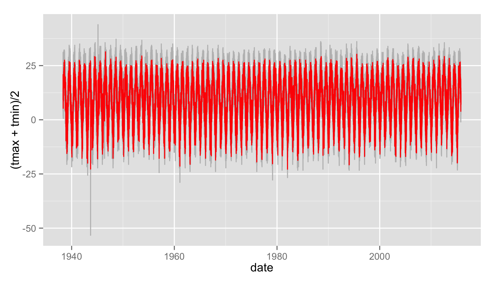

# Climate Metrics from gridded daily weather data


# Today

* Access and work with station weather data from Global Historical Climate Network (GHCN)  
* Explore options for plotting timeseries
* Trend analysis
* Compute Climate Extremes

# Climate Extremes

## Climate Metrics: ClimdEX
Indices representing extreme aspects of climate derived from daily data:


Climate Change Research Centre (CCRC) at University of New South Wales (UNSW) ([climdex.org](http://www.climdex.org)).  Same as included in NCO tools from last week.


### 27 Core indices

For example:

* **FD** Number of frost days: Annual count of days when TN (daily minimum temperature) < 0C.
* **SU** Number of summer days: Annual count of days when TX (daily maximum temperature) > 25C.
* **ID** Number of icing days: Annual count of days when TX (daily maximum temperature) < 0C.
* **TR** Number of tropical nights: Annual count of days when TN (daily minimum temperature) > 20C.
* **GSL** Growing season length: Annual (1st Jan to 31st Dec in Northern Hemisphere (NH), 1st July to 30th June in Southern Hemisphere (SH)) count between first span of at least 6 days with daily mean temperature TG>5C and first span after July 1st (Jan 1st in SH) of 6 days with TG<5C.
* **TXx** Monthly maximum value of daily maximum temperature
* **TN10p** Percentage of days when TN < 10th percentile
* **Rx5day** Monthly maximum consecutive 5-day precipitation
* **SDII** Simple pricipitation intensity index


# Weather Data

### Climate Data Online


### GHCN 


## Options for downloading data

### `FedData` package

* National Elevation Dataset digital elevation models (1 and 1/3 arc-second; USGS)
* National Hydrography Dataset (USGS)
* Soil Survey Geographic (SSURGO) database 
* International Tree Ring Data Bank.
* *Global Historical Climatology Network* (GHCN)

### NOAA API


[National Climatic Data Center application programming interface (API)]( http://www.ncdc.noaa.gov/cdo-web/webservices/v2). 

### `rNOAA` package

Handles downloading data directly from NOAA APIv2.

* `buoy_*`  NOAA Buoy data from the National Buoy Data Center
* `ghcnd_*`  GHCND daily data from NOAA
* `isd_*` ISD/ISH data from NOAA
* `homr_*` Historical Observing Metadata Repository
* `ncdc_*` NOAA National Climatic Data Center (NCDC)
* `seaice` Sea ice
* `storm_` Storms (IBTrACS)
* `swdi` Severe Weather Data Inventory (SWDI)
* `tornadoes` From the NOAA Storm Prediction Center

---

### Libraries


```r
library(raster)
library(sp)
library(rgdal)
library(ggplot2)
library(ggmap)
library(dplyr)
library(tidyr)

# New Packages
library(rnoaa)
library(climdex.pcic)
library(zoo)
library(reshape2)
```

### Station locations 

Download the GHCN station inventory with `ghcnd_stations()`.  


```r
datadir="data"

st = ghcnd_stations()$data

## Optionally, save it to disk
# write.csv(st,file.path(datadir,"st.csv"))
## If internet fails, load the file from disk using:
# st=read.csv(file.path(datadir,"st.csv"))
```

### GHCND Variables

5 core values:

* **PRCP** Precipitation (tenths of mm)
* **SNOW** Snowfall (mm)
* **SNWD** Snow depth (mm)
* **TMAX** Maximum temperature
* **TMIN** Minimum temperature

And ~50 others!  For example:

* **ACMC** Average cloudiness midnight to midnight from 30-second ceilometer 
* **AWND** Average daily wind speed
* **FMTM** Time of fastest mile or fastest 1-minute wind
* **MDSF** Multiday snowfall total


### `filter()` to temperature and precipitation

```r
st=dplyr::filter(st,element%in%c("TMAX","TMIN","PRCP"))
```

### Map GHCND stations

First, get a global country polygon

```r
worldmap=map("world",fill=T,plot=F)
```

Plot all stations:

```r
ggplot() +
  facet_wrap(~element)+
  geom_point(aes(y=latitude,x=longitude),data=st,size=.75,col="red")+
  geom_path(aes(x=long,y=lat,group=group,order=order),data=fortify(worldmap),size=.5)+
  coord_equal()
```

 

It's hard to see all the points, let's bin them...


```r
ggplot(st,aes(y=latitude,x=longitude)) +
  facet_wrap(~element)+
  stat_bin2d(bins=75)+
  scale_fill_gradient(low="yellow",high="red",trans="log",
                       breaks = c(1,10,100,1000))+
  geom_path(aes(x=long,y=lat,group=group,order=order),data=fortify(worldmap),size=.5)+
  coord_equal()
```

 

## Your turn

Produce a binned map (like above) with the following modifications:

* include only stations with data between 1950 and 2000
* include only `tmax`


```r
ggplot(filter(st,
              first_year<=1950 & 
              last_year>=2000 & 
              element=="TMAX"),
       aes(y=latitude,x=longitude)) +
  stat_bin2d(bins=75)+
  scale_fill_gradient(low="yellow",high="red",trans="log",
                       breaks = c(1,10,50))+
  geom_path(aes(x=long,y=lat,group=group,order=order),data=fortify(worldmap),size=.5)+
  coord_equal()
```

 

## Download daily data from GHCN

`ghcnd()` will download a `.dly` file for a particular station.  But how to choose?


```r
coords=as.matrix(geocode("Buffalo, NY"))
coords
```

```
##            lon      lat
## [1,] -78.88642 42.89606
```


```r
dplyr::filter(st,
              grepl("BUFFALO",name)&
              between(latitude,coords[2]-1,coords[2]+1) &
              between(longitude,coords[1]-1,coords[1]+1)&
         element=="TMAX")
```

```
##            id latitude longitude elevation
## 1 USC00301010  42.8833  -78.8833    -999.9
## 2 USC00301018  42.9333  -78.9000     177.1
## 3 USW00014733  42.9486  -78.7369     211.2
##            name gsn_flag    wmo_id element
## 1    NY BUFFALO                       TMAX
## 2 NY BUFFALO #2                       TMAX
## 3    NY BUFFALO          HCN 72528    TMAX
##   first_year last_year
## 1       1873      1944
## 2       1937      1941
## 3       1938      2015
```

```r
d=ghcnd("USW00014733", path = datadir)
d$data[1:5,1:12]
```

```
##            id year month element VALUE1 MFLAG1
## 1 USW00014733 1938     5    TMAX    144       
## 2 USW00014733 1938     5    TMIN     39       
## 3 USW00014733 1938     5    PRCP      0      T
## 4 USW00014733 1938     6    TMAX    261       
## 5 USW00014733 1938     6    TMIN    100       
##   QFLAG1 SFLAG1 VALUE2 MFLAG2 QFLAG2 SFLAG2
## 1             0    211                    0
## 2             0     83                    0
## 3             0      0      T             0
## 4             0    222                    0
## 5             0    133                    0
```
Could also filter using `over()` in sp package...

See [CDO Description](http://www1.ncdc.noaa.gov/pub/data/cdo/documentation/GHCND_documentation.pdf) and raw [GHCND metadata](http://www1.ncdc.noaa.gov/pub/data/ghcn/daily/readme.txt) for more details.

### Quality Control: MFLAG

Measurement Flag/Attribute

* **Blank** no measurement information applicable
* **B** precipitation total formed from two twelve-hour totals
* **H** represents highest or lowest hourly temperature (TMAX or TMIN) or average of hourly values (TAVG)
* **K** converted from knots
* ...

See [CDO Description](http://www1.ncdc.noaa.gov/pub/data/cdo/documentation/GHCND_documentation.pdf) 

### Quality Control: QFLAG

* **Blank** did not fail any quality assurance check 
* **D** failed duplicate check
* **G** failed gap check
* **K** failed streak/frequent-value check
* **N** failed naught check
* **O** failed climatological outlier check
* **S** failed spatial consistency check
* **T** failed temporal consistency check
* **W** temperature too warm for snow
* ...

See [CDO Description](http://www1.ncdc.noaa.gov/pub/data/cdo/documentation/GHCND_documentation.pdf) 

### Quality Control: SFLAG

Indicates the source of the data...

### Reshape and clean data

`rnoaa` includes a function `ghcnd_splitvars()` for reshaping the original data.


```r
d1=ghcnd_splitvars(d)
str(d1,list.len = 3)
```

```
## List of 46
##  $ tmax:Classes 'tbl_df', 'tbl' and 'data.frame':	28308 obs. of  6 variables:
##   ..$ id   : chr [1:28308] "USW00014733" "USW00014733" "USW00014733" "USW00014733" ...
##   ..$ tmax : int [1:28308] 144 261 189 256 183 139 144 0 56 11 ...
##   ..$ date : Date[1:28308], format:  ...
##   .. [list output truncated]
##  $ tmin:Classes 'tbl_df', 'tbl' and 'data.frame':	28308 obs. of  6 variables:
##   ..$ id   : chr [1:28308] "USW00014733" "USW00014733" "USW00014733" "USW00014733" ...
##   ..$ tmin : int [1:28308] 39 100 156 194 94 50 -6 -61 -94 -111 ...
##   ..$ date : Date[1:28308], format:  ...
##   .. [list output truncated]
##  $ prcp:Classes 'tbl_df', 'tbl' and 'data.frame':	28308 obs. of  6 variables:
##   ..$ id   : chr [1:28308] "USW00014733" "USW00014733" "USW00014733" "USW00014733" ...
##   ..$ prcp : int [1:28308] 0 0 5 295 97 0 0 0 48 15 ...
##   ..$ date : Date[1:28308], format:  ...
##   .. [list output truncated]
##   [list output truncated]
```

#### Merge datasets


```r
d2=lapply(1:length(d1),function(i) {
  x=d1[[i]]
  ivar=names(d1)[i]
  x$var=ivar
  x$val=unlist(x[,ivar])
  return(select(x,-contains(ivar)))})%>%
  bind_rows()
head(d2)
```

```
## Source: local data frame [6 x 7]
## 
##            id       date mflag qflag sflag   var
##         (chr)     (date) (chr) (chr) (chr) (chr)
## 1 USW00014733 1938-05-01                 0  tmax
## 2 USW00014733 1938-06-01                 0  tmax
## 3 USW00014733 1938-07-01                 0  tmax
## 4 USW00014733 1938-08-01                 0  tmax
## 5 USW00014733 1938-09-01                 0  tmax
## 6 USW00014733 1938-10-01                 0  tmax
## Variables not shown: val (int)
```

#### Filter with QC data and change units

```r
d3=d2%>%
  filter( 
    qflag==" " &
    var%in%c("tmax","tmin","prcp"))%>%                            # drop bad QC values
  mutate(val=ifelse(val==-9999,NA,val))%>%
  mutate(val=ifelse(var%in%c("tmax","tmin"), val/10,val))%>%  # convert to degrees C
  arrange(var,date)
```

## Summarize QC flags

Summarize the QC flags.  How many of which type are there?  Should we be more conservative?


```r
table(d3$mflag,d3$var)  
```

```
##    
##      prcp  tmax  tmin
##     23149 28296 28295
##   T  5158     0     0
```
* **T** failed temporal consistency check


### Reshape by variable for easy plotting
use `reshape2::dcast()` for flexible reshaping of data sets.  


```r
d3b=dcast(d3,id+date~var,value.var="val")%>%
  arrange(date)%>%
  na.omit() 
head(d3b)
```

```
##            id       date prcp tmax tmin
## 1 USW00014733 1938-05-01    0 14.4  3.9
## 2 USW00014733 1938-05-02    0 21.1  8.3
## 3 USW00014733 1938-05-03   25 16.7  7.2
## 4 USW00014733 1938-05-04  112 20.6  9.4
## 5 USW00014733 1938-05-05    0 31.1 10.6
## 6 USW00014733 1938-05-06   64 19.4  7.8
```
Use `melt()` to _undo_ a `cast()`


Plot temperatures

```r
ggplot(d3b,
       aes(ymax=tmax,ymin=tmin,x=date))+
  geom_ribbon(col="grey")+
  geom_line(aes(y=(tmax+tmin)/2),col="red")
```

 

Limit to a few years.

```r
ggplot(filter(d3b,date>as.Date("2014-01-01")),
       aes(ymax=tmax,ymin=tmin,x=date))+
  geom_ribbon(col="grey")+
  geom_line(aes(y=(tmax+tmin)/2),col="red")
```

 

### Zoo package for rolling functions

Infrastructure for Regular and Irregular Time Series (Z's Ordered Observations)

* `rollmean()`:  Rolling mean
* `rollsum()`:   Rolling sum
* `rollapply()`:  Custom functions

Use rollmean to calculate a rolling 60-day average. 

* `align` whether the index of the result should be left- or right-aligned or centered


```r
d4 = d3b %>% 
  arrange(date) %>%
  mutate(tmax.60 = rollmean(x = tmax, 60, align = "center", fill = NA),
         tmax.b60 = rollmean(x = tmax, 60, align = "right", fill = NA))
```


```r
ggplot(filter(d4,date>as.Date("2014-01-01")),
       aes(ymax=tmax,ymin=tmin,x=date))+
  geom_ribbon(fill="grey")+
  geom_line(aes(y=(tmin+tmax)/2),col=grey(0.4),size=.5)+
  geom_line(aes(y=tmax.60),col="red")+
  geom_line(aes(y=tmax.b60),col="darkred")
```

```
## Warning: Removed 30 rows containing missing values
## (geom_path).
```

 

## Your Turn

Plot a 30-day rolling "right" aligned sum of precipitation.


```r
tp=d3b %>%
  arrange(date)  %>% 
  mutate(prcp.30 = rollsum(x = prcp, 30, align = "right", fill = NA))

ggplot(tp,aes(y=prcp.30,x=date))+
  geom_line(col="black") 
```

```
## Warning: Removed 29 rows containing missing values
## (geom_path).
```

 


# Time Series analysis

Most timeseries funcitons use the time series class (`ts`)


```r
tmin.ts=ts(d3b$tmin,deltat=1/365)
```

## Temporal autocorrelation

Values are highly correlated!


```r
ggplot(d3b,aes(y=tmax,x=lag(tmax)))+
  geom_point()+
  geom_abline(intercept=0, slope=1)
```

```
## Warning: Removed 1 rows containing missing values
## (geom_point).
```

 

### Autocorrelation functions

* autocorrelation  $x$ vs. $x_{t-1}$  (lag=1)
* partial autocorrelation.  $x$  vs. $x_{n}$ _after_ controlling for correlations $\in t-1:n$


#### Autocorrelation

```r
acf(tmin.ts,lag.max = 365*3)
```

 

#### Partial Autocorrelation

```r
pacf(tmin.ts,lag.max = 365*3)
```

 


### Seasonal decomposition
Decompose data into seasonal, trend, and remaining components.


```r
seasd = stl(tmin.ts,"periodic",t.window=365*10)
plot(seasd)
```

 

## Your Turn
Compute the seasonal decomposition for precipitation


```r
prcp.ts=ts(d3b$prcp,deltat=1/365) 
pseasd = stl(prcp.ts,"periodic",t.window=365*10)
plot(pseasd) 
```

 

# Checking for significant trends

## Compute temporal aggregation indices

### Group by month, season, year, and decade.

How to convert years into 'decades'?

```r
1938
```

```
## [1] 1938
```

```r
round(1938,-1)
```

```
## [1] 1940
```

```r
floor(1938/10)*10
```

```
## [1] 1930
```


```r
d5=d4%>%
  mutate(month=as.numeric(format(date,"%m")),
        year=as.numeric(format(date,"%Y")),
        season=ifelse(month%in%c(12,1,2),"Winter",
            ifelse(month%in%c(3,4,5),"Spring",
              ifelse(month%in%c(6,7,8),"Summer",
                ifelse(month%in%c(9,10,11),"Fall",NA)))),
        dec=(floor(as.numeric(format(date,"%Y"))/10)*10))
head(d5)
```

```
##            id       date prcp tmax tmin tmax.60
## 1 USW00014733 1938-05-01    0 14.4  3.9      NA
## 2 USW00014733 1938-05-02    0 21.1  8.3      NA
## 3 USW00014733 1938-05-03   25 16.7  7.2      NA
## 4 USW00014733 1938-05-04  112 20.6  9.4      NA
## 5 USW00014733 1938-05-05    0 31.1 10.6      NA
## 6 USW00014733 1938-05-06   64 19.4  7.8      NA
##   tmax.b60 month year season  dec
## 1       NA     5 1938 Spring 1930
## 2       NA     5 1938 Spring 1930
## 3       NA     5 1938 Spring 1930
## 4       NA     5 1938 Spring 1930
## 5       NA     5 1938 Spring 1930
## 6       NA     5 1938 Spring 1930
```

## Timeseries models


How to assess change? Simple differences?


```r
d5%>%
  mutate(period=ifelse(year<=1976-01-01,"early","late"))%>%
  group_by(period)%>%
  summarize(n=n(),tmin=mean(tmin),tmax=mean(tmax),prcp=mean(prcp))
```

```
## Source: local data frame [2 x 5]
## 
##   period     n     tmin     tmax     prcp
##    (chr) (int)    (dbl)    (dbl)    (dbl)
## 1  early 13392 4.204518 13.65579 26.04017
## 2   late 14911 4.689504 13.67454 28.52344
```

#### Maximum Temperature

```r
library(EnvStats)

seasonal=d5%>%
  group_by(year,season)%>%
  summarize(n=n(),tmin=mean(tmin),tmax=mean(tmax),prcp=mean(prcp))%>%
  filter(n>75)

ggplot(seasonal,aes(y=tmin,x=year))+
  facet_wrap(~season,scales = "free_y")+
  stat_smooth(method="lm", se=T)+
  geom_line()
```

 

### Kendal Seasonal Trend Test

Nonparametric seasonal trend analysis. 

e.g. [Hirsch-Slack test](http://onlinelibrary.wiley.com/doi/10.1029/WR020i006p00727)


```r
t1=kendallSeasonalTrendTest(tmax~season+year,data=seasonal)
t1
```

```
## 
## Results of Hypothesis Test
## --------------------------
## 
## Null Hypothesis:                 All 4 values of tau = 0
## 
## Alternative Hypothesis:          The seasonal taus are not all equal
##                                  (Chi-Square Heterogeneity Test)
##                                  At least one seasonal tau != 0
##                                  and all non-zero tau's have the
##                                  same sign (z Trend Test)
## 
## Test Name:                       Seasonal Kendall Test for Trend
##                                  (with continuity correction)
## 
## Estimated Parameter(s):          tau       = -0.0010059683
##                                  slope     = -0.0001630435
##                                  intercept =  7.2593331244
## 
## Estimation Method:               tau:        Weighted Average of
##                                              Seasonal Estimates
##                                  slope:      Hirsch et al.'s
##                                              Modification of
##                                              Thiel/Sen Estimator
##                                  intercept:  Median of
##                                              Seasonal Estimates
## 
## Data:                            y      = tmax  
##                                  season = season
##                                  year   = year  
## 
## Data Source:                     seasonal
## 
## Sample Sizes:                    Fall   =  77
##                                  Summer =  78
##                                  Spring =  77
##                                  Winter =  76
##                                  Total  = 308
## 
## Test Statistics:                 Chi-Square (Het) =  7.32260444
##                                  z (Trend)        = -0.03957982
## 
## Test Statistic Parameter:        df = 3
## 
## P-values:                        Chi-Square (Het) = 0.06229604
##                                  z (Trend)        = 0.96842812
## 
## Confidence Interval for:         slope
## 
## Confidence Interval Method:      Gilbert's Modification of
##                                  Theil/Sen Method
## 
## Confidence Interval Type:        two-sided
## 
## Confidence Level:                95%
## 
## Confidence Interval:             LCL = -0.006674135
##                                  UCL =  0.006483909
```

#### Minimum Temperature

```r
t2=kendallSeasonalTrendTest(tmin~season+year,data=seasonal)
t2
```

```
## 
## Results of Hypothesis Test
## --------------------------
## 
## Null Hypothesis:                 All 4 values of tau = 0
## 
## Alternative Hypothesis:          The seasonal taus are not all equal
##                                  (Chi-Square Heterogeneity Test)
##                                  At least one seasonal tau != 0
##                                  and all non-zero tau's have the
##                                  same sign (z Trend Test)
## 
## Test Name:                       Seasonal Kendall Test for Trend
##                                  (with continuity correction)
## 
## Estimated Parameter(s):          tau       =   0.19027701
##                                  slope     =   0.01535573
##                                  intercept = -27.30584760
## 
## Estimation Method:               tau:        Weighted Average of
##                                              Seasonal Estimates
##                                  slope:      Hirsch et al.'s
##                                              Modification of
##                                              Thiel/Sen Estimator
##                                  intercept:  Median of
##                                              Seasonal Estimates
## 
## Data:                            y      = tmin  
##                                  season = season
##                                  year   = year  
## 
## Data Source:                     seasonal
## 
## Sample Sizes:                    Fall   =  77
##                                  Summer =  78
##                                  Spring =  77
##                                  Winter =  76
##                                  Total  = 308
## 
## Test Statistics:                 Chi-Square (Het) = 5.336492
##                                  z (Trend)        = 4.914530
## 
## Test Statistic Parameter:        df = 3
## 
## P-values:                        Chi-Square (Het) = 1.487519e-01
##                                  z (Trend)        = 8.899585e-07
## 
## Confidence Interval for:         slope
## 
## Confidence Interval Method:      Gilbert's Modification of
##                                  Theil/Sen Method
## 
## Confidence Interval Type:        two-sided
## 
## Confidence Level:                95%
## 
## Confidence Interval:             LCL = 0.009473889
##                                  UCL = 0.021066182
```

### Autoregressive models
See [Time Series Analysis Task View](https://cran.r-project.org/web/views/TimeSeries.html) for summary of available packages/models. 

* Moving average (MA) models
* autoregressive (AR) models
* autoregressive moving average (ARMA) models
* frequency analysis
* Many, many more...

-------

# Climate Metrics

### Climdex indices
[ClimDex](http://www.climdex.org/indices.html)

###  Format data for `climdex`


```r
library(PCICt)
    ## Parse the dates into PCICt.
    pc.dates <- as.PCICt(as.POSIXct(d5$date),cal="gregorian")
```


### Generate the climdex object

```r
  library(climdex.pcic)
    ci <- climdexInput.raw(
      tmax=d5$tmax,tmin=d5$tmin,prec=d5$prcp,
      pc.dates,pc.dates,pc.dates, 
      base.range=c(1971, 2000))
```

### Cumulative dry days


```r
cdd= climdex.cdd(ci, spells.can.span.years = TRUE)
plot(cdd~as.numeric(names(cdd)),type="l")
```

 

### Diurnal Temperature Range


```r
dtr=climdex.dtr(ci, freq = c("monthly", "annual"))
plot(dtr,type="l")
```

 

### Frost Days


```r
fd=climdex.fd(ci)
plot(fd,type="l")
```

 

## Your Turn

See all available indices with:

```r
climdex.get.available.indices(ci)
```

```
##  [1] "climdex.su"      "climdex.id"     
##  [3] "climdex.txx"     "climdex.txn"    
##  [5] "climdex.tx10p"   "climdex.tx90p"  
##  [7] "climdex.wsdi"    "climdex.fd"     
##  [9] "climdex.tr"      "climdex.tnx"    
## [11] "climdex.tnn"     "climdex.tn10p"  
## [13] "climdex.tn90p"   "climdex.csdi"   
## [15] "climdex.rx1day"  "climdex.rx5day" 
## [17] "climdex.sdii"    "climdex.r10mm"  
## [19] "climdex.r20mm"   "climdex.rnnmm"  
## [21] "climdex.cdd"     "climdex.cwd"    
## [23] "climdex.r95ptot" "climdex.r99ptot"
## [25] "climdex.prcptot" "climdex.gsl"    
## [27] "climdex.dtr"
```

Select 3 indices and use either the `kendallSeasonalTrendTest()` to assess trends over the available data period.  


