# Remote Sensing data


# Today

* Brief introduction to remote sensing
* MODIS
* MODIStools package

# Learning Objectives

* Obtaining NASA remote sensing data

# Debris & Satellites in low Earth orbit

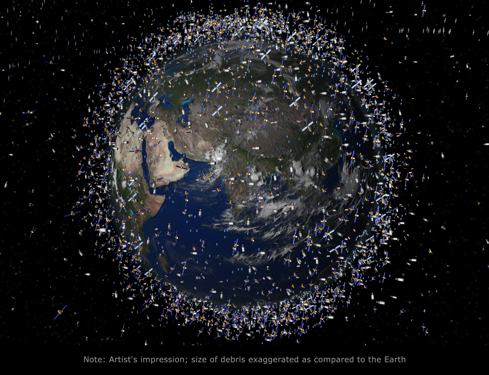
Image courtesy of [European Space Agency](http://www.esa.int/spaceinimages/Images/2008/03/Debris_objects_-_mostly_debris_-_in_low_Earth_orbit_LEO_-_view_over_the_equator)

## Active Earth Observing Satellites (EOS) (as of 8/31/2015)

* Total number of operating satellites: 1,305
* Total Earth Observing Satellites (EOS): 333 
    * United States: 34%
    * China: 21%	
    * Japan 6.3%

From the [Union of Concerned Scientists Satellite Database](http://www.ucsusa.org/nuclear-weapons/space-weapons/satellite-database.html#.VjzlnoS98VQ) and [Pixalytics Blog](http://www.pixalytics.com/blog/)

# NASA's Earth Observing System
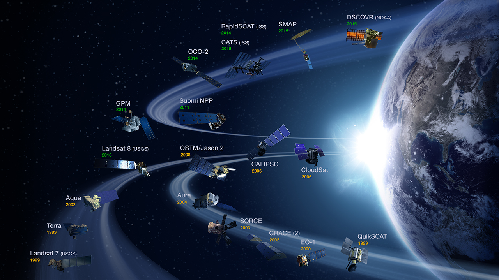

## Passive Remote Sensing

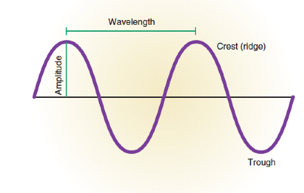
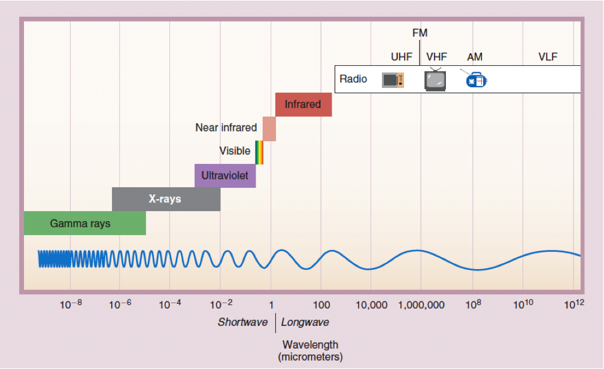
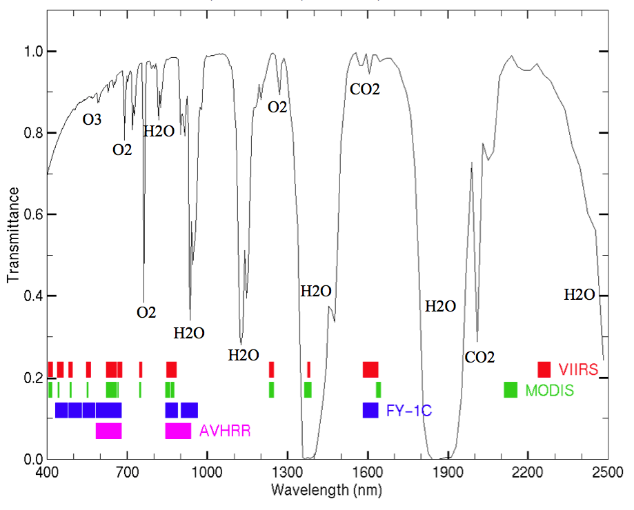

# Moderate Resolution Imaging Spectroradiometer (MODIS)

## Instrument


_Terra launched in 1999, Aqua in 2002._

* 2 Satellites (_Terra_ & _Aqua_)
* Viewing swath width of 2,330 km
* Covers Earth every one to two days
* Measures 36 spectral bands between 0.405 and 14.385 µm
* 3 spatial resolutions -- 250m, 500m, and 1,000m 

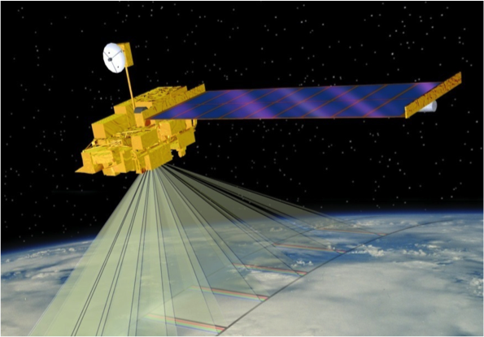

### MODIS Data Processing

* Tracking and Data Relay Satellite System in White Sands, New Mexico
* EOS Data and Operations System @ Goddard Space Flight Center in Greenbelt, MD
* MODIS Adaptive Processing System (MODAPS)
* 3 DAACs for distribution

### MODIS products (a subset...)

#### Atmosphere

* Aerosol
* Total Precipitable Water
* Clouds

#### Cryosphere Products

* Snow Cover
* Sea Ice and Ice Surface Temperature

#### Ocean Products

* Sea Surface Temperature
* Remote Sensing Reflectance
* Sub-surface Chlorophyll-a Concentration
* Particulate Carbon
* Instantaneous Photosynthetically Available Radiation

#### Land Products

* Surface Reflectance
* Land Surface Temperature and Emissivity
* Land Cover Products
* Vegetation Index Products (NDVI and EVI)
* Thermal Anomalies - Active Fires
* Fraction of Photosynthetically Active Radiation (FPAR) / Leaf Area Index (LAI)
* Evapotranspiration
* Primary Productivity
* Vegetation Continuous Fields
* Water Mask
* Burned Area Product

### Example product workflow

 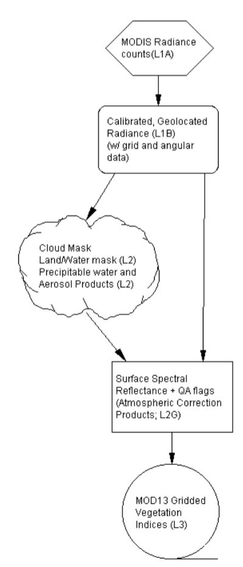
 
Flow diagram showing the MODIS Land and Atmosphere Products required to generate the gridded, composited vegetation indices. From the [MOD13 Algorithm Theoretical Basis Document](http://modis.gsfc.nasa.gov/data/atbd/atbd_mod13.pdf).  


### Data formats

Most NASA EOS data distributed as HDF files, which are very similar to netCDF.

 

 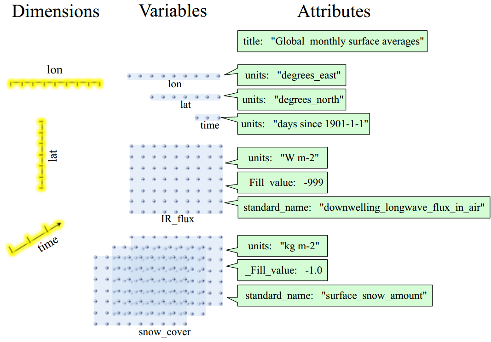


### MODIS Gridding system

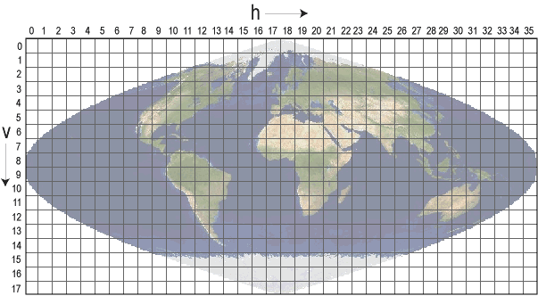

#### Collection-Level Naming Conventsions 

`MODIS/Terra Surface Reflectance 8-Day L3 Global 500m SIN Grid V005`

* `MODIS/Terra` - Instrument/Sensor
* `Surface Reflectance` - Geophysical Parameter
* `8-Day` - Temporal Resolution
* `L3` - Processing Level
* `Global` - Global or Swath
* `500m` - Spatial Resolution
* `SIN Grid` - Gridded or Not
* `V005` - Collection Version

#### Filename Conventions

`MOD09A1.A2006001.h08v05.005.2006012234657.hdf`

* `MOD09A1` - Product Short Name
* `.A2006001` - Julian Date of Acquisition (A-YYYYDDD)
* `.h08v05` - Tile Identifier (horizontalXXverticalYY)
* `.005` - Collection Version
* `.2006012234567` - Julian Date of Production (YYYYDDDHHMMSS)
* `.hdf` - Data Format (HDF-EOS)

#### MODIS Temporal Resolution
* Daily
* 8-Day
* 16-Day
* Monthly
* Quarterly
* Yearly

#### MODIS Spatial Resolution

* **Bands 1–2**  250-meter
* **Bands 3–7**  500-meter
* **Bands 8–36**  1000-meter

### Distributed Active Archive Centers (DAACs)

* **Level 1 data:** geolocation, cloud mask, and atmosphere products [ladsweb.nascom.nasa.gov/](http://ladsweb.nascom.nasa.gov/)
* **Land products:** [lpdaac.usgs.gov/](https://lpdaac.usgs.gov/)
* **Cryosphere (snow/ice) products:** [nsidc.org/daac/modis/index.html](http://nsidc.org/daac/modis/index.html)
* **Ocean color and sea surface temperature:** [oceancolor.gsfc.nasa.gov/](http://oceancolor.gsfc.nasa.gov/)


### Accessing data

The Land Processes Distributed Active Archive Center has a nice "Data Discovery" Tool:
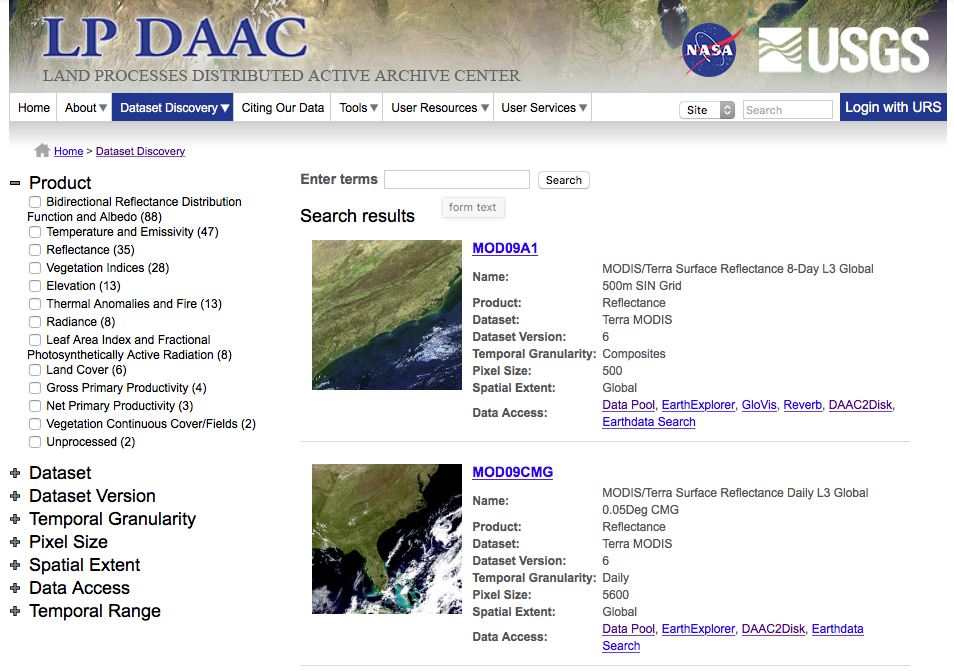

#### MODIS Products Table
Lists [all available MODIS land products]()

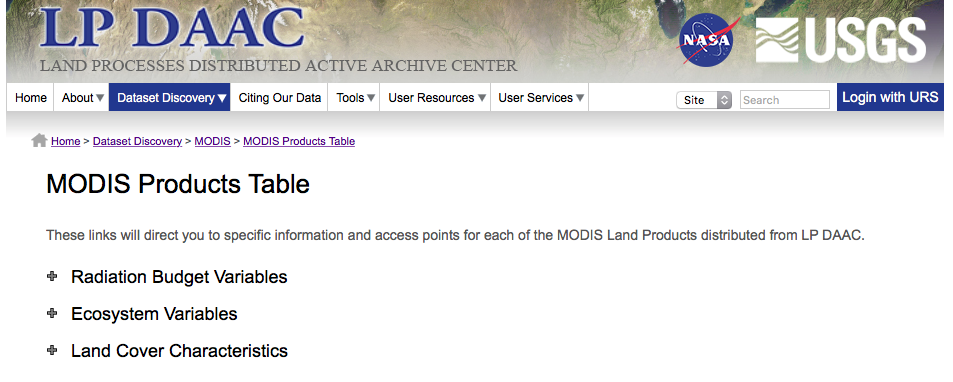

### Annual Land Cover Type

#### Description
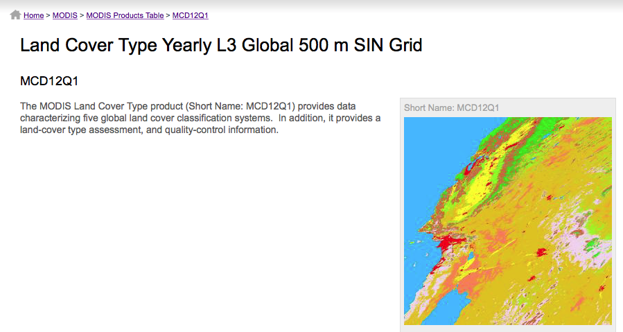

---

#### Detailed layer information
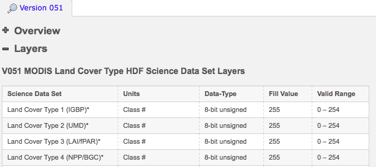

---

#### Data access links
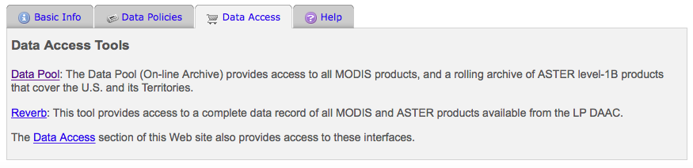

#### Downloading: `http`/`ftp` access
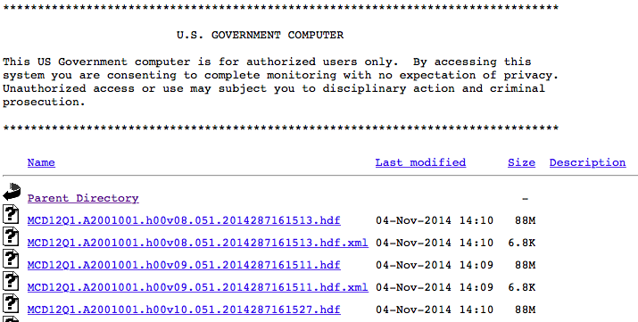

or the [LP DAAC2Disk Download Manager](https://lpdaac.usgs.gov/sites/default/files/public/datapool/DAAC2DiskUserGuide.pdf) which builds a download script.

#### MODIS Web service 
Subsets of MODIS Land Products through `SOAP` (Simple Object Access Protocol).

### Libraries


```r
library(raster)
#library(rgdal)
#library(ggplot2)
#library(ggmap)
#library(dplyr)
#library(tidyr)
#library(maps)
# New Packages
library(MODISTools)
```


```r
datadir="data"
```

##  List MODIS products available through 

```r
GetProducts()
```

```
##  [1] "MCD12Q1"    "MCD12Q2"    "MCD43A1"   
##  [4] "MCD43A2"    "MCD43A4"    "MOD09A1"   
##  [7] "MOD11A2"    "MOD13Q1"    "MOD15A2"   
## [10] "MOD15A2GFS" "MOD16A2"    "MOD17A2_51"
## [13] "MOD17A3"    "MYD09A1"    "MYD11A2"   
## [16] "MYD13Q1"    "MYD15A2"
```
