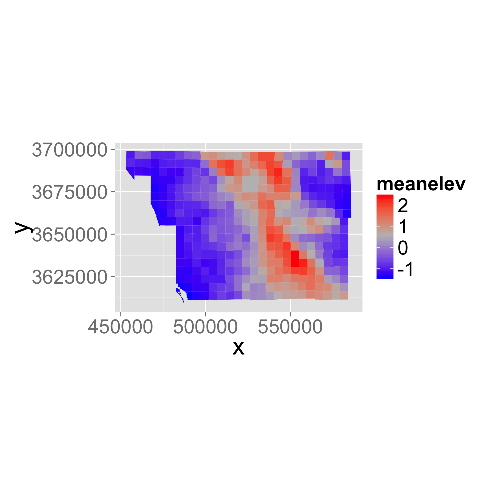

# Spatially-explicit logistic regression


 

```r
library(knitr)
library(raster)
library(rasterVis)
library(dplyr)
library(ggplot2)
library(ggmap)
library(rgdal)
library(sp) # handles spatial data

## New Packages
library(mgcv) # package for Generalized Additive Models
library(ncf) # has an easy function for correlograms
library(grid)
library(gridExtra)
library(xtable)
```

## Goal of this class

* To demonstrate a simple presence/absence modelling in spatial context. 
* To model spatial dependence (autocorrelation) in the response. 
  
Overview of [R's spatial toolset is here](http://cran.r-project.org/web/views/Spatial.html).
  
## What is spatial autocorrelation?
  
Today we will model space by **smooth splines** in `mgcv` package. 
  
Examples of Alternative approaches:

  - Simple polynomials
  - Eigenvector Mapping: ```vegan```, ```spdep```
  - Predictive process: ```spbayes```
  
Methods that tweak variance-covariance matrix of **Multivariate Normal Distribution**:

  - Generalized Least Squares: ```MASS```, ```nlme```
  - Autoregressive Models: ```spdep```
  - GeoBUGS module in OpenBUGS
  
See [Dormann et al. 2007 Ecography, 30: 609-628](http://onlinelibrary.wiley.com/doi/10.1111/j.2007.0906-7590.05171.x/full) for a review.

## Species Distribution Modeling

We'll attempt to explain the spatial distribution of the Purple finch (_Carpodacus purpureus_) in San Diego county, California:


(photo/Wikimedia)


## Preparing the data

Load a vector dataset (shapefile) representing the [San Diego bird atlas data](http://sdplantatlas.org/BirdAtlas/BirdPages.htm) for the Purple finch:


```r
finch <- readOGR("data", layer="finch")
```

```
## OGR data source with driver: ESRI Shapefile 
## Source: "data", layer: "finch"
## with 414 features
## It has 26 fields
```

```r
## add centroid locations to dataframe
finch@data[,c("x","y")]=coordinates(finch)
```


### Plot the shapefile
Plot the finch dataset over a google map layer.


#### First convert to latitude-longitude

```r
finchll=spTransform(finch,CRS("+proj=longlat +datum=WGS84"))
```


#### Get a google map image for the background

```r
map_usa=get_map("usa", zoom = 4,
             maptype = "terrain-background",
             source="stamen")
map_sd=get_map(bbox(finchll), zoom = 9,
             maptype="terrain-background",
             source="stamen")
```

#### Build the ggplot objects

```r
m1=ggmap(map_usa,extent = "device")+
geom_polygon(aes(y=lat,x=long,group=group,order=order),
             data=fortify(finchll),fill="transparent",colour="red",size=2)+
  ylab("")+xlab("")

m2=ggmap(map_sd)+
geom_polygon(aes(y=lat,x=long,group=group,order=order),
             data=fortify(finchll),fill="transparent",colour="red")+
  ylab("Latitude")+xlab("Longitude")
```

#### Draw the plot with an inset using `viewport()`

`viewport()` in the `grid` package allows you to put graphical objects anywhere in the plotting region.  Use it to draw the USA map as an inset to show the location of region with respect to the US. 


```r
print(m2)
print(m1,vp=viewport(width=.25,height=.25,x=.8,y=.8))
```

 

### Your Turn

Explore adjusting the `viewport()` parameters to see how it moves around.  Can you move it to lower right corner?  Note that the positions (e.g. `width`, `height`, `x`, and `y`) are all with respect to the full plotting domain, so if you change the aspect ratio of the plotting window, things will move around...

<br><br><br><br><br><br><br><br><br><br><br>

## Explore the data
Now look at the associated data frame (analogous to the *.dbf file that accompanied the shapefile):

```r
kable(head(finch@data))
```

     RC      FID_ATLAS1        AREA  ID_COARSE    FID_ATLA_1     AREA_1   PERIMETER   BIRD_ATLAS   BIRD_ATL_1  TRQ        BLOCKNAME         area_mdm     X_CEN   Y_CEN     ndvi   meanelev   minelev   maxelev   vegtypes   maxtmp   mintmp   meanppt   summert   wintert   urban   present          x         y
---  -----  -----------  ----------  ----------  -----------  ---------  ----------  -----------  -----------  ---------  ---------------  ---------  --------  ------  -------  ---------  --------  --------  ---------  -------  -------  --------  --------  --------  ------  --------  ---------  --------
0    C-9              0   214130000  c1                   11   24584734    19799.74           13           13  T09R3WNE   Rainbow           24584493   -117.16   33.41   129.42     336.60    155.84    560.32         19    32.35     4.21    318.74     23.32     11.68   10.48         1   484697.5   3696562
1    C-10             0   214130000  c1                   12   23355580    19452.50           14           14  T09R2WNW   Mt. Olympus       23355572   -117.11   33.40   123.24     470.04    173.03    675.84         16    32.30     3.64    346.14     23.35     10.95    1.98         0   489596.3   3696506
2    C-11             0   214130000  c1                   22   23534602    19300.92           24           24  T09R2WNE   Trujillo Creek    23534551   -117.05   33.40   123.20     498.70    159.22   1008.56         22    32.88     3.55    342.89     23.58     10.94    0.83         1   494551.9   3696394
3    D-10             0   214130000  c1                   43   24535492    19734.56           45           45  T09R2WSW   Gomez Creek       24535492   -117.11   33.36   127.96     244.19     87.45    552.72         25    32.88     4.57    301.73     23.58     12.19    1.17         0   489578.7   3691662
4    D-11             0   214130000  c1                   45   23853714    19508.38           47           47  T09R2WSE   Pala              23853715   -117.05   33.36   112.45     228.60    110.70    611.51         27    33.55     4.75    292.65     24.08     12.36    8.55         1   494531.9   3691600
5    D-9              0   214130000  c1                   46   23849098    19561.19           48           48  T09R3WSE   Monserate Mt.     23849098   -117.16   33.36   142.05     208.33     82.69    471.35         23    32.47     4.93    288.07     23.17     12.37   12.26         1   484658.0   3691653

> Note: in your final projects, don't simply print out large tables or outputs...  Filter/select only data relevent to tell your 'story'...

## Scaling and centering the environmental variables
Statistical models generally perform better when covariates have a mean of zero and variance of 1, using the `scale()` function:

```r
kable(head(select(finch@data,15:25)))
```

        ndvi   meanelev   minelev   maxelev   vegtypes   maxtmp   mintmp   meanppt   summert   wintert   urban
---  -------  ---------  --------  --------  ---------  -------  -------  --------  --------  --------  ------
0     129.42     336.60    155.84    560.32         19    32.35     4.21    318.74     23.32     11.68   10.48
1     123.24     470.04    173.03    675.84         16    32.30     3.64    346.14     23.35     10.95    1.98
2     123.20     498.70    159.22   1008.56         22    32.88     3.55    342.89     23.58     10.94    0.83
3     127.96     244.19     87.45    552.72         25    32.88     4.57    301.73     23.58     12.19    1.17
4     112.45     228.60    110.70    611.51         27    33.55     4.75    292.65     24.08     12.36    8.55
5     142.05     208.33     82.69    471.35         23    32.47     4.93    288.07     23.17     12.37   12.26

```r
envi <- finch@data[,15:25] 
envi.scaled <- as.data.frame(scale(envi))
finch@data[,15:25] <- envi.scaled
```


## The predictor (NDVI)  

### Plot a chloropleth

From [Wikipedia](https://en.wikipedia.org/wiki/Choropleth_map):

> A **choropleth** (from Greek χώρο ("area/region") + πλήθος ("multitude")) is a thematic map in which areas are shaded or patterned in proportion to the measurement of the statistical variable being displayed on the map, such as population density or per-capita income.

By default, the rownames in the dataframe are the unique identifier (e.g. the **FID**) for the polygons.  


```r
## add the ID to the dataframe itself for easier indexing
finch$id=as.numeric(rownames(finch@data))
## create fortified version for plotting with ggplot()
pfinch=fortify(finch,region="id")

ggplot(finch@data, aes(map_id = id)) +
    expand_limits(x = pfinch$long, y = pfinch$lat)+
    scale_fill_gradientn(colours = c("grey","goldenrod","darkgreen","green"))+
    coord_equal()+
    geom_map(aes(fill = ndvi), map = pfinch)
```

 

## Your turn

Explore the other variables in the `finch` dataset with `summary(finch)`.  Plot a map of the mean elevation in each region.

<br><br><br><br><br><br><br><br><br><br><br><br>


```r
ggplot(finch@data, aes(map_id = id)) +
    expand_limits(x = pfinch$long, y = pfinch$lat)+
    scale_fill_gradientn(colours = c("blue","grey","red"))+
    coord_equal()+
    geom_map(aes(fill = meanelev), map = pfinch)
```

 

Use `grid.arrange()` to plot multiple plots in the same figure.

```r
p1=ggplot(finch@data, aes(map_id = id)) +
    expand_limits(x = pfinch$long, y = pfinch$lat)+
    scale_fill_gradient2(low="blue",mid="grey",high="red")+
    coord_equal()+
    ylab("")+xlab("")+
     theme(legend.position = "top")+
    theme(axis.ticks = element_blank(), axis.text = element_blank())
```

```
## Warning: Non Lab interpolation is deprecated
```

```r
p1a=p1+geom_map(aes(fill = ndvi), map = pfinch)
p1b=p1+geom_map(aes(fill = meanelev), map = pfinch)
p1c=p1+geom_map(aes(fill = urban), map = pfinch)
p1d=p1+geom_map(aes(fill = maxtmp), map = pfinch)

grid.arrange(p1a,p1b,p1c,p1d,ncol=2)    
```

 


## The response (presences and absences)

```r
    ggplot(finch@data, aes(map_id = id)) +
    geom_map(aes(fill = as.logical(present)), map = pfinch)+
    expand_limits(x = pfinch$long, y = pfinch$lat)+
    scale_fill_manual(values = c("darkgrey","red"),name="Present")+
    coord_equal()
```

 

## Fitting the models

Compare three models:

1. Only NDVI
2. Only Space
3. Space and NDVI


### Model 1 - only NDVI

Now we will do the actual modelling. The first simple model links the presences and absences to NDVI.

First, we will fit model a model that only uses NDVI as a predictor of presence and absence:

$\log ( \frac{p_i}{1-p_i} ) = \beta_0 + \beta_1 NDVI_i$

$o_i \sim Bernoulli(p_i)$

> Note: this assumes residuals are _iid_ (independent and identically distributed).  

It can be fitted by simple glm() in R:

```r
  ndvi.only <- glm(present~ndvi, data=finch@data, family="binomial")
  ## and let's extract predictions and residuals:
  preds.ndvi.only <- predict(ndvi.only, type="response")
  resid.ndvi.only <- residuals(ndvi.only)
```


Now let's plot the logistic curve:

```r
  plot(finch$ndvi,preds.ndvi.only, type="p", 
       xlab="(Scaled) NDVI", ylab="P of presence", col="red")
  points(finch$ndvi, finch$present)
```

 

Print a summary table

```r
xtable(ndvi.only,
       caption="Model summary for 'NDVI-only'")%>%
    print(type="html")
```

<!-- html table generated in R 3.2.0 by xtable 1.7-4 package -->
<!-- Mon Nov 23 14:06:27 2015 -->
<table border=1>
<caption align="bottom"> Model summary for 'NDVI-only' </caption>
<tr> <th>  </th> <th> Estimate </th> <th> Std. Error </th> <th> z value </th> <th> Pr(&gt;|z|) </th>  </tr>
  <tr> <td align="right"> (Intercept) </td> <td align="right"> -2.9388 </td> <td align="right"> 0.2960 </td> <td align="right"> -9.93 </td> <td align="right"> 0.0000 </td> </tr>
  <tr> <td align="right"> ndvi </td> <td align="right"> 2.6521 </td> <td align="right"> 0.3223 </td> <td align="right"> 8.23 </td> <td align="right"> 0.0000 </td> </tr>
   </table>

### Model 2 - only space

The second model fits only the spatial trend in the data (using GAM and splines):

```r
  space.only <- gam(present~s(X_CEN, Y_CEN),
                   data=finch@data, family="binomial")
  ## extracting predictions
  preds.space.only <- as.numeric(predict(space.only, type="response"))
  resid.space.only <- residuals(space.only)
```

Plot the ***spatial term*** of the model:


```r
  finch$space=as.numeric(predict(space.only,type="terms"))

  ggplot(finch@data, aes(x=x,y=y,z=space, map_id = id)) +
  geom_map(aes(fill = space), map = pfinch)+
  geom_point(aes(col=as.logical(present)))+
  expand_limits(x = pfinch$long, y = pfinch$lat)+
  scale_fill_gradientn(colours=c("darkblue","blue","grey","yellow","orange","red"))+
  scale_color_manual(values=c("transparent","black"),name="Present")+
  coord_equal()
```

 


Print a summary table

```r
xtable(summary(space.only)$s.table, 
       caption="Model summary for 'Space-only'")%>%
    print(type="html")
```

<!-- html table generated in R 3.2.0 by xtable 1.7-4 package -->
<!-- Mon Nov 23 14:06:29 2015 -->
<table border=1>
<caption align="bottom"> Model summary for 'Space-only' </caption>
<tr> <th>  </th> <th> edf </th> <th> Ref.df </th> <th> Chi.sq </th> <th> p-value </th>  </tr>
  <tr> <td align="right"> s(X_CEN,Y_CEN) </td> <td align="right"> 28.83 </td> <td align="right"> 28.98 </td> <td align="right"> 51.17 </td> <td align="right"> 0.01 </td> </tr>
   </table>

### Model 3 - space and NDVI

The third model uses both the NDVI and spatial trends to explain the finch's occurrences:

```r
  space.and.ndvi <- gam(present~ndvi + s(X_CEN, Y_CEN),
                   data=finch@data, family="binomial")
  ## extracting predictions and residuals:
  preds.space.and.ndvi <- as.numeric(predict(space.and.ndvi, type="response"))
  resid.space.and.ndvi <- residuals(space.and.ndvi)
```

Print a summary table

```r
xtable(summary(space.and.ndvi)$s.table,
       caption="Model summary for 'Space and NDVI'")%>%
    print(type="html")
```

<!-- html table generated in R 3.2.0 by xtable 1.7-4 package -->
<!-- Mon Nov 23 14:06:29 2015 -->
<table border=1>
<caption align="bottom"> Model summary for 'Space and NDVI' </caption>
<tr> <th>  </th> <th> edf </th> <th> Ref.df </th> <th> Chi.sq </th> <th> p-value </th>  </tr>
  <tr> <td align="right"> s(X_CEN,Y_CEN) </td> <td align="right"> 23.35 </td> <td align="right"> 25.84 </td> <td align="right"> 47.74 </td> <td align="right"> 0.01 </td> </tr>
   </table>

Plot the ***spatial term*** of the model:

```r
  finch$ndvispace=as.numeric(predict(space.and.ndvi,type="terms")[,2])

  ggplot(finch@data, aes(x=x,y=y, map_id = id)) +
  geom_map(aes(fill = ndvispace), map = pfinch)+
  geom_point(aes(col=as.logical(present)))+
  expand_limits(x = pfinch$long, y = pfinch$lat)+
  scale_fill_gradient2(low="blue",mid="grey",high="red",name="Spatial Effects")+
  scale_color_manual(values=c("transparent","black"),name="Present")+
  coord_equal()
```

```
## Warning: Non Lab interpolation is deprecated
```

 


## Examine the fitted models

Now let's put all of the predictions together:

```r
predictions <- data.frame(id=finch$id,
                          x=finch$x,
                          y=finch$y,
                          present=finch$present,
                          ndvi=  preds.ndvi.only, 
                          ndvi_resid=  resid.ndvi.only,
                          space =  preds.space.only,
                          space_resid =  resid.space.only,
                          ndvispace=  preds.space.and.ndvi,
                          ndvispace_resid= resid.space.and.ndvi)
```

Combine all the predictions into a single _long_ table:

```r
library(reshape2)

predictionsl= melt(predictions,
                     variable.name="var",
                     id.vars=c("id","x","y"),
                     measure.vars=c(
                       "present",
                       "ndvi","ndvi_resid",
                       "space","space_resid",
                       "ndvispace","ndvispace_resid"))
```
 
Plot predictions from the three models, together with the observed presences and absences: 

```r
    ggplot(filter(predictionsl,!grepl("resid|present",var)), aes(map_id = id)) +
    geom_map(aes(fill = value), map = pfinch)+
      facet_wrap(~var)+
    geom_point(data=finch@data,aes(x=x,y=y,col=as.logical(present)),size=.5)+
    scale_color_manual(values=c("transparent","black"),name="Present")+
    expand_limits(x = pfinch$long, y = pfinch$lat)+
    scale_fill_gradientn(colours = c("blue","grey","red"))+
    coord_equal()+
   theme(axis.ticks = element_blank(), axis.text = element_blank())
```

 

## Model comparison

We can compare model performance of the models with Akaike's Information Criterion (AIC).  This uses the formula  $-2*log-likelihood + k*npar$, where

* $npar$ number of parameters in the fitted model
* $k = 2$ penalty per parameter 

Lower is better...


```r
kable(AIC(ndvi.only, space.only, space.and.ndvi))
```

                        df        AIC
---------------  ---------  ---------
ndvi.only          2.00000   232.6058
space.only        29.83238   183.7504
space.and.ndvi    25.35174   165.7837

## Spatial Autocorrelation of  Residuals

Should always check the spatial correlation in model residuals to evaluate assumptions.   We will use the function ```correlog``` from the ```ncf``` package. An overview of other [functions that plot correlograms is here.](http://www.petrkeil.com/?p=1050).


```r
inc=10000  #spatial increment of correlogram in m

cor=predictionsl%>%
  filter(grepl("present",var)|grepl("resid",var))%>%
  group_by(var)%>%
  do(var=.$var,cor=correlog(.$x,.$y,.$value,increment=inc, resamp=100))%>%
  do(data.frame(
      var=.$var[[1]],
      Distance = .$cor$mean.of.class/1000,
      Correlation=.$cor$correlation,
      pvalue=.$cor$p))
```

And we can plot the correlograms:

```r
ggplot(cor,aes(x=Distance,y=Correlation,col=var,group=var))+
  geom_point(aes(shape=pvalue<=0.05))+
  geom_line()+
  xlab("Distance (km)")+ylab("Spatial\nAuto-correlation")
```

 

## What did we gain by making the model "spatially explicit"?

- We know that the effect of NDVI is not artificially amplified by pseudoreplication.
- We have more realistic predictions.
- We have a fitted surface that can be interpreted -- perhaps to guide us towards some additional spatially-structured predictors that can be important.

## Your turn

Try adding additional co-variates into the spatial model (e.g. elevation or climate).

<br><br><br><br><br><br><br><br><br><br><br><br>


```r
m1 <- gam(present~ndvi+meanelev+
            wintert+meanppt+urban + 
            s(X_CEN, Y_CEN),
            data=finch@data, family="binomial")
```

Print a summary table

```r
xtable(summary(m1)$p.table)%>%
    print(type="html")
```

<!-- html table generated in R 3.2.0 by xtable 1.7-4 package -->
<!-- Mon Nov 23 19:04:55 2015 -->
<table border=1>
<tr> <th>  </th> <th> Estimate </th> <th> Std. Error </th> <th> z value </th> <th> Pr(&gt;|z|) </th>  </tr>
  <tr> <td align="right"> (Intercept) </td> <td align="right"> -5.82 </td> <td align="right"> 2.12 </td> <td align="right"> -2.75 </td> <td align="right"> 0.01 </td> </tr>
  <tr> <td align="right"> ndvi </td> <td align="right"> 2.11 </td> <td align="right"> 0.79 </td> <td align="right"> 2.67 </td> <td align="right"> 0.01 </td> </tr>
  <tr> <td align="right"> meanelev </td> <td align="right"> -4.91 </td> <td align="right"> 4.83 </td> <td align="right"> -1.02 </td> <td align="right"> 0.31 </td> </tr>
  <tr> <td align="right"> wintert </td> <td align="right"> -2.26 </td> <td align="right"> 4.06 </td> <td align="right"> -0.56 </td> <td align="right"> 0.58 </td> </tr>
  <tr> <td align="right"> meanppt </td> <td align="right"> 4.28 </td> <td align="right"> 3.21 </td> <td align="right"> 1.33 </td> <td align="right"> 0.18 </td> </tr>
  <tr> <td align="right"> urban </td> <td align="right"> 0.12 </td> <td align="right"> 0.74 </td> <td align="right"> 0.17 </td> <td align="right"> 0.87 </td> </tr>
   </table>

Compare all models

```r
kable(AIC(ndvi.only, 
          space.only, 
          space.and.ndvi,
          m1))
```

                        df        AIC
---------------  ---------  ---------
ndvi.only          2.00000   232.6058
space.only        29.83238   183.7504
space.and.ndvi    25.35174   165.7837
m1                28.91842   170.0102
