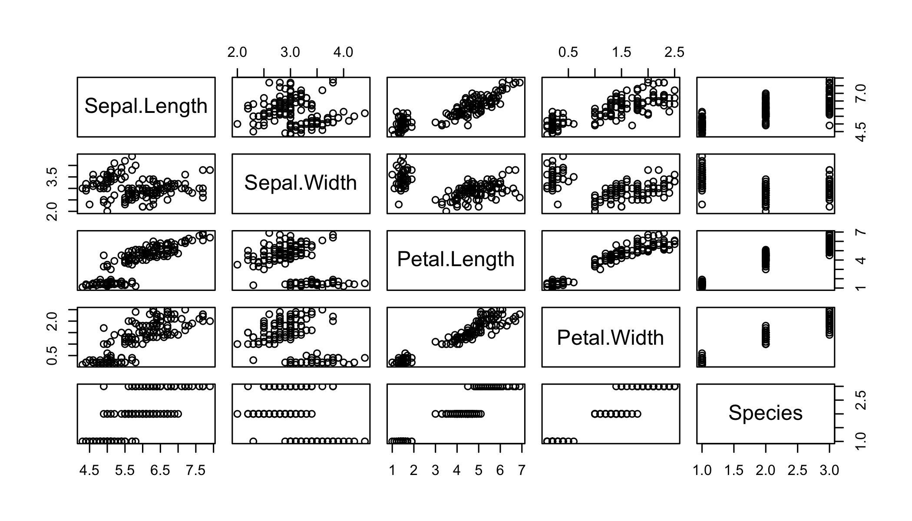

# Project-Related RMarkdown

## Documentation

* [RMarkdown](http://rmarkdown.rstudio.com)
* [Knitr](http://yihui.name/knitr/)

## Document options

See `knitr::opts_chunk$get()` for all options and their defaults.

Set options for the full document with:

```r
knitr::opts_chunk$set(cache=F,
                      fig.width=7,
                      fig.height=4,
                      dpi=300,
                      dev="png")
```


## Code chunk settings
Chunk headers:

Show code and results with `echo=T` and `results='markup'` (the defaults):

```r
2+2
```

```
## [1] 4
```

Or hide code with:

```
## [1] 4
```

Or hide results with:

```r
2+2
```

Or hide both with:


### Messages
Some functions print output that you will want to hide in the report.  Use `message=F` to do this, especially for packages...


```r
library(rgdal)
```

```
## Loading required package: sp
## rgdal: version: 1.0-4, (SVN revision 548)
##  Geospatial Data Abstraction Library extensions to R successfully loaded
##  Loaded GDAL runtime: GDAL 1.11.2, released 2015/02/10
##  Path to GDAL shared files: /Library/Frameworks/R.framework/Versions/3.2/Resources/library/rgdal/gdal
##  Loaded PROJ.4 runtime: Rel. 4.9.1, 04 March 2015, [PJ_VERSION: 491]
##  Path to PROJ.4 shared files: /Library/Frameworks/R.framework/Versions/3.2/Resources/library/rgdal/proj
##  Linking to sp version: 1.1-1
```

Use `message=F` to hide message output.


```r
library(rgdal)
library(raster)
```

Other things to hide or show:

* warnings
* errors


## Caching for computationally intensive steps (e.g. >1 minute)

Caching stores temporary output so it does not need to be run every time the document is compiled.  See demos available [here](http://yihui.name/knitr/demo/cache/). 

### knitr caching
Set `knitr::opts_chunk$set(cache=T)` as above.  

* Knitr automatically keeps track of which chunks have been edited and what needs to be re-run.  
* Results saved in `cache` folder
* Usually works, but awkward for really large temporary files and sometimes tricky to get paths correct

### User-caching
An alternative is to write temporary files to disk and only calculate them when they don't already exist (or you want to overwrite them)


```r
library(raster)

datadir="/Users/adamw/GoogleDrive/Work/courses/2015_UB503/SpatialR"
ow=FALSE  # flag whether to overwrite existing files anyway

## Heavy step
fo=file.path(datadir,"data.tif")  # define output filename

if(!file.exists(fo) | ow){  # test if file exists or overwrite is desired

  r=raster(matrix(rnorm(1:100),nrow=10))   # do your computation
  # ...
  writeRaster(r,file=fo,overwrite=ow)  # write it out to disk

  }
```


## Options for writing captions in RMarkdown

### HTML

* Write a custom _hook_ as explained [here](https://github.com/yihui/knitr-examples/blob/master/063-html5-figure.Rmd).
* Use the [captioner package](https://github.com/adletaw/captioner/blob/master/vignettes/using_captioner.Rmd) (easier and more flexible!)


```r
library(captioner)
figure_nums = captioner(prefix = "Figure")
table_nums = captioner(prefix = "Table")
```


```r
plot(iris)
```

 
_Figure  1: Edgar Anderson's iris data.  All measurements are in centimetres._

Then you can refer to a figure in the text with Figure  1.


```r
library(xtable)
print(xtable(head(iris)),type = "html", include.rownames = F, align="center")
```

<!-- html table generated in R 3.2.0 by xtable 1.7-4 package -->
<!-- Mon Nov 30 15:26:27 2015 -->
<table border=1>
<tr> <th> Sepal.Length </th> <th> Sepal.Width </th> <th> Petal.Length </th> <th> Petal.Width </th> <th> Species </th>  </tr>
  <tr> <td align="right"> 5.10 </td> <td align="right"> 3.50 </td> <td align="right"> 1.40 </td> <td align="right"> 0.20 </td> <td> setosa </td> </tr>
  <tr> <td align="right"> 4.90 </td> <td align="right"> 3.00 </td> <td align="right"> 1.40 </td> <td align="right"> 0.20 </td> <td> setosa </td> </tr>
  <tr> <td align="right"> 4.70 </td> <td align="right"> 3.20 </td> <td align="right"> 1.30 </td> <td align="right"> 0.20 </td> <td> setosa </td> </tr>
  <tr> <td align="right"> 4.60 </td> <td align="right"> 3.10 </td> <td align="right"> 1.50 </td> <td align="right"> 0.20 </td> <td> setosa </td> </tr>
  <tr> <td align="right"> 5.00 </td> <td align="right"> 3.60 </td> <td align="right"> 1.40 </td> <td align="right"> 0.20 </td> <td> setosa </td> </tr>
  <tr> <td align="right"> 5.40 </td> <td align="right"> 3.90 </td> <td align="right"> 1.70 </td> <td align="right"> 0.40 </td> <td> setosa </td> </tr>
   </table>
_Table  1: Edgar Anderson's iris data.  All measurements are in centimetres._


See the data in Table  1.

### PDF

Uses LaTeX to compile the document as explained [here](http://rmarkdown.rstudio.com/pdf_document_format.html).  

* Use `fig_caption: true` in the YAML header
* Use `fig.cap="your caption here"` in code chunk

Or use `captioner` as with HTML.


## Tables of regression models


```r
library(texreg)
```


```r
lm1=lm(rnorm(10)~rnorm(10))
## Xtable
print(xtable(lm1),type="html")
```

<!-- html table generated in R 3.2.0 by xtable 1.7-4 package -->
<!-- Mon Nov 30 15:26:27 2015 -->
<table border=1>
<tr> <th>  </th> <th> Estimate </th> <th> Std. Error </th> <th> t value </th> <th> Pr(&gt;|t|) </th>  </tr>
  <tr> <td align="right"> (Intercept) </td> <td align="right"> -0.3717 </td> <td align="right"> 0.2481 </td> <td align="right"> -1.50 </td> <td align="right"> 0.1684 </td> </tr>
   </table>

```r
## HTMLreg
htmlreg(lm1,caption = "")
```


<!DOCTYPE HTML PUBLIC "-//W3C//DTD HTML 4.01 Transitional//EN" "http://www.w3.org/TR/html4/loose.dtd">
<table cellspacing="0" align="center" style="border: none;">
<tr>
<th style="text-align: left; border-top: 2px solid black; border-bottom: 1px solid black; padding-right: 12px;"></th>
<th style="text-align: left; border-top: 2px solid black; border-bottom: 1px solid black; padding-right: 12px;"><b>Model 1</b></th>
</tr>
<tr>
<td style="padding-right: 12px; border: none;">(Intercept)</td>
<td style="padding-right: 12px; border: none;">-0.37</td>
</tr>
<tr>
<td style="padding-right: 12px; border: none;"></td>
<td style="padding-right: 12px; border: none;">(0.25)</td>
</tr>
<tr>
<td style="border-top: 1px solid black;">R<sup style="vertical-align: 0px;">2</sup></td>
<td style="border-top: 1px solid black;">0.00</td>
</tr>
<tr>
<td style="padding-right: 12px; border: none;">Adj. R<sup style="vertical-align: 0px;">2</sup></td>
<td style="padding-right: 12px; border: none;">0.00</td>
</tr>
<tr>
<td style="padding-right: 12px; border: none;">Num. obs.</td>
<td style="padding-right: 12px; border: none;">10</td>
</tr>
<tr>
<td style="border-bottom: 2px solid black;">RMSE</td>
<td style="border-bottom: 2px solid black;">0.78</td>
</tr>
<tr>
<td style="padding-right: 12px; border: none;" colspan="2"><span style="font-size:0.8em"><sup style="vertical-align: 0px;">***</sup>p &lt; 0.001, <sup style="vertical-align: 0px;">**</sup>p &lt; 0.01, <sup style="vertical-align: 0px;">*</sup>p &lt; 0.05</span></td>
</tr>
</table>
_Table  2: Regression of random variables_

## Rcpp

Compiling and calling functions written in C++ from R using the [`Rcpp` package](http://www.rcpp.org).  

## GGplot themes 

You can set the default themes for ggplot figures like this:

```r
library(ggplot2)
presentation_theme <- theme_grey()+
  theme(text = element_text(size = 25, colour = "black"))
theme_set(presentation_theme)
```
Then all ggplot plots will use those defaults.

# Data

## Historical climate data

Check out the `prism` package for gridded time series of historical US weather: https://github.com/ropensci/prism
