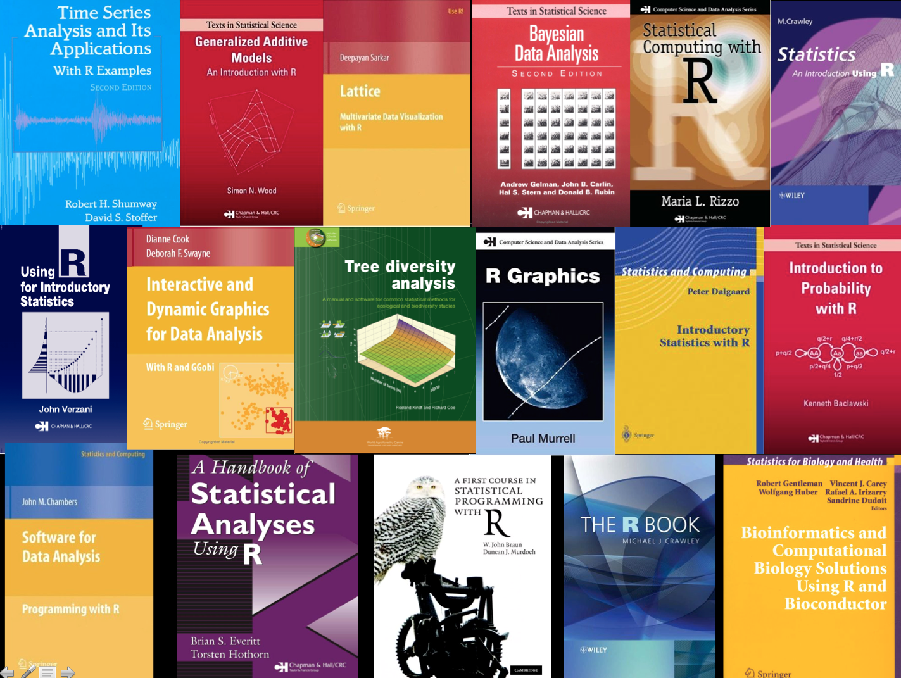
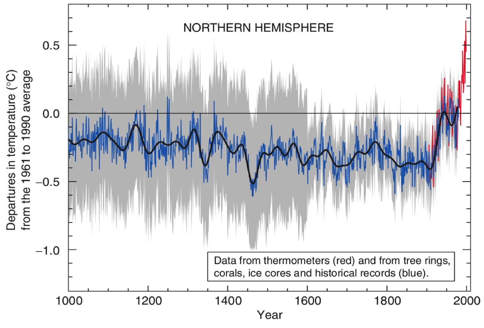
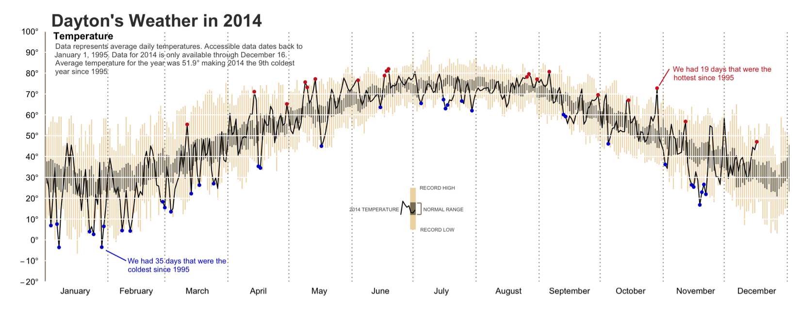
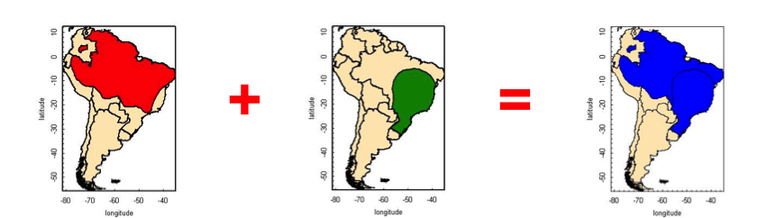
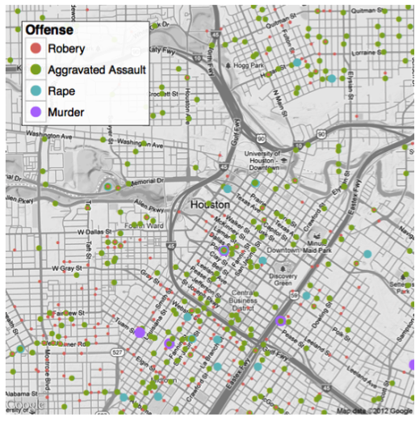
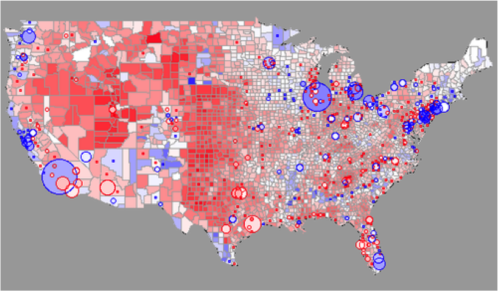
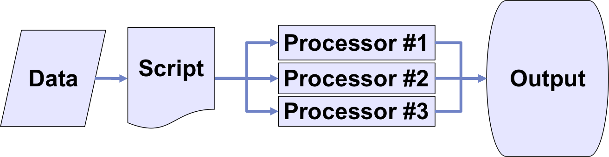
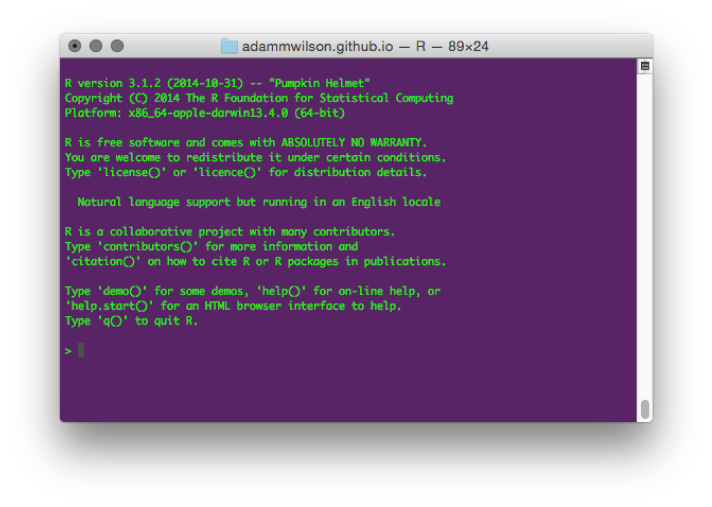
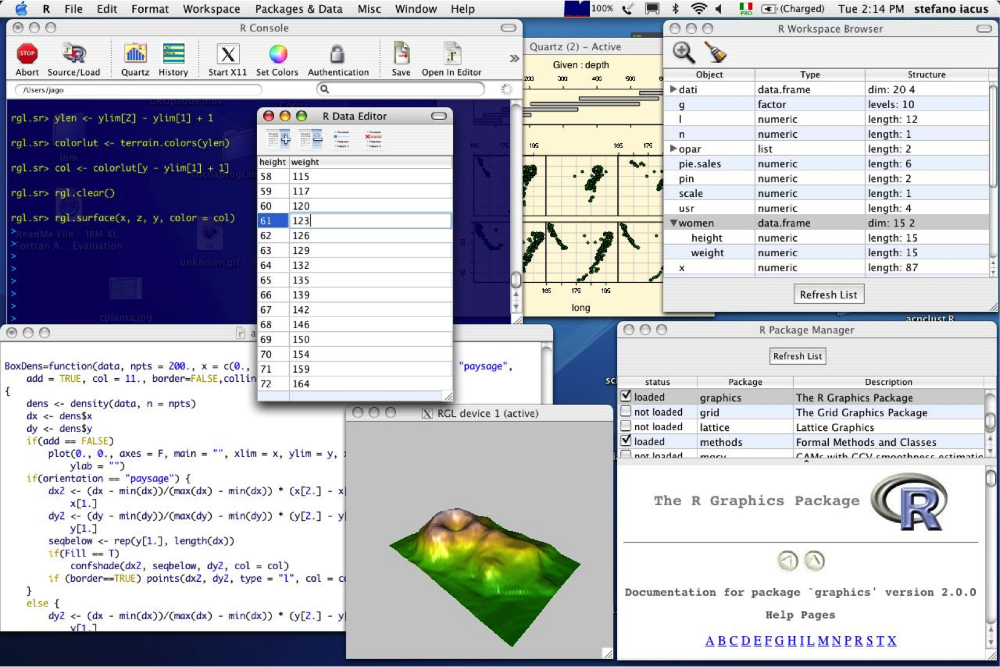

## Spatial environmental data analysis with R

* Course: Mondays 3-5pm 144 Wilkeson Quad
* Office Hours: Mondays 3-5pm, 120 Wilkeson Quad

## The R Project for Statistical Computing

* Open source
* Data manipulation
* Data analysis tools
* Great graphics
* Programming language
* 6,000+ free, community-contributed packages
* A supportive and increasing user community

R is a dialect of the S language and environment developed at Bell Laboratories (formerly AT&T) by John Chambers and colleagues (the same group that developed C and UNIX©)

## Why use the R environment?

* an effective data handling and storage facility
* a suite of operators for (vectorized) calculations
* a large, coherent, integrated collection of tools for data analysis
* graphical capabilities (screen or hardcopy)
* a well-developed, simple, and effective programming language  which includes
    * conditionals
    * loops
    * user defined functions
    * input and output facilities

## R Packages

Over 6k packages!
Task Views organize packages by topic: [http://cran.r-project.org/web/views/]

## Other Resources

## Reproducible, Portable, & Transparent

> "... all the code and data used to recreate Mann’s original analysis has been made available to the public [...] in R"
[Matthew Pocernich, R news 6/4, 10/31/06](http://www.cgd.ucar.edu/ccr/ammann/millennium/refs/WahlAmmann_ClimChange2006.html)

## Figures in R

[source](http://rpubs.com/bradleyboehmke/weather_graphic)

## Spatial Analysis & Visualization

Packages: `sp`, `maptools`, `rgeos`, `raster`, `ggmap`

Example: species range overlays
 [source](http://www.nceas.ucsb.edu/)

## Spatial Analysis & Visualization

Example: Visualizing Data with basemaps with `ggmap`
 [source](http://journal.r-project.org/archive/2013-1/kahle-wickham.pdf)

## Spatial Analysis & Visualization

[source](http://blog.revolutionanalytics.com/2009/01/r-graph-gallery.html)

## Parallel Processing

For *BIG* jobs:

multi-core processors / high performance computing

## Strengths & Limitations

* Just-in-time compilation: 
    *  Slower than compiled languages (-) 
    *   Faster to compose and develop (+) 
*  Many available packages (+) 
* Most operations conducted in RAM
    *  RAM can be limiting and/or expensive (-) 
    *  “Error: cannot allocate vector of size X Mb” 
    *  Various packages and clever programming can overcome this… (+) 
*  Free like beer and speech! (+) 

## R Interface

But there are other options...

## R Interface | Mac

## R Interface | Windows

## R Interface | RStudio

Mac, Windows, Linux, and over the web (via RStudio Server)

## Workflow

Adapted from Gandrud (2014) _Reproducible Research with R and RStudio_.